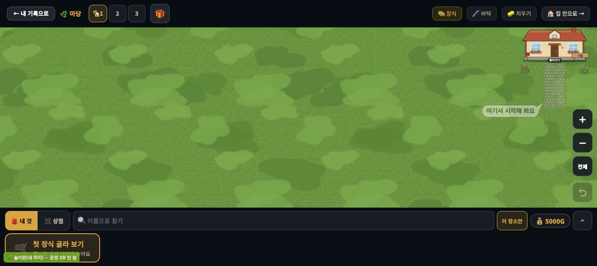
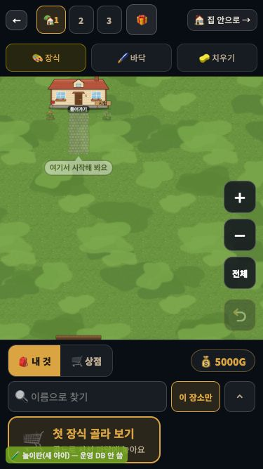
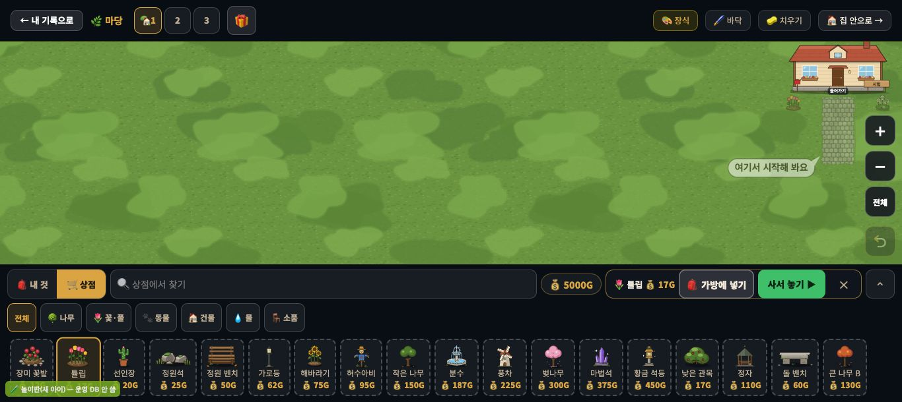
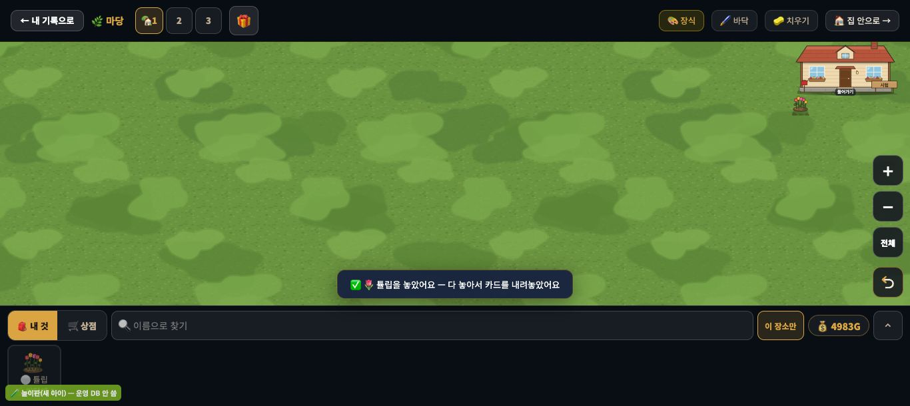

# 창조자의 눈 — 관찰 기록 58회: 꾸미기에 처음 온 아이 — #1056 첫 장식 카드 · #1058 첫 마당 본보기

> 막 머지된 '처음 온 아이' 둘을 새 학생처럼 되밟았습니다.
> - **#1056 DECO-FIRST-1**: 가진 장식이 0 이면 빈 서랍에 금테 카드 "🛒 첫 장식 골라 보기".
> - **#1058 DECO-FIRST-YARD-1**: 마당에 한 번도 안 놓은 아이에게 집 문 앞 돌길 + 튤립 · 데이지를 반투명으로 · '여기서 시작해 봐요' · 첫 장식을 놓으면 사라짐.
>
> 본 판: main `ed24e9d` 뒤(#1056 · #1058 들어 있음 · 제 가지 = origin/main) · 저장소 꾸미기 놀이판.
> **새 아이 놀이판**: 놀이판의 입장 파일 `play-enter.js` 를 **scratchpad 에 복사한 것만** 고쳐 '가진 장식 0 · 골드 5000'으로 들어갔습니다(원래 놀이판은 모든 장식을 3개씩 쥐여 줌). 앱 파일(`student.html` · `student.js`)은 작업 폴더 그대로입니다. 가짜 프로젝트 · 오프라인 — **운영 DB · 학생 실데이터 0**.
> **코드 수정 0 · 화면 창 0** · 제 headless 크롬(GPU Metal) · firebase 요청 막음 · 1366×610 · 375×667(폰) · 끝나고 크롬 · 놀이판을 껐습니다.
> ⚠ 사진 왼쪽 아래 초록 띠 "🧪 놀이판(새 아이) — 운영 DB 안 씀"은 놀이판이 붙인 표시입니다(실제 앱엔 없음). 그 띠가 첫 카드의 작은 글을 조금 가립니다.

## 한 줄
**처음 온 아이가 무엇을 할지 바로 압니다 ✔.** 마당을 열면 집 문 앞에 반투명 돌길 · 튤립 · 데이지와 "여기서 시작해 봐요"가 있고, 빈 서랍엔 금테 "🛒 첫 장식 골라 보기" 카드가 있습니다.
**마당을 연 뒤 네 번 누르면 첫 장식이 놓입니다 ✔**: 카드 → 튤립 → [사서 놓기 ▶] → 본보기 튤립 자리. 놓는 순간 본보기는 사라지고 "✅ 🌷 튤립을 놓았어요"가 뜹니다.
한 가지 물음: 첫 장식 **하나**로 본보기 **전체**(돌길 · 데이지까지)가 사라집니다. 아이가 나머지를 따라 놓으려다 길을 잃을지는 교실에서 봐야 합니다(ⓒ92).

---

## 1. 첫 화면

**사실**
- 본보기: `_decoTplOn` 켜짐 · 투명 캔버스 · 불투명도가 0.45 → 0.53 으로 숨 쉬듯 바뀜. 집 첫 칸 44열 기준 — 튤립 (3,44) · 데이지 (3,49) · 돌길 2칸 폭 3~6줄.
- 말풍선: 1366 에선 돌길 왼쪽 아래 · 폰에선 돌길 바로 아래(#1058 본문대로).
- 첫 카드: 1366 에서 서랍 왼쪽 아래 218×67px · "🛒 첫 장식 골라 보기 · 골드로 사서 마당에 놓아요".
  - 문서에 같은 카드가 둘 있습니다(하나는 숨은 옛 화면용 · 크기 0). 제 첫 돌림은 숨은 쪽을 집어 헛눌렀습니다. 아이 화면과는 상관없습니다(사실 · 줄 아님).
- 1366 첫 화면에서 집과 본보기는 **오른쪽 위 구석**에 있고, 나머지(화면의 약 85%)는 빈 잔디입니다. 폰에선 집이 위 가운데입니다.

**해석** 🟢 — 전엔 빈 잔디 + 서랍 아래 작은 글뿐이었습니다(#1056 본문). 이제는 "어디에(말풍선) · 무엇을(카드) · 어떻게(반투명 본보기)"가 한 화면에 다 있습니다. 1366 에서 눈이 먼저 가는 곳이 구석이라는 점은, 말풍선이 받쳐 줍니다.

## 2. 첫 장식까지 (1366)

| 누름 | 결과 |
|---|---|
| ① 첫 카드 | 서랍이 🛒 상점으로(`DECO_TAB` = shop) |
| ② 튤립 | 사기 막대 "🌷 튤립 💰 17G │ 🎒 가방에 넣기 │ 사서 놓기 ▶ │ ✕" |
| ③ 사서 놓기 ▶ | 골드 5000 → 4983 · 손에 튤립 · "🌷 튤립을 샀어요 — 놓을 곳을 눌러요" |
| ④ 본보기 튤립 자리 (3,44) | 놓임 `d_y2@3,44` · 0.3초 안에 본보기 꺼짐(불투명 0) · "✅ 🌷 튤립을 놓았어요 — 다 놓아서 카드를 내려놓았어요" |

- (덤) 빈손으로 판을 누르면 "🛒 아직 가진 장식이 없어요 — 아래 🛒 상점에서 골라 봐요"가 뜹니다(첫 돌림에서 봄).
- 오류 0.

**해석**
- 🟢 네 번 누르기 모두 다음 할 일을 말로 알려 줍니다("놓을 곳을 눌러요" → "놓았어요"). 17G 튤립은 5000G 가운데 작아서, 처음 아이가 겁 없이 사 볼 값입니다.
- 🟡 **ⓒ92.** 본보기는 '보여 주기만'(보스 결정 (A))이고 첫 장식을 놓으면 모두 사라집니다. 튤립을 놓은 아이는 돌길 · 데이지 자리를 더는 볼 수 없습니다.
  - "본보기대로 다 놓아 보기"를 하려던 아이에겐 길잡이가 너무 빨리 사라질 수 있습니다.
  - 반대로 "하나 놓으면 내 마당"이 더 좋을 수도 있습니다.
  - 어느 쪽인지는 교실에서만 압니다.

---

## 목록에 반영할 것 — 다음 '목록 모음' PR 에서

| 줄 | 후 |
|---|---|
| **새 58-ⓒ92** | 첫 장식 하나를 놓으면 본보기 전체(돌길 · 데이지 · 말풍선)가 사라짐 — 아이가 나머지를 따라 놓으려다 길을 잃나, '하나 놓으면 내 마당'으로 읽나 · 손맛 · 확인 |

# ⓐ 없음 · ⓑ 없음 · ⓒ 1(ⓒ92)

## 미검증 · 한계
- 새 아이는 놀이판 입장 파일 복사본으로 흉내 냈습니다(가진 장식 0 · 마당 장식 0 · 바닥 0 · 골드 5000). 실제 새 학생의 레벨 · 골드와 다를 수 있습니다.
- 1366 · 375 두 크기, 마우스 누름만 봤습니다(터치 · 768 은 안 봄).
- 집 안의 첫 카드('집 안에 놓아요')와 #1059(마당 밭 그림 · 새싹 → 작물)는 안 봤습니다 — 다음 회 후보.
- 통과는 조작·표시 길만 뜻합니다.
