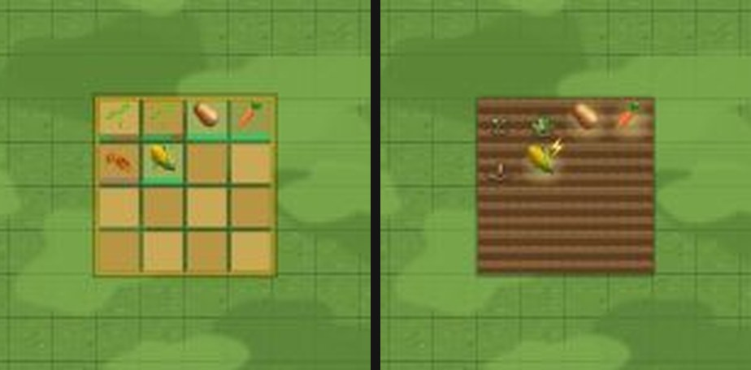

# 창조자의 눈 — 관찰 기록 59회: 마당 밭 그림(#1059) · 배율을 바꾸면 잔디에 가로줄(ⓑ105)

> 막 머지된 **#1059 DECO-FARM-ART-1**(마당 밭 — 갈아엎은 흙 · 새싹 → 포기 → 작물 · 시듦 · 진행 막대·주황 테두리 뺌)을 봤습니다. 보다가 마당 잔디에서 새 줄 하나를 찾았습니다.
> 본 판:
> - 저장소 꾸미기 놀이판(가짜 프로젝트 · 오프라인 · '시험' 학생 — **운영 DB · 학생 실데이터 0**).
> - #1059 뒤 판 = main `a012f28`(#1059 들어 있음 · merge-base 로 확인) · 전 판 = `f5bfd60`(#1058)을 같은 놀이판 다른 포트에 띄워 견줌.
> - 잔디 줄은 가장 새 main `c6d42e1`(#1062 판 위 잔디 띠 뒤)에서 한 번 더 쟀습니다(같은 값).
> **코드 수정 0 · 화면 창 0** · 제 headless 크롬(GPU Metal) · firebase 요청 막음 · 1366×610 · 끝나고 크롬 · 놀이판을 모두 껐습니다.
> **밭 기록(밝혀 둠)**: 밭은 실제 시간(감자 20시간 · 당근 24 · 옥수수 36)으로 자랍니다. 그래서 **제 headless 페이지 안에서만** `CUR.farm` 에 심은 때를 과거로 넣어 여섯 칸을 만들었습니다(새싹 · 포기 · 다 자람 둘 · 시듦 · 돌연변이). 마당은 밭을 읽기만 하므로 그림 시험으로는 같습니다.

## 한 줄
**밭이 '진짜 밭'이 됐습니다 ✔.** 모래색 체크 칸 · 주황 테두리 · 초록 진행 막대가 사라지고, 갈아엎은 흙 이랑 위에 새싹 → 포기 → 감자·당근(옅은 빛) · 시든 줄기 · 옥수수 ⚡가 섭니다.
**새로 찾은 것(ⓑ105)**: 마당을 [전체] 뒤 [＋]로 보면(한 칸 14 · 18px) 잔디에 **칸마다 가는 가로줄**이 보입니다. 처음 배율(한 칸 27)엔 없습니다. 31-ⓑ71 '모눈종이'가 배율을 바꾸면 다시 나타나는 셈입니다.

---

## 1. 마당 밭 (#1059)

**사실(레벨 12 · 밭 4×4 · 열 45~48 · 줄 23~26 · 같은 기록 두 판)**

| 칸 | 넣은 기록 | #1059 전 | **#1059 뒤** |
|---|---|---|---|
| 0 | 감자 · 5시간 전(25%) | 초록 새싹 + 진행 막대 | 작은 새싹 |
| 1 | 감자 · 14시간 전(70%) | 새싹 + 진행 막대 | 잎이 무성한 포기 |
| 2 | 감자 · 21시간 전(다 자람) | 감자 | 감자 + 옅은 빛 |
| 3 | 당근 · 30시간 전(다 자람) | 당근 | 당근 + 옅은 빛 |
| 4 | 감자 · 70시간 전(시듦: 자라는 시간 × 3 넘음) | 주황빛 시든 모양 | 마른 줄기 |
| 5 | 옥수수 · 40시간 전 · 돌연변이 | 옥수수 | 옥수수 + ⚡ |

- 흙은 칸마다 두 가지 흙 그림이 번갈아 이어져 한 덩이 밭으로 보이고, 둘레엔 흙 그림자 한 겹이 있습니다.
- 두 판 모두 오류 0 입니다.

**해석** 🟢 — 밭이 마당의 다른 그림(윤곽 있는 나무 · 꽃)과 같은 결이 됐습니다. 진행 막대가 빠져 숫자 대신 **모습(새싹 → 포기 → 작물)**으로 자람을 읽습니다. 다 자란 것은 빛으로 '거둘 때'를 알려 줍니다.
- (사실 · 줄 아님) 밭은 기준 판 오른쪽 아래(열 45~48 · 줄 23~26)에 있어, 1366 처음 화면(한 칸 27)에선 아래로 벗어나 안 보입니다. 옮기거나 [전체]를 눌러야 보입니다.

## 2. 배율을 바꾸면 잔디에 가로줄 (ⓑ105)

![잔디 확대 — 왼쪽: 처음 배율(한 칸 27) · 오른쪽: [전체] 뒤 [＋] 두 번(한 칸 14) — 칸마다 가는 가로줄](img/round59/02_lawn_27_vs_14.jpg)

**사실(카드를 들지 않은 채 · 잔디만)**

| 배율 | 사진에서 칸 주기 가로줄 세기 | 세로줄 세기 |
|---|---|---|
| 처음(한 칸 27) | 0.3(없음) | 0.2 |
| [전체](한 칸 9) | 0.4 | 0.7 |
| [전체] 뒤 [＋]×2(한 칸 14) | **7.7** | 0.1 |
| [전체] 뒤 [＋]×3(한 칸 18) | **14.3** | **6.8** |

- 세기 = 사진 밝기의 줄 단위 평균에서, 한 칸 주기 자리가 옆 줄보다 어두운 정도입니다(0 근처 = 줄 없음).
- **캔버스 안(`getImageData`)**: 색 밝기로는 줄이 없습니다. 그런데 **투명도(알파)**가 한 칸(캔버스 28px)마다 한 줄씩 205~220 입니다(나머지는 255). 그 반투명 줄 틈으로 판 뒤의 어두운 바탕이 비쳐 가는 줄로 보입니다.
- 모눈 그리기 줄은 카드를 들지 않으면 투명 선입니다(`[DECO-GROUND-1]` · 코드). 그러니 이 줄은 모눈이 아니라 **잔디 그림 조각의 이음새**입니다.
- 첫 마당 본보기 층(`deco-tpl`)을 숨겨도 세기가 같았습니다(7.71 → 7.71).
- 가장 새 main(`c6d42e1` · #1062 판 위 잔디 띠 뒤)에서도 같습니다.

**해석** 🟡 **ⓑ105.** 31-ⓑ71(땅이 모눈종이)은 47회에 처음 배율로 닫혔습니다. 하지만 아이는 [전체] · [＋] · [－]를 자주 누르고, 그 배율들에선 '줄 그은 종이' 같은 잔디가 다시 보입니다. 교실 TV(1920)나 크롬북 배율에 따라서도 달라질 것입니다(가설).
- (가설) 잔디 조각이 칸 경계에서 반쯤 투명하게 끝나, 판 뒤 바탕이 어두우면 줄이 되고 밝으면 덜 보일 것입니다.

---

## 목록에 반영할 것 — 다음 '목록 모음' PR 에서

| 줄 | 후 |
|---|---|
| **새 59-ⓑ105** | 마당을 [전체] 뒤 [＋]로 보면(한 칸 14 · 18px) 잔디에 칸마다 가는 가로줄(18px 에선 세로줄도) — 잔디 조각 이음새 투명도 205~220 로 뒤 어두운 바탕이 비침 · 처음 배율(27)엔 없음 · 결 · 열림(꾸미기 추천) · 재는 법: 한 칸 14 에서 캔버스 알파의 한 칸 주기 줄 |

# ⓐ 없음 · ⓑ 1(ⓑ105) · ⓒ 없음

## 미검증 · 한계
- 밭 기록은 제 페이지에서 넣었습니다. 🌾 농장 탭에서 심고 기다려 본 것은 아닙니다(그림 시험만).
- 잔디 줄은 1366 · 배율 넷에서 쟀습니다. 768 · 1920 · 폰과 DPR 2 기기는 안 봤습니다(캔버스는 2배로 그려 화면에 줄여 보입니다).
- 집 안 바닥 · 마당 바닥 칠한 곳에서도 같은지는 안 봤습니다.
- 통과는 조작·표시 길만 뜻합니다.
