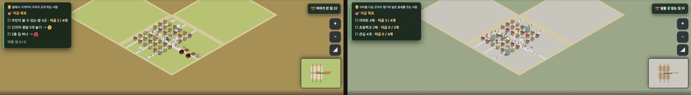
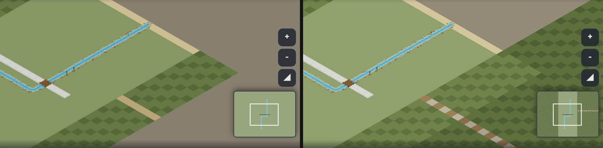

# 창조자의 눈 — 관찰 기록 60회: '닫혔지만 되밟기 전' 마을 둘 — farm·city 땅 두 빛(#1005) · 산 판 고갯길 돌길(#968)

> 목록 모음 54~55 때 '되밟기 전 닫힘'으로 적은 마을 줄 가운데 그림 쪽 둘을 되밟았습니다.
> - **41-ⓑ92**: farm · city 땅 전체가 한 빛 → #1005(열린 구역과 잠긴 땅을 판 모습 색으로).
> - **36-ⓑ86**: 산 판 고갯길이 흙 테두리와 같은 모래빛 줄 → #968(돌 박힌 흙길).
>
> 본 판: main `c6d42e1` 을 `git archive` 한 제 서버 8781 · `?sid=guest` 새 프로필 · **코드 수정 0 · 화면 창 0** · GPU(Metal) · 그림자 보임 · firebase 요청 막음 · 1366×610.
> 잰 법: 41회와 같이 farm · city 는 표준 시험 저장본 `mid36` 을 들여와 10시로 맞춘 뒤, 판 모습 색이 스미도록 15초 뒤(12시)에 찍었습니다. 산 판은 저장본 없이 8시로 맞춘 뒤 15초 뒤(10시)에 찍었습니다.
> 시작 카드는 아이처럼 닫았습니다: 첫 안내 [건너뛰기] → 짐작 '모르겠어요' → [시작].

## 한 줄
**둘 다 닫힙니다 ✔.**
- farm 은 열린 구역이 연한 가을 들빛이고, 바깥 잠긴 땅은 갈색 묵은 흙입니다. city 는 열린 구역이 밝은 포장 바닥빛이고, 바깥은 잿빛 풀밭입니다. 41회의 '한 빛 판'이 '내 땅 · 아직 안 연 땅'으로 갈립니다.
- 산 판 고갯길은 회색 돌과 갈색 흙이 한 칸씩 번갈아 박힌 길이 되어, 골짜기 가장자리의 모래빛 테두리와 더는 헷갈리지 않습니다. 미니맵에도 점선으로 나옵니다.

---

## 1. farm · city 땅 (41-ⓑ92)

**사실(넓게 보기 사진 · 빈 땅 표본 평균 RGB)**

| 판 | 41회 | 60회 열린 구역 | 60회 잠긴 땅 |
|---|---|---|---|
| farm | 한 빛(겨자빛 `#c9bd6a`) | (180, 186, 110) | (163, 149, 90) |
| city | 한 빛(회색 `#b3b5b2`) | (193, 192, 180) | (159, 167, 143) |

- #1005 본문 값: farm 풀 `#aabd63` · 바닥 `#9b8656` / city 풀 `#c4c1b6` · 바닥 `#8e9c80`. 사진 값은 한낮 빛이 더해진 것입니다.
- (사실 · 줄 아님) farm 에 mid36 을 들여오면 목표판이 "주민이 쓸 수 있는 밭 4곳 · 지금 2 / 4개" 한 줄 + 기본 목표 둘("긴의자·꽃밭 5개 놓기 → 🌼" · "2층 집 하나 → 🌺")로 채워집니다. 51-ⓑ101(한 목표 판의 남는 줄을 기본 목표가 채움 · 고장 맡음)과 같은 꼴입니다.
- (사실 · 줄 아님) 시작 카드에 '🤔 먼저 짐작해 봐요'가 있어, 하나를 골라야 [시작]이 켜집니다(farm · city · 산 모두).

**해석** 🟢 — 41-ⓑ92 **닫힘 ✔**. 1920 에서 '넓은 한 빛 판 가운데 작은 마을'이던 것이, 이제 **내 땅의 테두리**가 보입니다. 농촌은 가을 들판과 묵은 밭, 도시는 포장된 시내와 아직 안 지은 풀밭으로 읽힙니다(41-ⓒ81·82 는 교실에서).

## 2. 산 판 고갯길 (36-ⓑ86)

**사실(10시 사진 · `__terrain` 바닥 '고개' 47칸 = y 140 줄)**

| 곳 | 37·42회(#968 전 · 8시) | 60회(10시) |
|---|---|---|
| 고갯길 | (184, 164, 120) — 테두리와 비슷 | 돌 (163, 161, 135) · 흙 (125, 117, 73) 번갈아 |
| 골짜기 흙 테두리 | (203, 189, 146) | (211, 198, 156) |
| 비탈 · 골짜기 풀 | — | (111, 117, 86) · (144, 161, 109) |

- 고갯길 양옆은 '비탈', 두 끝은 '풀'입니다. 미니맵에도 고갯길이 점선으로 그려집니다.

**해석** 🟢 — 36-ⓑ86 **닫힘 ✔**. 빛깔(회갈)도 결(엇갈린 돌)도 테두리(모래빛 한 색)와 달라, '하나뿐인 넘어가는 길'로 읽힙니다. 36회 걱정대로 산마을 아이가 "이 길로 고개를 넘는다"를 말할 수 있게 됐습니다.

---

## 목록에 반영할 것 — 다음 '목록 모음' PR 에서

| 줄 | 후 |
|---|---|
| 41-ⓑ92 farm · city 한 빛 | **닫힘(#1005) ✔60회** — farm 열린 (180,186,110) ↔ 잠긴 (163,149,90) · city (193,192,180) ↔ (159,167,143) |
| 36-ⓑ86 고갯길 | **닫힘(#968) ✔60회** — 돌 (163,161,135) · 흙 (125,117,73) 번갈아 ↔ 테두리 (211,198,156) · 미니맵 점선 |

# ⓐ 없음 · ⓑ 없음 · ⓒ 없음

## 미검증 · 한계
- 1366 · 한낮 사진 한 장씩입니다(1920 교실 TV · 비 · 저녁은 안 봄).
- 색은 사진 표본 평균입니다(표본 자리는 빈 땅으로 골랐지만 그림자 · 사람이 섞였을 수 있음).
- 22-ⓑ32(농촌 목표 '쓸 수 있는' 것만 · #1017)과 23-ⓑ41(큰길 말 · #997)은 놓아 보는 시험이라 다음 회로 미뤘습니다.
- 통과는 조작·표시 길만 뜻합니다.
