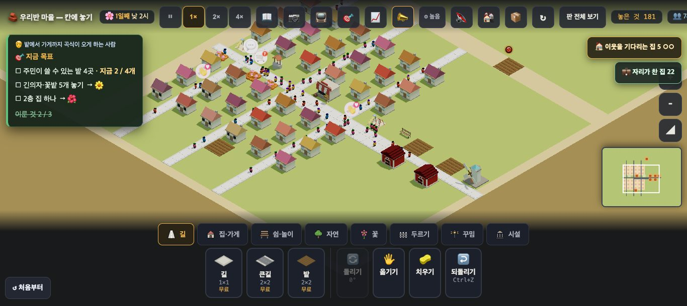
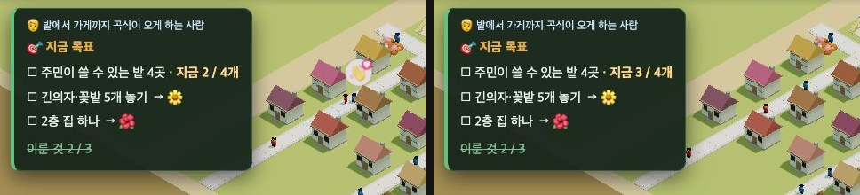

# 창조자의 눈 — 관찰 기록 61회: 농촌 목표 '쓸 수 있는 밭'(#1017) · 목표판 숫자가 제때 안 바뀜(ⓑ106)

> 60회에 미룬 '되밟기 전 닫힘' 둘을 놓아 보며 봤습니다.
> - **22-ⓑ32**: 목표가 '놓으면 끝' → 농촌은 #1017(주민이 쓸 수 있는 밭 · 헛간만 셈).
> - **23-ⓑ41**: 큰길로 닿게 된 것도 '생겼어요' → #997(이제 …까지 갈 수 있어요).
>
> 본 판: main `c6d42e1` 을 `git archive` 한 제 서버 8781 · `?sid=guest&stage=farm` 새 프로필 + 표준 시험 저장본 `mid36` · **코드 수정 0 · 화면 창 0** · GPU(Metal) · firebase 요청 막음 · 1366×610.
> 한 일: 시작 카드를 아이처럼 닫고(첫 안내 건너뛰기 → 짐작 '모르겠어요' → 시작) 10시에서 12초 기다린 뒤, [길] 탭의 [밭]을 두 곳에 놓았습니다.
> - 먼 곳 (147,127): 길에서 6칸 · 집에서 9칸.
> - 길 곁 (138,153): 길 바로 곁 · 집에서 2칸.
> 셈은 `__usable('field')`(쓸 수 있는 밭 · 못 쓰는 자리)와 목표판 글(`#goals`)로 봤습니다. 같은 차례를 세 번 돌렸습니다(값 같음).

## 한 줄
**농촌 목표는 이제 '쓸 수 있는' 밭만 셉니다 ✔(22-ⓑ32).** 길에서 먼 밭은 '못 쓰는 자리'로 빠지고, 길 곁 밭은 셈에 들어갑니다(쓸 수 있는 밭 2 → 3).
**그런데 목표판 숫자가 안 바뀝니다(ⓑ106).** 길 곁 밭을 놓고 15초가 지나도 목표판은 '지금 **2** / 4개'입니다. 🎯 로 목표판을 닫았다 열어야 '지금 **3** / 4개'가 됩니다. 아이는 "밭을 놓았는데 왜 안 늘지?"를 봅니다.

---

## 1. 쓸 수 있는 밭만 센다 (22-ⓑ32 · #1017)

**사실(`__usable('field')`)**

| 때 | 밭 모두 | 쓸 수 있는 밭 | 못 쓰는 자리 |
|---|---|---|---|
| 처음(mid36) | 2 | 2 | — |
| 먼 곳에 밭 | 3 | **2** | (147,127) |
| 길 곁에 밭 | 4 | **3** | (147,127) |

- 먼 곳에 놓을 때도, 길 곁에 놓을 때도 알림은 없었습니다(놓임은 둘 다 ✔).
- 목표 글은 "주민이 쓸 수 있는 밭 4곳"입니다. 먼 밭이 왜 안 세어지는지 말하는 곳은 없습니다.

**해석**
- 🟢 22-ⓑ32 의 농촌 쪽이 풀렸습니다. 바닷가(부두 · ✔33회)와 함께, '아무 데나 놓으면 끝'이 아니라 '주민이 쓸 수 있게 길 곁에'가 목표가 됐습니다. 산지(벌목장)는 판 파일이 전부터 '쓸 수 있는'이었다고 #1017 본문에 있습니다(되밟기 전).
- 🟡 **ⓒ93.** 먼 밭은 조용히 안 세어집니다. 아이가 목표 글의 '주민이 쓸 수 있는'을 읽고 길 곁으로 옮길지, "밭을 놓았는데 왜 안 세요?"에서 멈출지는 교실에서 봅니다. 긴의자에는 "길 옆에 있어야 주민이 와서 쉬어요 — 길에 붙여 보세요"가 있는데, 밭에는 그런 말이 없습니다(사실 · 이번 회 첫 돌림에서 봄).

## 2. 목표판 숫자가 제때 안 바뀜 (ⓑ106)

**사실**
- 길 곁 밭을 놓고 2.5초 뒤에도, 15초 뒤에도 목표판은 "주민이 쓸 수 있는 밭 4곳 · 지금 **2** / 4개"입니다. 그때 `__usable` 은 쓸 수 있는 밭 **3** 입니다.
- 🎯 를 눌러 목표판을 닫았다가 다시 열면 "지금 **3** / 4개"로 바뀝니다.
- **코드 읽기**(고치지 않음):
  - 목표 검사(`goalTick`)는 10틱마다 돕니다.
  - 목표판 그리기(`renderGoals`)는 **목표를 하나 이뤘을 때**, 목표 목록이나 다음 인구 단계가 바뀌었을 때(`goalTraySync`), 목표판을 열거나 잠깐 보여 줄 때만 불립니다.
  - 진행 중인 목표의 '지금 값'(MAC-GOALPROG · 19회 ⓑ20)은 그 사이에 새로 안 써집니다.

**해석** 🟡 **ⓑ106.** '지금 값'은 "얼마나 왔나"를 보여 주려고 넣은 것인데, 아이가 한 수를 둔 바로 그때 안 움직입니다. 밭 · 벌목장 · 부두처럼 '쓸 수 있는 것만 세는' 목표에서는 더 헷갈립니다. 먼 곳에 놓아 안 세어진 것인지, 화면이 늦은 것인지 아이가 가를 수 없습니다(ⓒ93 과 겹침).
- (가설) 놓기 · 치우기 뒤 목표판이 떠 있으면 한 번 다시 그리면 풀릴 것입니다.

## 3. 큰길 말 (23-ⓑ41 · #997) — 코드로 확인

**사실**
- #997(MAC-JOYWORD)은 놓은 물건 종류를 보지 않습니다. 🎉 기쁨 · ✨ 바람 말의 '…이 생겼어요'를 가로채, 그 필요를 채우는 시설이 **20초(판 속 시간) 안에 놓였으면** 그대로 두고, 아니면 '이제 …까지 갈 수 있어요'로 바꿉니다(코드 읽기).
- 53회에 길을 다시 이었을 때 "✨ ○○의 바람을 들어줬어요 — 이제 장 볼 곳까지 갈 수 있어요" · "🎉 ○○네가 기뻐해요 — 이제 놀 곳까지 갈 수 있어요"를 봤습니다. 큰길도 같은 말 길입니다.
- '정말 새로 놓았을 때 생겼어요가 남는지'는 이번에 못 봤습니다.
  - 길 곁에 새 긴의자를 놓았더니 그 집 카드에서 '쉴 곳'은 빠졌지만, 🎉 는 뜨지 않았습니다(`__joyOthers().말함` 0).
  - 코드: 🎉 는 그 집이 **말하던 까닭**이 채워질 때 뜹니다. 이 집의 첫 까닭은 '물 뜰 곳'이었습니다.

**해석** — 23-ⓑ41 은 닫힘(#997)으로 둡니다. 53회 화면 + 코드로 봤고, 큰길로 직접 놓아 보지는 않았습니다.

---

## 목록에 반영할 것 — 다음 '목록 모음' PR 에서

| 줄 | 후 |
|---|---|
| 22-ⓑ32 목표 '놓으면 끝' | **닫힘(#1017) ✔61회(농촌)** — 먼 밭은 못 쓰는 자리 · 길 곁 밭만 셈(쓸 수 있는 밭 2→3) · 바닷가 ✔33 · 산지는 판 파일이 전부터 '쓸 수 있는'(되밟기 전) |
| 23-ⓑ41 큰길 말 | 닫힘(#997) — 53회 길 다시 잇기에서 '이제 …까지 갈 수 있어요' 봄 · 코드상 길·큰길 같은 말 길 · 큰길로 놓아 보기는 안 함 |
| **새 61-ⓑ106** | 목표판 '지금 n / m'이 놓아도 안 바뀜 — 쓸 수 있는 밭 3 인데 15초 뒤에도 '지금 2 / 4' · 목표판을 닫았다 열어야 3 · 목표를 이루거나 목록이 바뀔 때만 다시 그림 · 말 · 열림 · 재는 법: 쓸 수 있는 것을 놓고 5초 뒤 `#goals` 글과 `__usable(종류).쓸수있는` 견주기 |
| **새 61-ⓒ93** | 길에서 먼 밭은 조용히 안 세어짐(까닭 말 없음) — 아이가 '주민이 쓸 수 있는'을 읽고 길 곁으로 옮기나 · 수업 · 확인 |

# ⓐ 없음 · ⓑ 1(ⓑ106) · ⓒ 1(ⓒ93)

## 미검증 · 한계
- farm + mid36 한 판 · 1366 · 마우스만 봤습니다. 산지(벌목장) · 바닷가(부두)의 목표판 숫자도 같은지는 안 봤습니다(같은 그리기 길이라 같을 것 — 가설).
- 목표판 숫자는 15초까지 봤습니다. 판 속 하루 넘게 두면 다른 까닭으로 다시 그려질 수 있습니다.
- 큰길로 직접 놓아 보는 시험과 '생겼어요'가 남는 경우는 못 봤습니다.
- 우물(물 뜰 곳) 필요는 🚱 우물 폐기 전 판의 사실입니다.
- 통과는 조작·표시 길만 뜻합니다.
