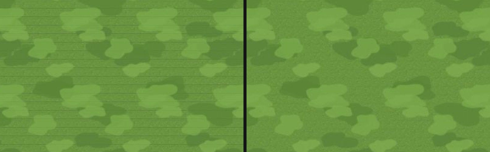

# 창조자의 눈 — 관찰 기록 62회: 고친 것 되밟기 — #1070 잔디 줄(59-ⓑ105) · #1067 판 전체 보기(56-ⓒ91)

> 목록 모음 전에 지난 모음(#1061) 뒤 머지를 훑었더니, 제 줄을 고친 PR 이 둘 있었습니다. 둘 다 바로 되밟았습니다.
> - **#1070 DECO-LAWN-SEAM-1**: 배율을 바꿔도 잔디에 칸마다 줄이 없게 — 캔버스 옮기는 값을 캔버스 픽셀 단위로(59-ⓑ105).
> - **#1067 MAC-WHOLEFRAME**: 판 전체 보기 = 열린 땅 + 둘레 여백 — 원본 마을이 화면의 1% 이던 것(56-ⓒ91).
>
> 본 판: main `37850fa`(두 PR 다 들어 있음 · merge-base 로 확인).
> - 꾸미기: 저장소 놀이판 `play.mjs` 8784 — 운영 DB · 학생 실데이터 0.
> - 마을: 제 서버 8781 · `?sid=guest&stage=origin` 새 프로필 · GPU(Metal).
> **코드 수정 0 · 화면 창 0** · 1366×610 · 끝나고 크롬 · 서버 · 놀이판을 모두 껐습니다. 잰 법은 59회 · 56회 그대로입니다.

## 한 줄
**둘 다 풀렸습니다 ✔.**
- 마당을 [전체] 뒤 [＋]로 봐도 잔디에 줄이 없습니다. 캔버스 투명도가 모두 255 이고, 사진 줄 세기도 0.3 안팎입니다(59회 7.7 · 14.3).
- 원본 판 전체 보기에서 마을이 화면의 약 8% 입니다(56회 약 1%). 집 · 길 · 개울 · 숲 테두리가 알아보입니다.

---

## 1. 잔디 줄 (59-ⓑ105 · #1070)

**사실(59회와 같은 차례 · 카드를 들지 않은 채)**

| 배율 | 59회 캔버스 알파 | **62회 캔버스 알파** | 59회 사진 줄 세기(가로 · 세로) | **62회** |
|---|---|---|---|---|
| [전체] 뒤 [＋]×2(한 칸 14) | 한 칸마다 205~220 | **모두 255** | 7.7 · 0.1 | **0.28 · 0.13** |
| [전체] 뒤 [＋]×3(한 칸 18) | (가로·세로 줄) | **모두 255** | 14.3 · 6.8 | **0.34 · 0.17** |

**해석** 🟢 — 59-ⓑ105 **닫힘 ✔**. 줄이 나던 배율(14 · 18)에서 잔디가 더는 '줄 그은 종이'가 아닙니다. 처음 배율(27)과 [전체](9)는 59회에도 줄이 없었습니다.

## 2. 판 전체 보기 (56-ⓒ91 · #1067)

**사실**
- 62회 판 전체 보기에서 원본 마을은 가로 약 393px · 세로 약 225px 마름모입니다. 1366 화면의 보이는 판(약 1366×396)에서 약 8% 입니다.
  - #1067 본문의 잰 값은 9.1% 입니다. 제 값은 사진 눈대중 마름모 넓이라 조금 작습니다.
  - 56회엔 약 145×80px(약 1%)이었습니다.
- 둘레에 여백(열린 땅 바깥 풀밭)이 남아, 마을이 '땅 한가운데 우리 마을'로 보입니다.
- (사실 · 줄 아님) 판 전체 보기에서 나오려고 단추를 다시 누르자, 단추가 '가까이 보기 해제'가 되고 카메라가 가까이 보기로 남았습니다. 37회에 적은 것과 같은 토글이라, 밤 판 전체 보기 사진은 못 찍었습니다.

**해석** 🟢 — 56-ⓒ91 은 화면 쪽이 섰습니다. 아이가 "우리 마을 전체"를 누르면 이제 마을이 보입니다. '땅이 이렇게 넓구나'는 줄었지만, 둘레 여백으로 아직 넓은 땅이 느껴집니다. 어느 쪽으로 읽을지는 여전히 교실에서 봅니다(ⓒ 줄은 확인으로 둠).

---

## 목록에 반영할 것 — 다음 '목록 모음' PR 에서

| 줄 | 후 |
|---|---|
| 59-ⓑ105 잔디 줄 | **닫힘(#1070) ✔62회** — 한 칸 14 · 18 에서 캔버스 알파 모두 255 · 사진 줄 세기 0.3 안팎(전 7.7 · 14.3) |
| 56-ⓒ91 판 전체 보기 1% | 확인 — #1067 열린 땅 + 둘레 여백 · 62회 원본 마을 약 8%(#1067 본문 9.1%) · 화면 쪽 ✔ |

# ⓐ 없음 · ⓑ 없음 · ⓒ 없음

## 미검증 · 한계
- 잔디는 1366 · 배율 둘(14 · 18)에서 봤습니다. 768 · 1920 · DPR 2 는 안 봤습니다.
- 판 전체 보기는 원본 · 낮 한 장입니다(바다 · 산 판 · 밤은 안 봄).
- 통과는 조작·표시 길만 뜻합니다.
