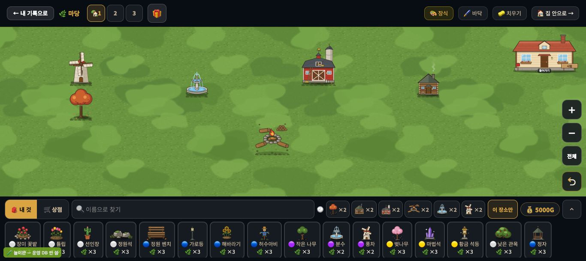
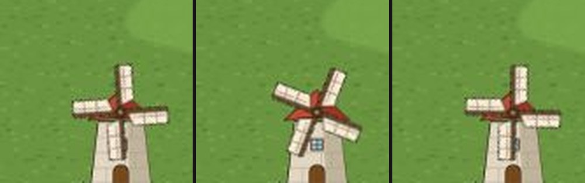
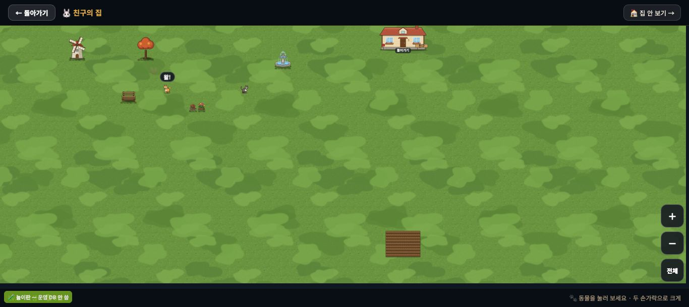

# 창조자의 눈 — 관찰 기록 63회: 꾸미기 새것 둘 — 움직임 층(#1065) · 친구 마당 구경(#1068)

> 막 머지된 꾸미기 새것 둘을 아이처럼 봤습니다.
> - **#1065 DECO-MOTION-1**: 풍차 날개가 돌고 · 분수 물줄기 · 헛간 풍향계 · 오두막 연기 · 모닥불이 산다.
> - **#1068 DECO-FRIEND-VIEW-1**: 친구 마당 구경을 확대·이동하고 동물을 눌러 본다(읽기 전용).
>
> 본 판: main `4ec2cae`(두 PR 들어 있음) · 저장소 꾸미기 놀이판 — 가짜 프로젝트 · 오프라인 · **운영 DB · 학생 실데이터 0**.
> **친구 놀이판(밝혀 둠)**: 놀이판의 부팅 파일 `play-boot.js` 를 **scratchpad 에 복사한 것만** 고쳐, 가짜 DB 에 친구 한 명('친구' · 강아지 · 고양이 · 풍차 · 분수 · 큰 나무 · 벤치 · 꽃 둘)을 더했습니다. 앱 파일은 작업 폴더 그대로입니다.
> 친구 창은 친구 줄의 `onclick` 과 같은 함수(`visitFriend`)로 열었습니다. 친구 목록이 첫 화면 아래 접힌 곳에 있어 제 헤드리스 화면에선 크기가 0 이었습니다. 창 안의 '🌸 꾸미기 보기'는 실제로 눌렀습니다.
> **코드 수정 0 · 화면 창 0** · 제 headless 크롬(GPU Metal) · firebase 요청 막음 · 1366×610 · 끝나고 크롬 · 놀이판을 껐습니다.

## 한 줄
**내 마당이 살아 움직입니다 ✔.** 풍차 날개가 돌고, 분수 물줄기와 모닥불이 그림을 바꾸고, 헛간 풍향계가 돌아서고, 오두막 연기가 떠오르며 옅어집니다. '움직임 줄이기'를 켜면 모두 멈춘 한 장으로 돌아갑니다.
**친구 마당은 '가 본 곳'이 됐습니다 ✔.** 친구 강아지를 누르면 "왈!"이 뜨고, ＋ · － · 전체 단추와 끌기로 둘러볼 수 있고, 친구 저장본은 그대로입니다.
한 가지(ⓑ107): **친구 마당의 풍차 · 분수는 움직이지 않습니다**(움직임 층 0). 내 마당에선 도는 풍차가 친구 집에선 멈춰 있습니다.

---

## 1. 움직임 층 (#1065)

**사실(장식 여섯을 놓고 · 0초 · 0.5초 · 2초 뒤에 층 안쪽을 읽음)**

| 장식 | 층 | 0초 → 0.5초 → 2초 |
|---|---|---|
| 풍차 `d_y11` | `deco-mv-rotate` | 회전 행렬이 계속 바뀜(날개 각도 셋 다 다름) |
| 분수 `d_y10` | `deco-mv-frames f3` | 그림 셋 가운데 보이는 것이 둘째 → 첫째 → 셋째 |
| 모닥불 `d_y68` | `deco-mv-frames f2` | 그림 둘이 번갈아 |
| 헛간 `d_y28`(풍향계) | `deco-mv-turn` | 좌우 뒤집기 0.99 → 0.65 → −1.00 |
| 오두막 `d_y33`(연기) | `deco-mv-rise` ×2 | 연기 둘이 떠오르며 커지고 옅어짐(반 박자 어긋남) |

- 층은 장식마다 하나씩 모두 5개입니다(큰 나무엔 없음).
- `prefers-reduced-motion: reduce` 를 켜면 층이 **0개**가 되고, 캔버스가 날개까지 그린 한 장을 보입니다.
- 놓을 때 알림은 평소대로입니다("✅ 🌀 풍차를 놓았어요" 등) · 오류 0.

**해석** 🟢 — '살아 있는 마당'(`docs/deco_living_yard_20260920.md`)의 첫걸음입니다. 풍차 · 연기처럼 늘 움직이는 것이 마당에 시간을 줍니다. 움직임 줄이기를 지켜, 어지럼을 타는 아이도 쓸 수 있습니다.
- #1065 가 적은 한계(층은 그 장식 앞줄의 키 큰 장식보다도 위에 그려짐)는, 제가 놓은 큰 나무가 풍차와 안 겹쳐 이번엔 못 봤습니다.

## 2. 친구 마당 구경 (#1068 · ⓑ107)

**사실**
- 친구 창 → '🌸 꾸미기 보기' → "🐰 친구의 집"(← 돌아가기 · 🏠 집 안 보기 →). 처음엔 친구 마당 전체가 한 화면에 들어옵니다.
- 강아지(17×34px) 한가운데를 누르면 **24ms** 에 "왈!"이 뜹니다. '+1 💗'(하트 셈)는 뜨지 않습니다(친구 동물이라 — #1068 본문과 같음).
- 오른쪽 아래 ＋ · － · 전체 단추(46px). [＋] 두 번이면 판 가운데가 커집니다. 끌면 판이 옮겨집니다.
- 누르기 · 확대 · 끌기 뒤에도 친구 저장본(`houseDecorations`)은 글자까지 같습니다. 내 마당 장식 수도 그대로(0)입니다.
- **움직임 층: 친구 마당엔 0개**입니다. 친구 마당의 풍차는 날개까지 그린 멈춘 그림, 분수도 멈춘 그림입니다.

**해석**
- 🟢 친구 집이 '작은 그림'이 아니라 **들어가서 둘러보고 동물을 불러 보는 곳**이 됐습니다. 읽기 전용이 지켜져, 남의 마당을 망칠 걱정이 없습니다.
- 🟡 **ⓑ107.** 내 마당에서 돌던 풍차가 친구 집에선 멈춰 있어, 친구 마당만 '사진'처럼 보입니다. #1068 의 뜻('가 본 곳')에 비해 덜 살아 있습니다. (가설) 친구 마당 그리기에도 움직임 층을 붙이면 풀릴 것입니다.
- (사실 · 줄 아님) 제 시험 친구는 장식이 위쪽에만 있어, [＋]를 누르면 장식이 화면 위로 밀렸습니다. 끌어서 찾을 수 있고, 실제 아이 마당에 따라 다릅니다.

---

## 목록에 반영할 것 — 다음 '목록 모음' PR 에서

| 줄 | 후 |
|---|---|
| **새 63-ⓑ107** | 친구 마당 구경에선 풍차 · 분수가 안 움직임(움직임 층 0) — 내 마당에선 돔 · 결 · 열림(꾸미기 추천) · 재는 법: 친구 마당에서 `.deco-mv` 수 |

# ⓐ 없음 · ⓑ 1(ⓑ107) · ⓒ 없음

## 미검증 · 한계
- 친구는 scratchpad 놀이판 복사본의 가짜 학생입니다(실제 반 친구 마당 · 친구 목록 누르기는 안 봄).
- 1366 · 마우스만 봤습니다. 두 손가락 확대(터치) · 트랙패드는 안 봤습니다.
- 움직임은 0.5초 · 2초 간격 세 번 읽었습니다(얼마나 매끄러운지 · 프레임은 안 잼).
- 밤 불빛(glow)은 #1065 가 '아직'이라 적었습니다.
- 통과는 조작·표시 길만 뜻합니다.
