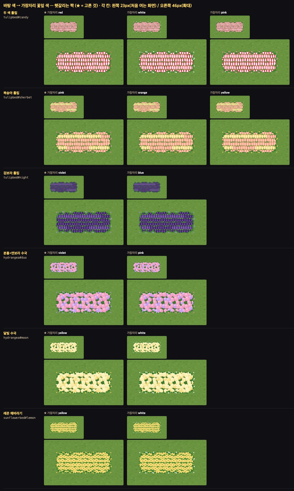

# 정원 바닥 — 바탕 색 → 가장자리(`bed_*`) 꽃잎 색 짝 표 (2026-09-20)

> 마당 꾸미기 디자인 담당. 프로그램 담당 ③(가장자리)이 **눈대중 없이** 쓰도록. 코드·표·그림 변경 0.
> 표기: 바탕 색은 `student.js` 의 `_FLOOR_COLORS` 이름 그대로(기본색 = `''`, 색 없음). 가장자리 색은 `assets/floor/bed_*.svg` 안에 실제로 있는 7가지 그대로.

## 가장자리 색 — 그림에 있는 7가지

`bed_*.svg#<색>`: **`pink`**(기본 — `#` 없이 불러도 pink) · `red` · `yellow` · `white` · `violet` · `orange` · `blue`.
마감 테두리(`rim_brick_*` · `rim_stone_*` · `rim_picket_*`)는 색이 없다 — 이 표는 **마감이 없을 때(자연)** 만 쓴다.

## 짝 표

| 바닥 | 바탕 색 (`_FLOOR_COLORS`) | → 가장자리 `bed_*#` |
|---|---|---|
| `tulipbed` · `tulipcol` | `''`(기본 분홍) | `pink` |
| | `red` | `red` |
| | `yellow` | `yellow` |
| | `white` | `white` |
| | `violet` | `violet` |
| | `orange` | `orange` |
| | `candy` | **`red`** |
| | `sherbet` | **`pink`** |
| | `night` | **`violet`** |
| `hydrangea` | `''`(기본 파랑) | `blue` |
| | `violet` | `violet` |
| | `pink` | `pink` |
| | `white` | `white` |
| | `duo` | **`violet`** |
| | `moon` | **`yellow`** |
| `lavender` | `''`(기본 보라) | `violet` |
| | `pink` | `pink` |
| | `white` | `white` |
| `sunflowerbed` | `''`(기본 노랑) | `yellow` |
| | `orange` | `orange` |
| | `lemon` | **`yellow`** |
| `daisyfield` | `''`(기본 흰색) | `white` |
| | `yellow` | `yellow` |
| | `pink` | `pink` |
| `wildflower` | `''` · `rainbow` · `snow` | **가장자리 없음** — 풀밭의 한 종류(`deco_showcase_yard` §1) |

굵은 것 = 이름이 같지 않아 **눈으로 골랐다**. 나머지는 이름이 같은 색(그림의 꽃 색 값도 같다).

### 그대로 붙여 쓸 모양 (참고)

```js
const _BED_COLOR = {
  tulipbed:     { '': 'pink', red: 'red', yellow: 'yellow', white: 'white', violet: 'violet', orange: 'orange', candy: 'red', sherbet: 'pink', night: 'violet' },
  tulipcol:     { '': 'pink', red: 'red', yellow: 'yellow', white: 'white', violet: 'violet', orange: 'orange', candy: 'red', sherbet: 'pink', night: 'violet' },
  hydrangea:    { '': 'blue', violet: 'violet', pink: 'pink', white: 'white', duo: 'violet', moon: 'yellow' },
  lavender:     { '': 'violet', pink: 'pink', white: 'white' },
  sunflowerbed: { '': 'yellow', orange: 'orange', lemon: 'yellow' },
  daisyfield:   { '': 'white', yellow: 'yellow', pink: 'pink' },
};   // wildflower 는 가장자리를 그리지 않는다
```

`_FLOOR_COLORS` 에 색이 늘면 이 표에도 한 줄 — 표에 없는 바탕 색은 **그 바닥의 기본 짝**(`''` 줄)으로.

## 헷갈리는 짝 — 나란히 놓고 고름



풀밭 가운데 5×2 꽃밭, 각 칸 왼쪽 = 칸 23px(처음 여는 화면) · 오른쪽 = 46px(확대). ★ = 고른 것.

- **두 색짜리는 '둘째 색'(덜 칠한 쪽)을 가장자리로**: `candy`(흰 바탕 + 빨강 무늬) → `red`, `duo`(분홍 + 연보라) → `violet`. 경계에서도 두 색이 다 보여 '두 색 밭'으로 읽힌다. `candy` 에 `white` 를 두르면 떨어진 흰 꽃잎이 풀 위에서 **흰 점**으로 튄다(점박이 — 피한 모양).
- `sherbet`(복숭아) → `pink`: `orange` 는 복숭아보다 짙어 가장자리만 따로 논다.
- `night`(검보라) → `violet`: 같은 계열 중 유일. 검보라 떨어진 꽃잎은 풀 위에서 안 보인다 — 밝은 보라라야 가장자리가 보인다.
- `moon`(달빛 연노랑) · `lemon` → `yellow`: `white` 는 흰 점이 튄다.
- `rainbow` · `snow` 는 들꽃 잔디 색이라 가장자리가 없다(물을 필요 없음).
