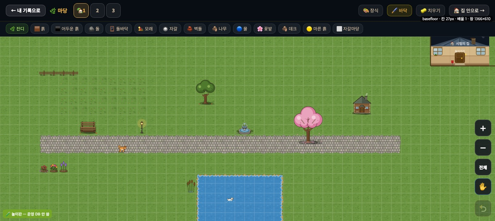
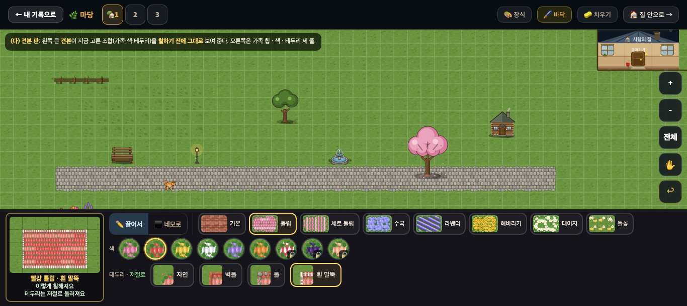
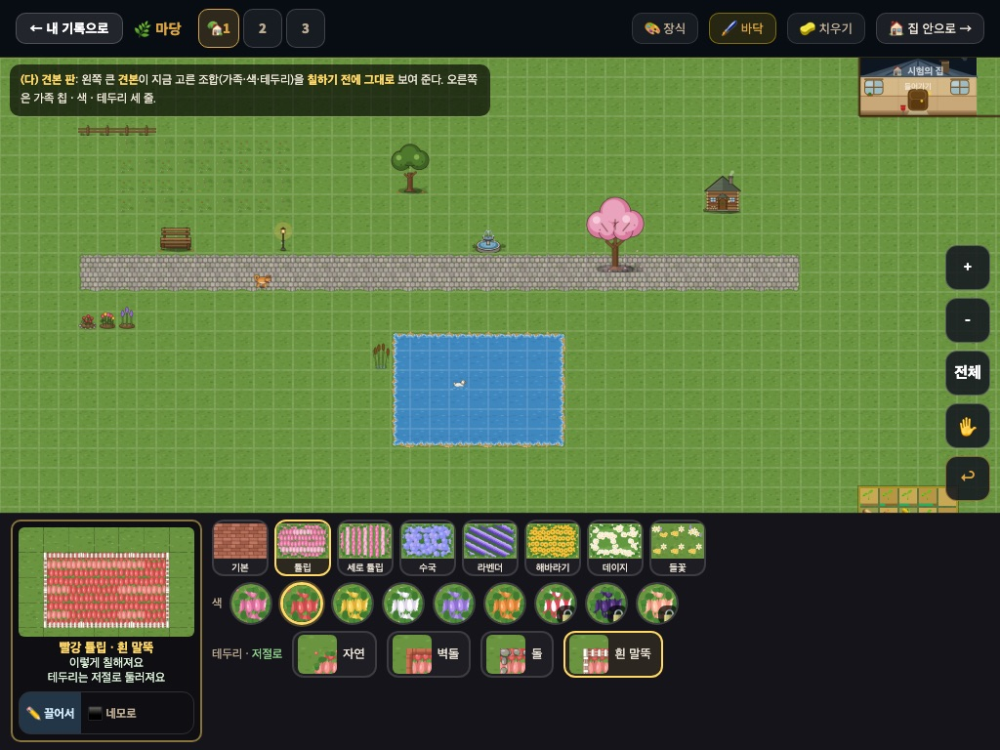
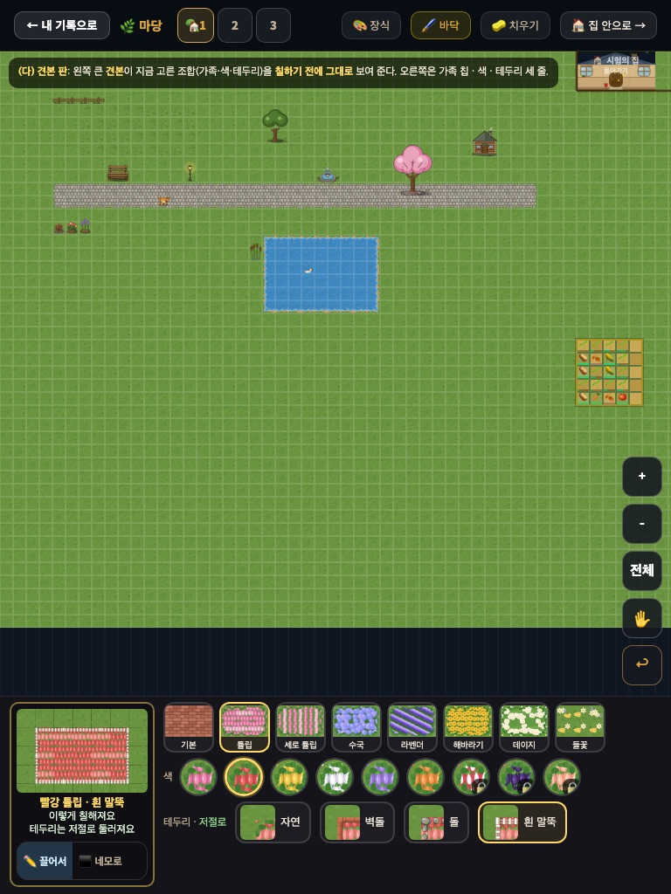
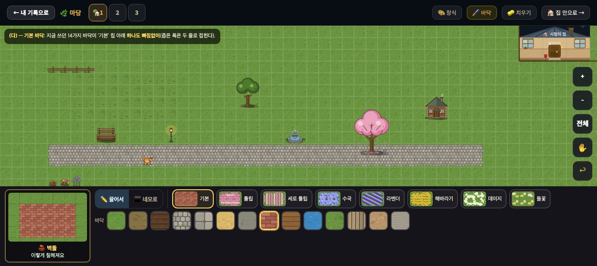
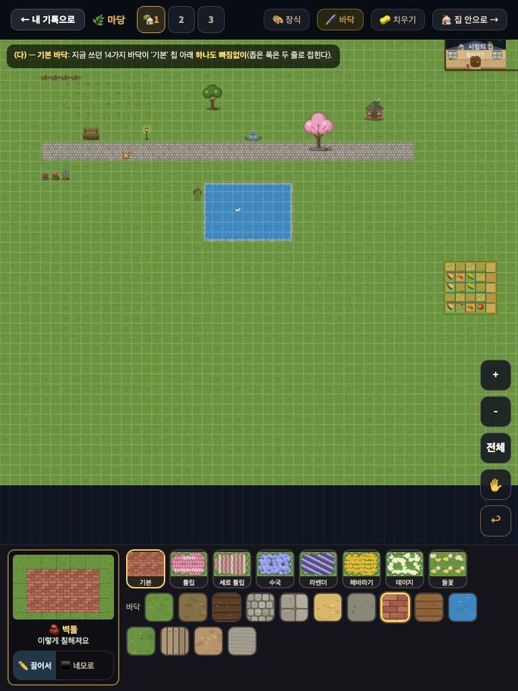
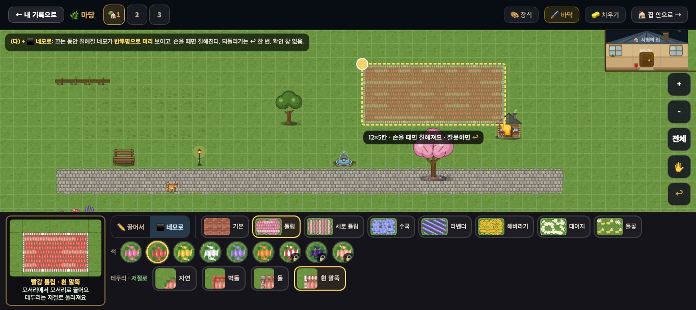
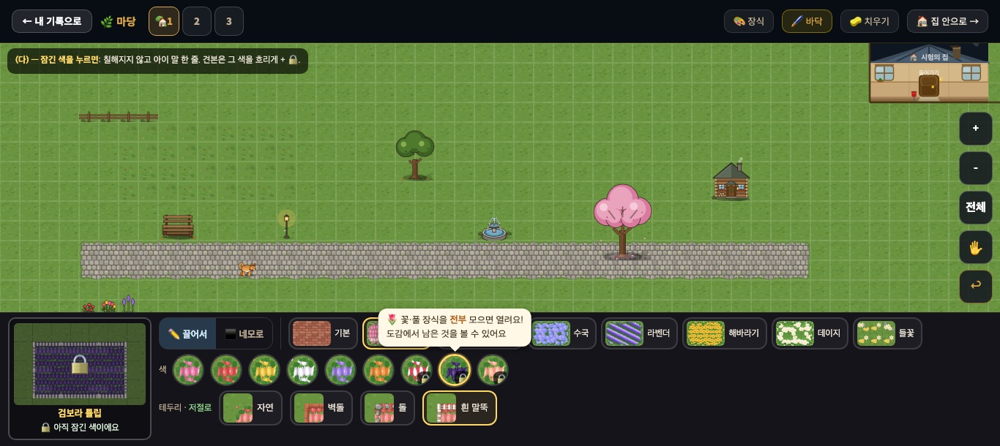

# 마당 꾸미기 — 바닥 고르기 화면 규칙 (2026-09-20)

> 마당 꾸미기 디자인 담당 · **확정 시안 + 규칙 표**. 보스 결정 = **(다) 견본 판 + [✏️ 끌어서 | ⬛ 네모로]**.
> **프로그램 담당이 이 문서만 보고 만들 수 있게** 썼다. 코드·표·그림 변경 0.
> 시안은 놀이판(운영 DB 미접속)에서 **지금 🖌 바닥 모드를 그대로 찍고**, 그 위에 지금 화면에서 뽑은 스타일 값(서랍 · 기둥 46px · 단추)으로 얹었다. 카드·견본 그림은 **실제 바닥 SVG** 를 그 자리에서 캔버스에 그린 것이다(칠해질 모습 그대로). 그림: `docs/img/deco_floor_picker_20260920/`.
> 저장값 표기 `이름#색+마감` 은 `docs/deco_showcase_yard_20260920.md` 와 **글자 하나까지 같다**.

---

## 0. 지금 → 바뀐 뒤

| 그림 | 무엇 |
|---|---|
|  | **지금** — 위쪽 `#if-floor-row` 에 글자 단추 14개(높이 28px — 44px 미달), 그림 없음. 1366 에서 42px, 768 에서 77px(두 줄)을 마당 위에서 먹는다 |
|  | **바뀐 뒤 · 정원** 1366×610 — 위쪽 줄은 없어지고 **아래 서랍 자리**가 바닥 고르기가 된다 |
|  | 같은 장면 1024×768 — 칩이 '그림 위 · 이름 아래' 네모로, 도구 토글은 견본 아래로 |
|  | 같은 장면 768×1024 |
|  | **기본** 칩 — 지금 쓰던 14바닥이 **지금 순서 그대로** 한 줄 |
|  | 기본 칩 768 — 14개가 **두 줄로 접혀 하나도 안 잘린다** |
|  | **⬛ 네모로** — 끄는 동안 칠해질 네모가 반투명으로 미리 |
|  | **잠긴 색**을 눌렀을 때 — 칠하지 않고 아이 말 한 줄 |

(그림 속 까만 설명 상자는 시안 설명이다 — 실제 화면에는 없다. 세 안 비교 시트·지금 화면 세 폭은 저장소 밖 `우리반RPG/보고_20260919/화면시안_바닥고르기/`.)

**떨어진 안(기록):** (가) 가족 카드 → 색 줄 + 테두리 줄 — 카드 그림은 좋지만 서랍이 두 줄이라 1366×610 에서 마당 54%. (나) [기본|정원] 탭 + 카드 위 점 — 점이 44px 이 안 돼 보여주기만 하고, 펼치면 1366×610 에서 마당 47%(조건 위반).

---

## 1. 서랍 배치 — 세 폭

바닥 모드(`#if-mode-floor`)에 들어가면 **위쪽 `#if-floor-row` 는 없애고**, 지금 접히는 아래 서랍 자리(`body.deco-floor-mode`)에 이 판을 연다. 서랍 바탕·테두리는 지금 서랍 그대로(`#141419` · 위 테두리 `1px rgba(255,255,255,.08)` · 안쪽 여백 `6px 11px 8px`).

```
W ≥ 1200 (크롬북 1366×610)
┌견본────────┐ [✏️ 끌어서|⬛ 네모로] │ [기본][튤립][세로 튤립][수국][라벤더][해바라기][데이지][들꽃]   ← 1줄: 가족 칩
│ 180×112    │ 색  ● ● ● ● ● ● ●🔒●🔒●🔒                                                   ← 2줄: 색(정원) / 14바닥(기본)
│ 이름       │ 테두리 · 저절로  [자연][벽돌][돌][흰 말뚝]                                    ← 3줄: 테두리(정원만)
└캡션────────┘

W < 1200 (1024×768 · 768×1024)
┌견본────────┐ [기본][튤립][세로 튤립] … [들꽃]    ← 칩 58×58: 그림 위 · 이름 아래
│ 180×112    │ 색 ● ● ● …   /  기본이면 14바닥 — 넘치면 두 줄로 접힘
│ (W<900:    │ 테두리 · 저절로 [자연][벽돌][돌][흰 말뚝]
│  150×96)   │
│ 이름·캡션   │
│[✏️ 끌어서|⬛ 네모로] ← 도구 토글은 견본 아래
└────────────┘
```

| | 1366×610 | 1024×768 | 768×1024 |
|---|---|---|---|
| 견본 | 180×112 | 180×112 | 150×96 |
| 도구 토글 자리 | 1줄 맨 앞(칩 앞, 가는 세로줄로 가름) | 견본 아래 | 견본 아래 |
| 가족 칩 | 높이 44 · 그림 52×34 + 이름 12px 옆 | 58×58 · 그림 54×40 + 이름 10px 아래 | 같음 |
| 기본 14바닥 | 한 줄 | 한 줄 | **두 줄로 접힘** |
| **마당 보이는 비율**(서랍 위 마당 높이 ÷ 화면 높이, 시안에서 잼) | 정원 59% · 기본 60% | 61% · 62% | 72% · 73% |

- 조건 "1366×610 에서 마당 절반 넘게" — 가장 높은 상태(정원 = 세 줄)에서 **59%**. 서랍은 **최대 세 줄**, 넘치면 늘리지 말고 옆으로 넘긴다(가족 칩 · 색 줄). 기본 14바닥만 접힌다(아이가 쓰던 바닥이 안 보이면 안 되니까).
- **기둥(＋ － 전체 ✋ ↩)** 은 지금 그대로: 오른쪽, `bottom = 서랍 높이 + 12`. 되돌리기 `↩` 자리·모양 변경 없음. 🧽 치우기 단추(위쪽 막대) 변경 없음.
- 모든 누를 곳 **44px 이상**(칩 44·58, 색 동그라미 44, 바닥 네모 44, 테두리 48, 도구 토글 44).

## 2. 견본 판 — "칠하기 전에 이렇게 된다"

| 자리 | 값 |
|---|---|
| 틀 | 반지름 10 · 테두리 `2px rgba(255,216,102,.5)` · 바탕 `rgba(0,0,0,.25)` · 여백 6 |
| 그림 | **7×5 칸 판**: 잔디(`tile_grass_a~d`, 마당과 같은 변형 식) 가운데 **3×5 칸**을 고른 조합으로 칠한 것. 꽃밭이면 둘레에 **실제 가장자리/마감 조각**까지 — 마당에서 쓰는 그리기 함수 그대로 쓰면 된다 |
| 이름 줄 | 13px 굵게 `#ffd866`: 정원 `빨강 튤립 · 흰 말뚝` / 기본 `🧱 벽돌`(지금 단추 글자 그대로) |
| 캡션 | 12px `#dff5dc`: `이렇게 칠해져요` + 꽃밭이면 둘째 줄 **`테두리는 저절로 둘러져요`** / 네모로 도구면 첫 줄이 `모서리에서 모서리로 끌어요` |

**견본이 바뀌는 때** — 칩·색·테두리 중 무엇을 눌러도 **바로** 그 조합으로 다시 그린다. 칠하지 않아도 바뀐다(고르는 것 = 미리 보기). 도구 토글은 캡션만 바꾼다.

- 기본 칩 아래 14바닥은 **그림만**(글자 없음) — 이름은 견본의 이름 줄이 말해 준다. 그래서 이름 줄은 빼면 안 된다.
- 들꽃 잔디(`wildflower`)는 가장자리가 없는 풀밭 종류라 견본에도 테두리가 없고, 둘째 캡션 줄·테두리 줄이 **안 뜬다**.

## 3. 가족 칩 · 색 · 테두리 — 상태별 생김새

### 3-1. 가족 칩 (1줄) — 순서 고정

`기본 · 튤립 · 세로 튤립 · 수국 · 라벤더 · 해바라기 · 데이지 · 들꽃`

| 상태 | 테두리 | 바탕 | 그림 |
|---|---|---|---|
| 보통 | `2px rgba(255,255,255,.14)` | `rgba(255,255,255,.04)` | **3×2 칸** 꽃밭(그 가족의 기본 색 + 자연 가장자리) — 한 칸짜리는 1366 에서 튤립/세로 튤립, 수국/라벤더가 구별이 안 됐다(보스 ⓐ). 기본 칩은 벽돌 3×2 |
| 고름 | `2px #ffd866` | `rgba(255,216,102,.1)` | 같음 |

- 칩 이름은 짧게(위 순서의 글자 그대로). **아이는 그림으로 고른다** — 그림을 키우고 글자를 줄였다.
- 칩을 누르면 그 가족의 **마지막으로 쓴 색**(처음이면 기본 색)과 **마지막으로 쓴 테두리**(처음이면 자연)로 견본이 바뀐다.

### 3-2. 색 (2줄, 정원일 때)

| 상태 | 생김새 | 누르면 |
|---|---|---|
| 열림 | 44px 동그라미, 안에 그 색 꽃밭 한 칸, 테두리 `2px rgba(255,255,255,.18)` | 그 색으로 고름 |
| 고름 | 테두리 `3px #ffd866` + 바깥 `0 0 0 2px rgba(255,216,102,.25)` | — |
| **잠김** | 열림과 같은 그림 + 오른쪽 아래 **🔒 12px**(검은 반투명 바탕) — 그림은 흐리게 하지 않는다(갖고 싶게) | **칠하지 않는다.** 동그라미 위에 말풍선 한 줄(아래) + 견본을 그 색으로 그리되 **어둡게 + 가운데 🔒**, 이름 줄 아래 `🔒 아직 잠긴 색이에요`. 2.5초 뒤(또는 다른 곳을 누르면) 말풍선이 닫히고 **고른 것은 누르기 전 열린 색 그대로** |

- 말풍선: 바탕 `#fff8e6` · 글자 `#3a2c14` 13px · 반지름 12 · 아래 꼬리. 문구는 **무엇을 모으면 열리는지 한 줄**(아이 말, 혼내지 않기) — 열림 조건과 색 이름은 `docs/deco_garden_family_20260920.md` 의 '열린 색 / 잠긴 색' 표가 원본. 예: `#night` → `🌷 꽃·풀 장식을 전부 모으면 열려요! / 도감에서 남은 것을 볼 수 있어요`.
- 색 순서: **기본 색 먼저**, 그다음 열린 색, 잠긴 색은 뒤로(시안 순서).

### 3-3. 테두리 (3줄, 정원일 때 · 들꽃 제외)

`자연 · 벽돌 · 돌 · 흰 말뚝` — 줄 이름 `테두리 · 저절로`(`저절로` 는 `#8fd18a`).

| 상태 | 생김새 |
|---|---|
| 보통 | 높이 48 · 반지름 12 · 테두리 `2px rgba(255,255,255,.14)`. 그림 40×40 = **지금 고른 꽃밭의 모퉁이를 확대해 자른 것**(그 마감이 둘러진 모습) — 통째 작은 판은 넷이 구별이 안 됐다 |
| 고름 | 테두리 `#ffd866` · 바탕 `rgba(255,216,102,.1)` |

- **테두리는 칠하는 것이 아니다**: 고른 테두리는 저장값의 `+마감` 이 되어 꽃밭 둘레(이웃이 꽃밭 무리가 아닌 변)에 **저절로** 그려진다(`deco_showcase_yard` §1). 아이에게 보이는 말도 '둘러져요'뿐 — '테두리 칠하기' 같은 말을 쓰지 않는다.

### 3-4. 기본 (2줄, 기본 칩일 때) — 지금 14바닥 그대로

지금 단추 순서 그대로: `grass 잔디 · dirt 흙 · dark_earth 어두운 흙 · stone 돌 · stone_floor 돌바닥 · sand 모래 · gravel 자갈 · brick 벽돌 · wood 나무 · water 물 · flower 꽃밭 · deck 데크 · dry_earth 마른 흙 · gravel_yard 자갈마당`.
44×44 네모(반지름 10) 안에 그 바닥 한 칸. 고름 = `3px #ffd866`. 좁은 폭은 **두 줄로 접는다**(옆으로 넘기지 않는다 — 쓰던 바닥이 사라져 보이면 안 된다, 보스 ⓓ). 옛 `flower`(꽃밭)도 그대로 남긴다.

## 4. 저장값과의 대응 — `이름#색+마감`

`docs/deco_showcase_yard_20260920.md` §1 과 같은 표기. 고른 상태 → `CUR_FLOOR_TILE` 문자열:

| 고른 것 | 저장값 | 규칙 |
|---|---|---|
| 기본 칩 · 벽돌 | `brick` | 지금 값 그대로(14가지) |
| 튤립 · 분홍(기본 색) · 자연 | `tulipbed` | **기본 색이면 `#색` 을 안 붙인다** |
| 튤립 · 빨강 · 흰 말뚝 | `tulipbed#red+picket` | |
| 세로 튤립 · 노랑 · 자연 | `tulipcol#yellow` | **자연이면 `+마감` 을 안 붙인다** |
| 수국 · 파랑(기본) · 돌 | `hydrangea+stone` | |
| 수국 · 분홍 · 자연 | `hydrangea#pink` | |
| 라벤더 · 보라(기본) · 벽돌 | `lavender+brick` | |
| 데이지 · 흰(기본) · 자연 | `daisyfield` | |
| 들꽃 · 무지개 | `wildflower#rainbow` | 들꽃은 **`+마감` 이 없다**(테두리 줄이 안 뜬다) |

| 칩 | 이름 | 기본 색(`#` 없음) | 다른 색 `#` 값 | 마감 `+` 값 |
|---|---|---|---|---|
| 튤립 | `tulipbed` | pink | red yellow white violet orange · 특별 candy sherbet night | brick stone picket |
| 세로 튤립 | `tulipcol` | pink | (튤립과 같음) | brick stone picket |
| 수국 | `hydrangea` | blue | violet pink white · 특별 duo moon | brick stone picket |
| 라벤더 | `lavender` | violet | pink white | brick stone picket |
| 해바라기 | `sunflowerbed` | yellow | orange lemon | brick stone picket |
| 데이지 | `daisyfield` | white | yellow pink | brick stone picket |
| 들꽃 | `wildflower` | meadow | 특별 rainbow snow | — |

(색 값 = 각 `tile_<이름>_a.svg` 안 `#색:target` 이름 그대로. 기본 색은 파일 머리 주석의 '기본'.)

- **거꾸로 읽기**: 바닥 모드를 열 때 지금 `CUR_FLOOR_TILE` 을 풀어 칩·색·테두리를 고른 상태로 맞춘다. 처음이면 지금처럼 `grass`(기본 칩 · 잔디). 옛 값(`#`·`+` 없음)은 그대로 읽힌다(#469).
- 같은 값으로 이미 칠해진 칸을 한 번 누르면 풀로 되돌리는 지금 규칙(`_paintFloor`)은 그대로 — 저장값 문자열이 같을 때만(색·마감이 다르면 덮어 칠한다).

## 5. 도구 — [✏️ 끌어서 | ⬛ 네모로]

높이 44 · 반지름 12 · 고른 쪽 바탕 `rgba(93,173,226,.25)` · 글자 `#cfe8f7`. 처음은 **✏️ 끌어서**(지금 DECO-DRAG-1 그대로), 고른 도구는 기억.

| | ✏️ 끌어서 (지금) | ⬛ 네모로 (새로) |
|---|---|---|
| 한 번 누름 | 한 칸 칠함 | 한 칸 칠함(같음) |
| 한 손가락 끌기 | 지나간 칸을 칠함 | **시작 칸 ↔ 지금 칸을 모서리로 하는 네모**를 미리 보여 줌 |
| 끄는 동안 보이는 것 | 칸이 바로 바뀜 | 칠해질 네모 = **고른 조합을 반투명(알파 .55)으로** + 금색 점선 테(`3px dashed #ffd866`) + 시작 모서리에 금색 점 + 아래에 `12×9칸 · 손을 떼면 칠해져요 · 잘못하면 ↩` |
| 손을 뗌 | — | 네모 안 칸을 **한꺼번에** 칠함(집·밭 칸은 지금처럼 건너뜀) |
| 되돌리기 | ↩ 한 번 = 한 획 | **↩ 한 번 = 네모 하나 통째로** |
| 확인 창 | 없음 | **없음** — 마당 절반만 한 네모도 ↩ 한 번이면 돌아간다(보스 ⓑ). 뗄 때 짧은 토스트도 없다(네모가 바로 보이니까) |
| 지우기 | 시작 칸이 같은 바닥이면 '지우기'로 감 | **지우지 않는다**(칠하기만). 넓게 지우려면 기본 칩 · 잔디로 네모 |
| 두 손가락 | 확대·이동 | 확대·이동(같음) |

- 미리보기 네모는 장식 **아래**(바닥 층)에 그려도, 위에 반투명으로 그려도 된다 — 시안은 위에 얹었다. 중요한 것은 '어디까지 칠해지는지'가 끄는 내내 보이는 것.

## 6. 본보기 마당을 만드는 손놀림 수 — 왜 '네모로'인가

본보기 마당(`deco_showcase_yard_20260920.md`)의 장면 데이터로 셈: 바닥 **18구역 · 628칸 · 값 11가지**, 장식 **24종 36개**.

| | 끌어서만 (지금) | 네모로 있으면 |
|---|---|---|
| 바닥 고르기(칩·색·테두리 누름) | 17 | 17 |
| 바닥 칠하기 | 66획(한 줄에 한 번) | **18획**(구역마다 한 번) |
| 장식(카드 24 + 놓기 36) | 60 | 60 |
| **합계** | **약 143** | **약 95** |

바닥 손놀림 **83 → 35**. 장식 60은 이 화면 밖(서랍 카드) 몫이라 그대로 둔다.

---

## 프로그램 담당에게 — 만들 것 요약

1. 바닥 모드에서 `#if-floor-row` 대신 아래 서랍 자리에 이 판(견본 + 세 줄). 폭 1200 기준으로 칩 모양·도구 토글 자리만 바뀐다.
2. 견본 = 마당과 같은 바닥 그리기 함수로 7×5 판을 그린다(가장자리·마감 포함).
3. 저장값은 §4 표 그대로(기본 색·자연은 생략). 거꾸로 읽어 상태 맞추기.
4. 잠긴 색 = 칠하지 않고 말풍선 + 견본 어둡게. 열림 조건은 `deco_garden_family` 표.
5. ⬛ 네모로 = 반투명 미리보기 → 떼면 한꺼번에 → ↩ 한 단계 · 확인 창 없음 · 지우기 없음.
