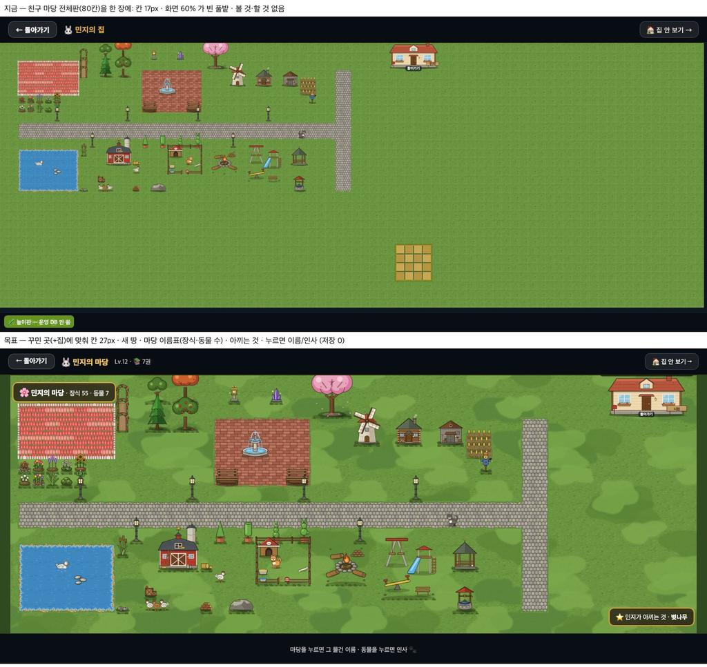
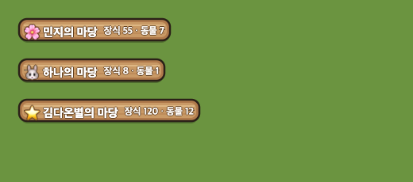

# 친구 마당 구경 — 꾸민 곳에 맞춤 · 이름표 · 아끼는 것 (2026-09-24)

> 쓴 사람: 꾸미기 디자인 담당. 보스 결정(09-23): ①~⑤ **진행**(저장 0) · 친구에게 남기는 반응(멋져요 · 꽃 두고 가기)은 **보류**. 반응은 운영 Firebase 쓰기와 교사 관리가 필요하기 때문이다.
> 이 문서와 그림 PR 에서 **코드 · 저장 · 표 · 경제 값 변경 0.**



## 무엇이 바뀌나 (프로그램 담당 몫)
| | 무엇 | 저장 |
|---|---|---|
| ① 꾸민 곳에 맞춤 | 장식 · 깐 바닥 · 집을 두른 상자에 둘레 한 칸을 둔다. 칸 = `min(W/폭, H/높이)`(상한 44px), 가운데 놓기. 1366 에서 17 → **27px**, 768 에서 9 → 약 **15~18px** | 없음 |
| ② 새 땅 | `deco_ground_20260923.md` 의 풀빛 얼룩 · 밑동 풀 · 계절 | 없음 |
| ③ 마당 이름표 | `🌸 민지의 마당 · 장식 55 · 동물 7` — 왼쪽 위, 아래 나무판 | 없음(세어서) |
| ④ 아끼는 것 | 가장 희귀도가 높은 장식 하나 — 같으면 가장 큰 것. 오른쪽 아래 | 없음(표에서 고름) |
| ⑤ 누르면 | 물건은 이름, 동물은 인사(내 마당의 누르기와 같은 말) | 없음 |

- `_renderFriendCanvas` 가 마당일 때 `C = floor(W / DY.cols)` 대신 꾸민 곳 상자에 맞춘다. 집 안의 방 맞춤(`fRooms`)과 같은 모양이다.
- 동물 층 `_animSyncLayer` 에도 같은 C 와 옮김을 넘긴다.

## 이름표 판 — `assets/deco/ui_wood_sign.svg`


```css
border-style: solid;
border-image: url(assets/deco/ui_wood_sign.svg) 14 24 18 24 fill / 14px 24px 18px 24px stretch;
color: #fff; font-weight: 800;
text-shadow: 0 1px 0 #5a3a1c, 0 -1px 0 #5a3a1c, 1px 0 0 #5a3a1c, -1px 0 0 #5a3a1c;
```
- 120×48 나무판이다. 둥근 모서리와 못 두 개가 있고, 가운데는 결 무늬만 있다.
- 글이 길어져도 결만 늘어난다. 이름이 긴 친구도 판이 깨지지 않는다.
- 이름표 · 아끼는 것 · 스티커 첩 머리 같은 **나무 글판**에 같이 쓴다.
