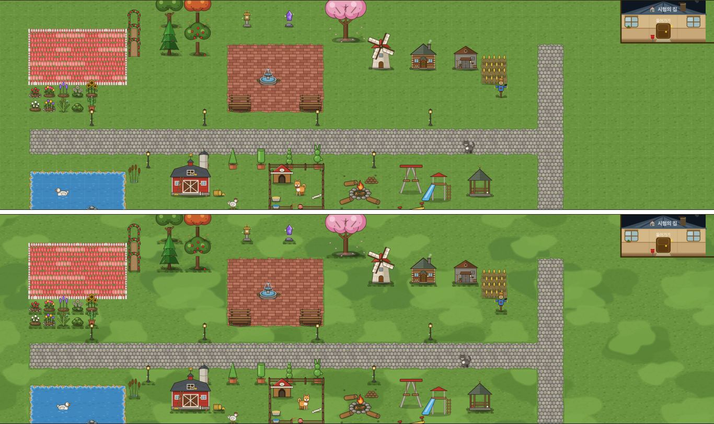
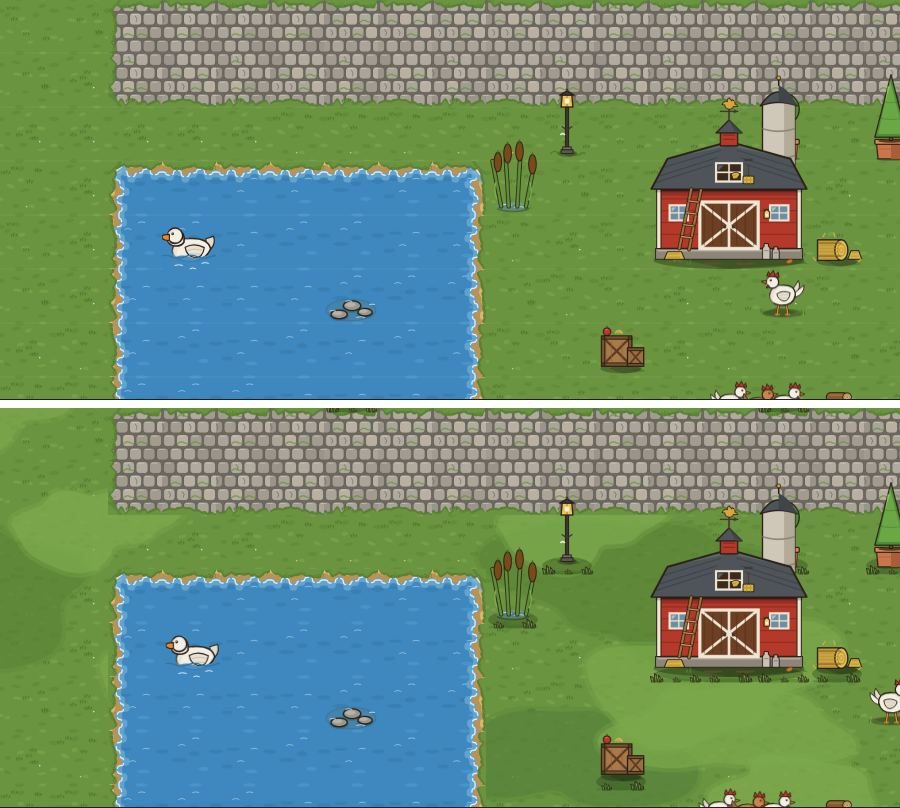

# 마당 땅 — 풀빛 얼룩 · 밑동 접지 · 모눈은 고를 때만 (2026-09-23)

> 쓴 사람은 꾸미기 디자인 담당이다. 기준은 창조자 31회 ⓑ71 — 한 가지 초록에 늘 보이는 모눈선이 있어서, 스티커를 모눈종이에 붙인 모습이었다.
> 보스가 **추천안 그대로** 골랐다(09-23). 이 문서와 그림 PR 에서는 **코드 · 저장 · 표 · 경제 값을 바꾸지 않는다.** 그리는 코드는 꾸미기 프로그램 담당 몫이다.

사진 설명:
- 놀이판(운영 DB 0)의 실제 화면에 놀이판 전용 훅을 끼워 찍었다.
- 아래 사양을 그대로 흉내 낸 것이다.

## 그림 — `assets/floor/`
| 그림 | 크기 | 쓰는 법 |
|---|---|---|
| `grass_patch_light.svg` | 900×900 = **9×9칸 주기** | 밝은 연두 덩어리 다섯. 반투명(.62 + 부드러운 가장자리 .3)이라 잔디 풀잎 결이 비친다 |
| `grass_patch_dark.svg` | 1300×1300 = **13×13칸 주기** | 짙은 풀 덩어리 일곱. 두 주기가 겹쳐 **117칸마다만 되풀이**된다 |
| `ground_tuft_a.svg` · `ground_tuft_b.svg` | 100×40 | 물건 밑동의 풀 덮임과 짙은 풀 띠. 칸마다 a · b 를 번갈아 쓴다 |

## 그리는 법 (칸 C 기준)
- **얼룩**
  - 어디에 그리나: `_drawFloorSVG` 가 바탕을 그린 뒤, `_floorIsGrass(type)` 인 칸(잔디 · 옛 꽃 · 들꽃 잔디)에만 그린다.
  - 무엇을: 짙은 판의 `(c%13, r%13)` 조각과 밝은 판의 `(c%9, r%9)` 조각. 조각 하나는 100 단위 한 칸이고, `(px, py, C, C)` 에 붙인다.
  - 판은 한 번 비트맵으로 구워 둔다. 시안은 한 칸 64px 로 구웠다.
  - 가장자리 조각(물가 · 잔디 번짐)은 지금처럼 **그 뒤에** 그린다.
- **밑동 접지**
  - 무엇에: `_drawDecoSVG` 로 그리는 마당 물건. 동물(`ANIM_DECO`)과 울타리(`d_y49~52` · `d_y70~72`)는 뺀다. 울타리 그림에는 풀이 이미 들어 있다.
  - 그리기 **전** — 발자리 바닥 가운데 칸이 잔디이면 그림자 타원을 그린다:
    - 중심 `(px+bw/2, py+bh−.06C)`
    - 반지름 `bw×.46 · .16C`
    - 색 `rgba(30,52,14,.30)`
  - 그린 **뒤** — 맨 아래 줄 칸마다, 그 칸이 잔디이면 `ground_tuft_a|b` 를 `(x, py+bh−.3C, C, .4C)` 에 그린다.
  - 돌길 · 벽돌 · 물 위의 물건에는 둘 다 그리지 않는다.
- **모눈**
  - `_drawYard` 의 `// 격자` 줄(`rgba(255,255,255,.12)`)을 **물건을 든 동안(`SEL_DECO`)이나 바닥 모드일 때만** 그린다.

## 한계
- 얼룩의 색과 세기는 디자인 담당이 눈으로 정했다. 진한 대안은 위장무늬처럼 보여서 뺐다.
- 768 화면은 보지 않았다. 얼룩은 칸 단위라 화면이 작아지면 같은 모양으로 줄어든다.
- 늘어나는 일은 칸마다 drawImage 두 번이다. 크롬북 성능은 **재지 않았다** — 구현 뒤 `perf` 로 잰다.
