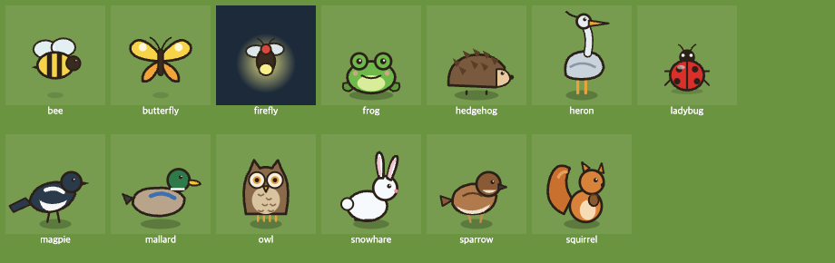
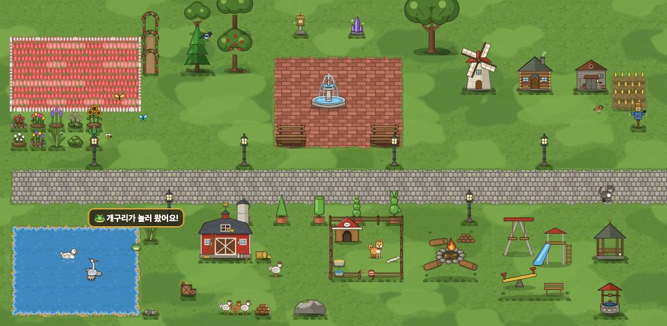
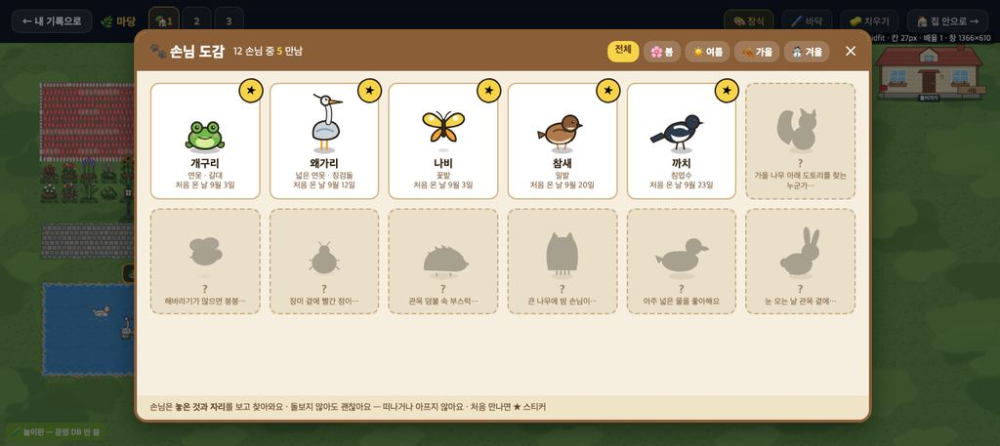
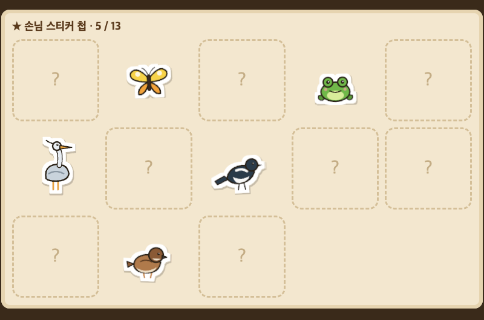
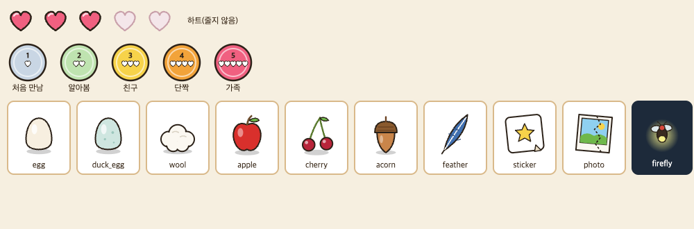
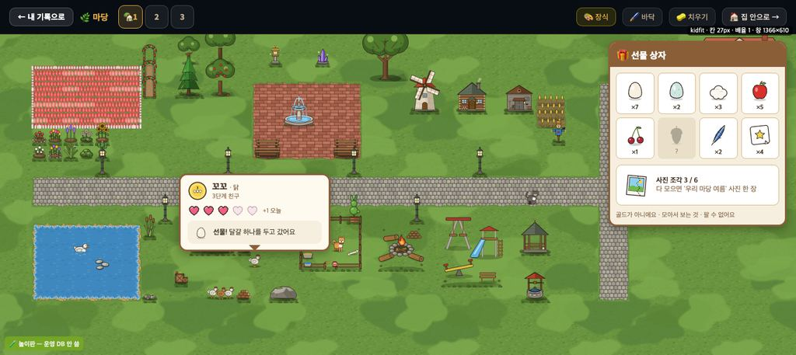

# 손님 도감 · 친해지기 · 작은 선물 — 그림과 표 (2026-09-24)

> 쓴 사람은 꾸미기 디자인 담당이다. 사용자 승인(09-24)과 보스 확정 셋(손님 도감 · 친해지기 · 작은 선물)을 따른다.
> - 저장 설계(처음 온 날 · 하트 · 단계 · 이름 · 받은 선물)는 프로그램 담당의 `docs/deco_guests_design.md` 몫이다. 이 문서의 표는 그 문서와 **같은 이름**을 쓴다.
> - 이 PR 은 그림과 표만 다룬다. **코드 · 저장 · 표(gamedata) · 경제 값 변경 0.** 그림은 코드가 부르기 전에는 게임에 나오지 않는다.

## 원칙
- **돌봄 의무 · 벌 없음.** 손님과 동물은 떠나거나 아프거나 굶지 않는다. 하트는 **줄지 않는다.**
- 손님은 **놓은 것 + 자리(+ 계절 · 때)** 를 보고 온다. 아이가 꾸미는 대로 온다.
- 선물은 **골드가 아니다.** 팔 수 없고, 모아서 보는 것이다.
- **이름은 고르기다**(자유 입력이 아니다). 친구 마당 구경에서 친구도 보는 글이기 때문이다(교실 안전).

## 손님 13 — `assets/deco/guest_<영문>.svg`(100×100 · 발 y90 · 칸의 .5~.8)

| 그림 | 손님 | 무엇 + 어디 | 계절 · 때 | 도감 힌트 |
|---|---|---|---|---|
| `guest_frog` | 개구리 | 물 4칸 이상 + 물가에 갈대 묶음 `d_y29` | 봄 · 여름 · 가을 | 연못가 갈대 사이에서 개굴 소리가… |
| `guest_heron` | 왜가리 | 물 9칸 이상 + 징검돌 `d_y30` | 여름 · 가을 | 넓은 연못의 징검돌 위에 누가 서 있을까 |
| `guest_butterfly` | 나비 | 꽃밭 바닥 9칸 이상 이어짐, 또는 꽃밭이 물에서 3칸 안 | 봄 · 여름 | 꽃밭이 넓으면 날아와요 |
| `guest_sparrow` | 참새 | **밀밭 `d_y25` · 밀밭 B `d_y35` · 보리밭 `d_y36`** | 사계절 | 곡식이 있는 곳에 짹짹 |
| `guest_magpie` | 까치 | 침엽수 `d_y46` | 사계절 | 소나무 꼭대기에 반가운 손님이 |
| `guest_squirrel` | 다람쥐 | 잎 나무 2그루 이상이 3칸 안에 | 가을 | 가을 나무 아래 도토리를 찾는 누군가… |
| `guest_bee` | 꿀벌 | 해바라기 `d_y7` · 라벤더 `d_y41` 장식 3개 이상 | 여름 | 해바라기가 많으면 붕붕… |
| `guest_ladybug` | 무당벌레 | 장미 꽃밭 `d_y1` · `d_y43` 또는 장미 아치 `d_y21` | 봄 · 여름 | 장미 곁에 빨간 점이… |
| `guest_hedgehog` | 고슴도치 | 낮은 관목 `d_y15` 2개 이상 | 봄~가을 · 저녁 | 관목 덤불 속 부스럭… |
| `guest_owl` | 부엉이 | 큰 나무 `d_y19` · 벚나무 `d_y12` | 사계절 · 밤 | 큰 나무에 밤 손님이… |
| `guest_mallard` | 청둥오리 | 물 16칸 이상 | 가을 · 겨울 | 아주 넓은 물을 좋아해요 |
| `guest_snowhare` | 눈토끼 | 낮은 관목 또는 침엽수 | 겨울 | 눈 오는 날 관목 곁에… |
| `guest_firefly` | 반딧불 | 물 4칸 이상 | 여름 · 밤 | 여름 밤 물가에 작은 불빛이… |

- '물 몇 칸'은 이어진 물 바닥의 칸 수다. '곁'은 둘레 3칸이다.
- 저녁 · 밤 조건은 낮밤이 붙은 뒤에 쓴다. 그 전에는 뺀다.
- 반딧불은 둥근 빛을 품고 있다. 밤 색 막 위에 lighter 로 그리기를 권한다.

## 손님 스티커 13 — `assets/deco/sticker_<영문>.svg`(120×120)

- 손님 그림에 **흰 칼선 테 + 옅은 그림자**를 입힌 것이다. 파일 안 필터 하나로 되어 있다.
- 처음 만나면 받는다. 도감 카드의 ★ 와 **스티커 첩**(만난 것은 스티커를 조금 기울여 붙이고, 못 만난 것은 점선 칸 '?')에 쓴다.
- 반딧불 스티커는 빛 원을 뺐다(흰 테가 빛을 따라가 버린다).

## 친해지기 · 작은 선물 — `assets/deco/`

| 그림 | 쓰임 |
|---|---|
| `heart_full` · `heart_empty` (40×40) | 동물 카드의 하트 다섯 칸 |
| `friend_stage1~5` (60×60) | 단계 배지: 처음 만남 · 알아봄 · 친구 · 단짝 · 가족 |
| `gift_egg` · `gift_duck_egg` · `gift_wool` | 닭 · 오리 · 양(과 그 무리)이 두고 가는 것 |
| `gift_apple` · `gift_cherry` | 과수나무 · 과수원(여름 · 가을) · 벚나무(여름) |
| `gift_acorn` · `gift_feather` | 손님 다람쥐 · 까치 / 참새 |
| `gift_sticker` · `gift_photo` | 도감 첫 만남 · 단계 오름 / 사진 조각(여섯 조각 → 사진 한 장) |

## 동물 이름 고르기 — 목록 40
- 미리 만든 이름에서 **고른다.** 동물 칸마다 **어울리는 이름 다섯**을 먼저 보이고, '더 보기'로 공통 목록을 보인다.
- 성별이 없는 이름, 먹을 것 · 자연 · 소리 말 위주로 골랐다. **반 친구 이름처럼 들리는 것은 뺐다**(예: 하늘 · 나리 · 지우).

| 동물 | 어울리는 이름 |
|---|---|
| 강아지 | 콩이 · 보리 · 호두 · 초코 · 뭉치 |
| 고양이 | 모카 · 두부 · 밤톨 · 달콩 · 까망 |
| 닭 | 꼬꼬 · 삐약 · 옥수수 · 콩알 · 좁쌀 |
| 오리 | 꽥꽥 · 방울 · 퐁당 · 동글 · 물방울 |
| 양 | 솜이 · 구름 · 몽글 · 폭신 · 뭉게 |
| 공통(15) | 봄봄 · 단비 · 이슬 · 새싹 · 감자 · 고구마 · 쿠키 · 말랑 · 포근 · 토리 · 도토리 · 별콩 · 반짝 · 소복 · 해님 |

- 같은 마당에서 같은 이름을 고르면 뒤에 숫자를 붙인다(예: 콩이 2). 저장 방식은 프로그램 담당 몫이다.

### 번호 (저장은 번호로 — 순서 고정)
저장 설계(`docs/deco_guests_design.md`)는 이름을 **이 목록의 번호**로 저장한다.
- 이 목록은 **뒤에 더하기만** 한다. **빼거나 순서를 바꾸지 않는다.**
- 더는 쓰지 않을 이름은 지우지 말고 **'안 보임'**으로 표시한다. 이미 고른 아이의 이름이 바뀌지 않게 하기 위해서다.
- 1~25 는 동물별 다섯(강아지 · 고양이 · 닭 · 오리 · 양 순), 26~40 은 공통이다.

1~40

1. 콩이
2. 보리
3. 호두
4. 초코
5. 뭉치
6. 모카
7. 두부
8. 밤톨
9. 달콩
10. 까망
11. 꼬꼬
12. 삐약
13. 옥수수
14. 콩알
15. 좁쌀
16. 꽥꽥
17. 방울
18. 퐁당
19. 동글
20. 물방울
21. 솜이
22. 구름
23. 몽글
24. 폭신
25. 뭉게
26. 봄봄
27. 단비
28. 이슬
29. 새싹
30. 감자
31. 고구마
32. 쿠키
33. 말랑
34. 포근
35. 토리
36. 도토리
37. 별콩
38. 반짝
39. 소복
40. 해님

