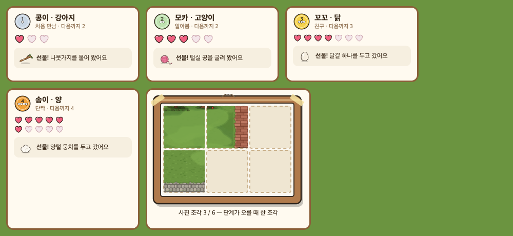
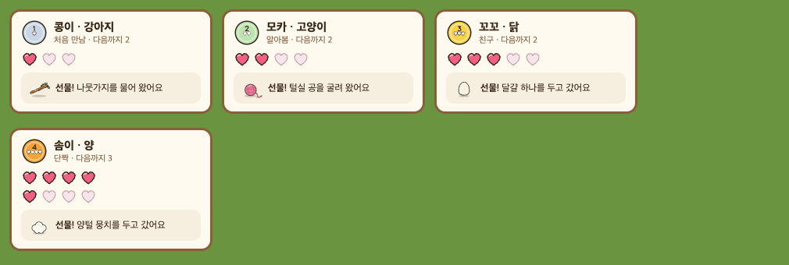
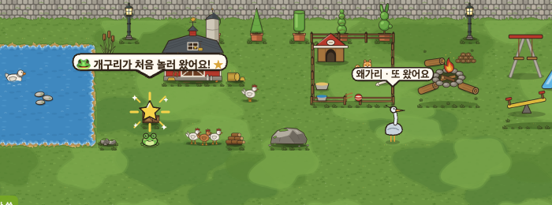
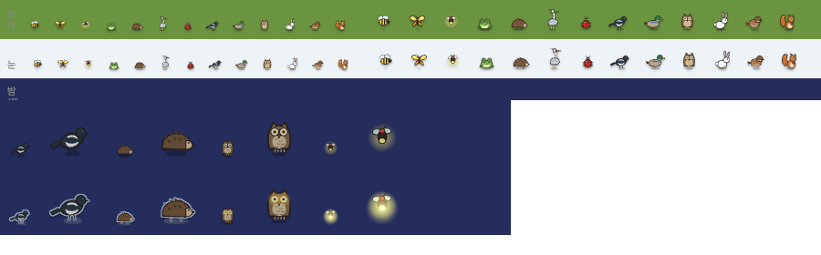
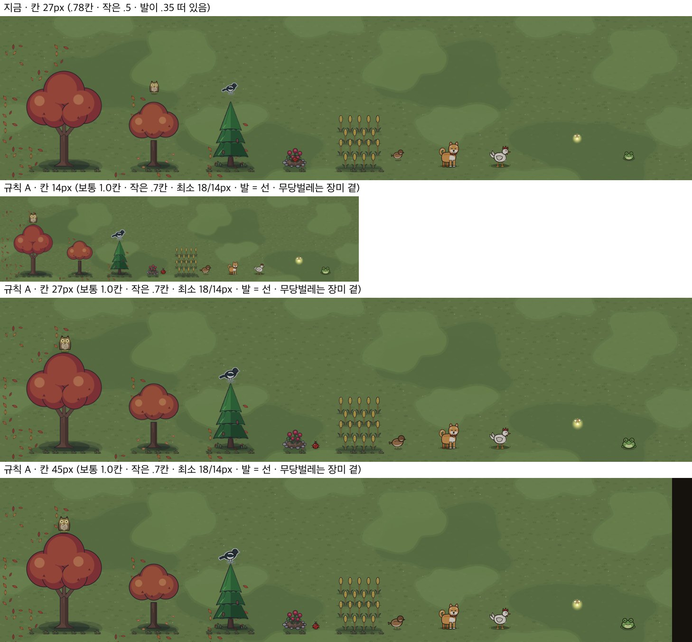

# 손님 도감 · 친해지기 · 작은 선물 — 그림과 표 (2026-09-24)

> 쓴 사람은 꾸미기 디자인 담당이다. 사용자 승인(09-24)과 보스 확정 셋(손님 도감 · 친해지기 · 작은 선물)을 따른다.
> - 저장 설계(처음 온 날 · 하트 · 단계 · 이름 · 받은 선물)는 프로그램 담당의 `docs/deco_guests_design.md` 몫이다. 이 문서의 표는 그 문서와 **같은 이름**을 쓴다.
> - 이 PR 은 그림과 표만 다룬다. **코드 · 저장 · 표(gamedata) · 경제 값 변경 0.** 그림은 코드가 부르기 전에는 게임에 나오지 않는다.

## 원칙
- **돌봄 의무 · 벌 없음.** 손님과 동물은 떠나거나 아프거나 굶지 않는다. 하트는 **줄지 않는다.**
- 손님은 **놓은 것 + 자리(+ 계절 · 때)** 를 보고 온다. 아이가 꾸미는 대로 온다.
- 선물은 **골드가 아니다.** 팔 수 없고, 모아서 보는 것이다.
- **이름은 고르기다**(자유 입력이 아니다). 친구 마당 구경에서 친구도 보는 글이기 때문이다(교실 안전).

## 손님 13 — `assets/deco/guest_<영문>.svg`(100×100 · 발 y90 · 칸의 .5~.8)

| 그림 | 손님 | 무엇 + 어디 | 계절 · 때 | 도감 힌트 |
|---|---|---|---|---|
| `guest_frog` | 개구리 | 물 4칸 이상 + 물가에 갈대 묶음 `d_y29` | 봄 · 여름 · 가을 | 연못가 갈대 사이에서 개굴 소리가… |
| `guest_heron` | 왜가리 | 물 9칸 이상 + 징검돌 `d_y30` | 여름 · 가을 | 넓은 연못의 징검돌 위에 누가 서 있을까 |
| `guest_butterfly` | 나비 | 꽃밭 바닥 9칸 이상 이어짐, 또는 꽃밭이 물에서 3칸 안 | 봄 · 여름 | 꽃밭이 넓으면 날아와요 |
| `guest_sparrow` | 참새 | **밀밭 `d_y25` · 밀밭 B `d_y35` · 보리밭 `d_y36`** | 사계절 | 곡식이 있는 곳에 짹짹 |
| `guest_magpie` | 까치 | 침엽수 `d_y46` | 사계절 | 소나무 꼭대기에 반가운 손님이 |
| `guest_squirrel` | 다람쥐 | 잎 나무 2그루 이상이 3칸 안에 | 가을 | 가을 나무 아래 도토리를 찾는 누군가… |
| `guest_bee` | 꿀벌 | 해바라기 `d_y7` · 라벤더 `d_y41` 장식 3개 이상 | 여름 | 해바라기가 많으면 붕붕… |
| `guest_ladybug` | 무당벌레 | 장미 꽃밭 `d_y1` · `d_y43` 또는 장미 아치 `d_y21` | 봄 · 여름 | 장미 곁에 빨간 점이… |
| `guest_hedgehog` | 고슴도치 | 낮은 관목 `d_y15` 2개 이상 | 봄~가을 · 저녁 | 관목 덤불 속 부스럭… |
| `guest_owl` | 부엉이 | 큰 나무 `d_y19` · 벚나무 `d_y12` | 사계절 · 밤 | 큰 나무에 밤 손님이… |
| `guest_mallard` | 청둥오리 | 물 16칸 이상 | 가을 · 겨울 | 아주 넓은 물을 좋아해요 |
| `guest_snowhare` | 눈토끼 | 낮은 관목 또는 침엽수 | 겨울 | 눈 오는 날 관목 곁에… |
| `guest_firefly` | 반딧불 | 물 4칸 이상 | 여름 · 밤 | 여름 밤 물가에 작은 불빛이… |

- '물 몇 칸'은 이어진 물 바닥의 칸 수다. '곁'은 둘레 3칸이다.
- 저녁 · 밤 조건은 낮밤이 붙은 뒤에 쓴다. 그 전에는 뺀다.
- 반딧불은 둥근 빛을 품고 있다. 밤 색 막 위에 lighter 로 그리기를 권한다.

## 손님 스티커 13 — `assets/deco/sticker_<영문>.svg`(120×120)

- 손님 그림에 **흰 칼선 테 + 옅은 그림자**를 입힌 것이다. 파일 안 필터 하나로 되어 있다.
- 처음 만나면 받는다. 도감 카드의 ★ 와 **스티커 첩**(만난 것은 스티커를 조금 기울여 붙이고, 못 만난 것은 점선 칸 '?')에 쓴다.
- 반딧불 스티커는 빛 원을 뺐다(흰 테가 빛을 따라가 버린다).

## 친해지기 · 작은 선물 — `assets/deco/`

| 그림 | 쓰임 |
|---|---|
| `heart_full` · `heart_empty` (40×40) | 동물 카드의 하트 칸(다음 단계까지 3·4·5·8 — 아래 절) |
| `friend_stage1~5` (60×60) | 단계 배지: 처음 만남 · 알아봄 · 친구 · 단짝 · 가족 |
| `gift_egg` · `gift_duck_egg` · `gift_wool` | 닭 · 오리 · 양(과 그 무리)이 두고 가는 것 |
| `gift_apple` · `gift_cherry` | 과수나무 · 과수원(여름 · 가을) · 벚나무(여름) |
| `gift_acorn` · `gift_feather` | 손님 다람쥐 · 까치 / 참새 |
| `gift_sticker` · `gift_photo` | 도감 첫 만남 · 단계 오름 / 사진 조각(여섯 조각 → 사진 한 장) |

## 하트 칸 · 강아지/고양이 선물 · 사진 틀 (2026-09-24 추가 · 보스 확정 반영)

- **하트 칸 = 다음 단계까지 필요한 수**: 처음 만남 3 · 알아봄 4 · 친구 5 · 단짝 8 (문턱 **0/3/7/12/20** · 보스 결정 2026-09-24, 전엔 3/5/7/10). 가족(5단계)은 칸을 보이지 않는다.
  - 5칸까지는 한 줄 · 8칸은 **넷씩 두 줄** — `heart_*` 모두 22px. 카드가 한 줄(약 25px)만 길어진다.

- **강아지 · 고양이 선물**(골드 아님 · 먹는 것 아님) — 표 `LIFE_GIFT_OF` 한 줄씩(프로그램 몫):

| 동물 | 선물 | 그림 | 카드 말 |
|---|---|---|---|
| 강아지 `d_y53` | 나뭇가지 | `gift_stick` | 나뭇가지를 물어 왔어요 |
| 고양이 `d_y54` | 털실 공 | `gift_yarn` | 털실 공을 굴려 왔어요 |

- **사진 조각 → 사진 틀**(보스 결정: 단계가 오를 때 한 조각, 여섯이면 사진 한 장): `ui_photo_frame.svg`(300×225).
  - 여섯 칸(3×2) · 칸 자리 = `x 24+84c · y 24+86r` · 80×82.
  - 조각을 받으면 그 칸에 **아이 마당 그림의 그 부분**(구울 때의 마당)을 그리고, 못 받은 칸은 점선 빈칸으로 둔다.

## 말풍선 · 처음 만남 반짝 (2026-09-24 추가)

| 그림 | 쓰는 법 |
|---|---|
| `ui_speech_bubble.svg` (120×56) | 손님 · 동물 말풍선 판. `border-image: url(...) 18 22 26 22 fill / 18px 22px 26px 22px stretch` — 글 길이만큼 늘어난다 |
| `ui_speech_tail.svg` (20×14) | 글이 아주 길어 꼬리가 넓어지면 판 대신 쓰는 꼬리 조각(아래 가운데) |
| `fx_first_meet.svg` (100×100) | **처음 만난 손님** 머리 위에 0.8초(커졌다 사라짐) — ★ + 빛살 + 반짝. 두 번째부터는 말풍선만 |

- 말: 처음 → "🐸 개구리가 처음 놀러 왔어요! ★" · 다음부터 → "왜가리 · 또 왔어요".

## 동물 이름 고르기 — 목록 40
- 미리 만든 이름에서 **고른다.** 동물 칸마다 **어울리는 이름 다섯**을 먼저 보이고, '더 보기'로 공통 목록을 보인다.
- 성별이 없는 이름, 먹을 것 · 자연 · 소리 말 위주로 골랐다. **반 친구 이름처럼 들리는 것은 뺐다**(예: 하늘 · 나리 · 지우).

| 동물 | 어울리는 이름 |
|---|---|
| 강아지 | 콩이 · 보리 · 호두 · 초코 · 뭉치 |
| 고양이 | 모카 · 두부 · 밤톨 · 달콩 · 까망 |
| 닭 | 꼬꼬 · 삐약 · 옥수수 · 콩알 · 좁쌀 |
| 오리 | 꽥꽥 · 방울 · 퐁당 · 동글 · 물방울 |
| 양 | 솜이 · 구름 · 몽글 · 폭신 · 뭉게 |
| 공통(15) | 봄봄 · 단비 · 이슬 · 새싹 · 감자 · 고구마 · 쿠키 · 말랑 · 포근 · 토리 · 도토리 · 별콩 · 반짝 · 소복 · 해님 |

- 같은 마당에서 같은 이름을 고르면 뒤에 숫자를 붙인다(예: 콩이 2). 저장 방식은 프로그램 담당 몫이다.

### 번호 (저장은 번호로 — 순서 고정)
저장 설계(`docs/deco_guests_design.md`)는 이름을 **이 목록의 번호**로 저장한다.
- 이 목록은 **뒤에 더하기만** 한다. **빼거나 순서를 바꾸지 않는다.**
- 더는 쓰지 않을 이름은 지우지 말고 **'안 보임'**으로 표시한다. 이미 고른 아이의 이름이 바뀌지 않게 하기 위해서다.
- 1~25 는 동물별 다섯(강아지 · 고양이 · 닭 · 오리 · 양 순), 26~40 은 공통이다.

1~40

1. 콩이
2. 보리
3. 호두
4. 초코
5. 뭉치
6. 모카
7. 두부
8. 밤톨
9. 달콩
10. 까망
11. 꼬꼬
12. 삐약
13. 옥수수
14. 콩알
15. 좁쌀
16. 꽥꽥
17. 방울
18. 퐁당
19. 동글
20. 물방울
21. 솜이
22. 구름
23. 몽글
24. 폭신
25. 뭉게
26. 봄봄
27. 단비
28. 이슬
29. 새싹
30. 감자
31. 고구마
32. 쿠키
33. 말랑
34. 포근
35. 토리
36. 도토리
37. 별콩
38. 반짝
39. 소복
40. 해님

## 손님 그림 점검 — 코드(DECO-GUEST-1)가 바로 붙게 (2026-09-25)

**규격** — 손님은 장식(`(w×100)×((h+1)×100)`)이 아니라 **정사각 100×100** 이다.
- 프로그램 코드가 `width = height = --g` 로 그리기 때문이다. 장식 규격(100×200)으로 바꾸면 반만 그려진다 → 바꾸지 않는다.
- **발은 y90~95**(바닥 틈 5). 나는 것(꿀벌 · 나비 · 반딧불)과 무당벌레는 틈 7~13 으로 조금 떠 있다(의도).

| 손님 | 그린 상자 (x · y) | 바닥 틈 | 무게 | 조각 |
|---|---|---|---|---|
| 개구리 | 20–80 · 46–95 | 5 | 1.4KB | — |
| 왜가리 | 32–78 · 5–95 | 5 | 1.3KB | — |
| 나비 | 18–82 · 31–93 | 7 (남) | 1.0KB | — |
| 참새 | 13–81 · 36–95 | 5 | 1.3KB | — |
| 까치 | 3–84 · 36–95 | 5 | 1.6KB | **#night**(달빛 테) |
| 다람쥐 | 14–74 · 27–95 | 5 | 1.4KB | — |
| 꿀벌 | 26–76 · 32–93 | 7 (남) | 1.1KB | — |
| 무당벌레 | 27–73 · 38–89 | 11 | 1.1KB | — |
| 고슴도치 | 20–88 · 43–95 | 5 | 1.7KB | **#night**(달빛 테) |
| 부엉이 | 26–74 · 24–95 | 5 | 2.3KB | **#night**(눈이 빛남) |
| 청둥오리 | 11–91 · 33–95 | 5 | 1.1KB | — |
| 눈토끼 | 19–78 · 16–95 | 5 | 1.2KB | — |
| 반딧불 | 21–79 · 29–87 | 13 (남) | 1.8KB | **#night**(빛이 크고 밝게) |

- **스티커 `sticker_*` 13**: 120×120 UI 그림이다. 발자리가 없고 1.6~2.2KB 다. 조각은 필요 없다(도감 · 첩에서만 쓴다).
- **계절 조각은 필요 없다**: 손님은 제철에만 온다(조건 표). 겨울 손님(눈토끼 · 청둥오리 · 사계절 넷)은 눈 위에서도 갈색 윤곽이 있어 보인다(위 그림 · 눈 줄).
- **밤 조각 넷을 더함**(이번 PR):
  - 까치 · 고슴도치 — 몸이 짙어 밤 땅(남색)에 묻혔다 → 달빛 테.
  - 부엉이 — 밤 손님이라 눈이 빛난다.
  - 반딧불 — 빛이 크고 밝게. **밤이면 코드가 반딧불에만 동물 층의 어둡게 필터를 걸지 않는다**(그래야 빛으로 보인다).
  - 넷 모두 주소 뒤가 없으면 main 과 픽셀 0 차이다.
- **코드 몫**:
  - 밤(`_decoPhase()==='night'` 또는 별빛)이면 `guest_<k>.svg#night` 로 부른다. 조각이 없는 손님은 조각을 무시하므로 모두에게 붙여도 된다.
  - 손님 그림에는 자기 그림자 타원(y90 근처)이 이미 있다. 코드의 `drop-shadow` 와 겹치면 그림자가 두 겹이 되니, 둘 중 하나만 쓴다(권: 코드 쪽을 옅게).

## 손님 크기 · 자리 규칙 (2026-09-25 · 보스 요청 · 값 바꾸기는 프로그램 몫)

놀이판 실화면에서 칸 14 · 27 · 45px 세 배율로 찍었다. 손님은 무당벌레(작은 벌레) · 참새(새) · 부엉이(나무 위)와 까치 · 반딧불 · 개구리, 견줄 동물은 강아지 · 닭이다.

**지금의 흠 둘**
1. **작다** — 칸 27px 에서 그림이 21px(작은 벌레 16px)이다.
   - 몸은 그림 안 60~80% 라 참새는 14×12px, 무당벌레는 7px 이다. 강아지 몸(약 21×27px)의 절반이 안 된다.
2. **떠 있다** — 그림 아래 끝이 발 줄보다 `.35 × 그림 크기` 위에 놓인다.
   - 땅 손님은 동물들 발 줄보다 한참 위에 선다.
   - 나무 위 손님은 꼭대기에서 떨어져 공중에 뜬다(칸 27 에서 약 9px).

**규칙 A (권)** — 보통 1.0칸 · 작은 .7칸 · 최소 18 / 14px · 발 = 선
- **B(1.15칸 · 작은 .8 · 최소 20 / 16)도 찍어 봤다.** 칸 14 에서 참새가 강아지만 해지고, 까치가 침엽수 끝보다 넓어져 A 로 정했다.
- **그림 안 여백(100×100 안의 몸)은 그대로 둔다.** 크기 규칙만으로 충분했고, 손님끼리의 크기 차(왜가리는 크고 참새는 작다)는 그림이 이미 맡는다.

| 무엇 | 지금 | 규칙 A |
|---|---|---|
| 그림 크기 `gz` | `max(16, round(C × .78))` · 작은 `.5` | **`max(18, round(C × 1.0))` · 작은(무당벌레 · 반딧불) `max(14, round(C × .7))`** |
| 칸 14 / 27 / 45 → 보통 | 16 / 21 / 35px | **18 / 27 / 45px** |
| 칸 14 / 27 / 45 → 작은 | 16 / 16 / 23px | **14 / 19 / 31px** |
| 누르는 자리 | ≥ 44px | 그대로 (≥ 44px) |
| 세로 자리 | 그림 아래 = 발 줄 − `.35gz` (뜸) | **그림 아래 = 발 줄**(그림의 발이 y90~95 라 발이 선 위에 선다 — 동물과 같은 선) → `translateY = footY − gz/2 − hit/2` |
| 나는 것(나비 · 꿀벌 · 반딧불) | `r − .6 ~ .8` + 날기 흔들림 | 그대로 (위 세로 자리 규칙만 같이) |

**나무 위 손님의 자리** — `footY = (row + h) × C − 그린높이 × (1 − 앉을자리)`
- 앉을 자리 = 나무 그림 **맨 위(가운데 줄) + 약 2.5%** 다. 발이 우듬지에 살짝 묻혀 '앉아' 보인다.
- 지금 코드의 `.86`(= 위에서 .14)은 큰 나무 B 에는 맞고, 벚나무에는 우듬지 속으로 들어간다.

| 나무 | 그림 | 맨 위(가운데) | **앉을 자리** | 손님 |
|---|---|---|---|---|
| d_y12 벚나무 | 300×400 | .034 | **.06** | 부엉이 |
| d_y19 큰 나무 B | 200×300 | .117 | **.14** | 부엉이 |
| d_y46 침엽수 | 200×300 | .110 (뾰족 끝) | **.13** | 까치 |
| (표에 없는 나무) | | | .14 (지금 값) | |

- 가로는 지금처럼 발자리 가운데(`_guestOn`)다.
- 계절 조각(가을 · 겨울)도 우듬지 윤곽이 같아 같은 값을 쓴다.

**무당벌레 자리** — 장미 **위**(`_guestOn`)에서 장미 **곁**으로 옮긴다.
- 빨간 몸이 빨간 장미 속에서 세 배율 모두 사라졌다.
- 힌트('장미 곁에 빨간 점이…')와도 맞춘다: `c = p.col + z.w − .2`, 그 칸 발 줄에 둔다(꽃밭 오른쪽 돌 테 끝).
- 잔디 위라 칸 14 에서도 보인다(그림).
