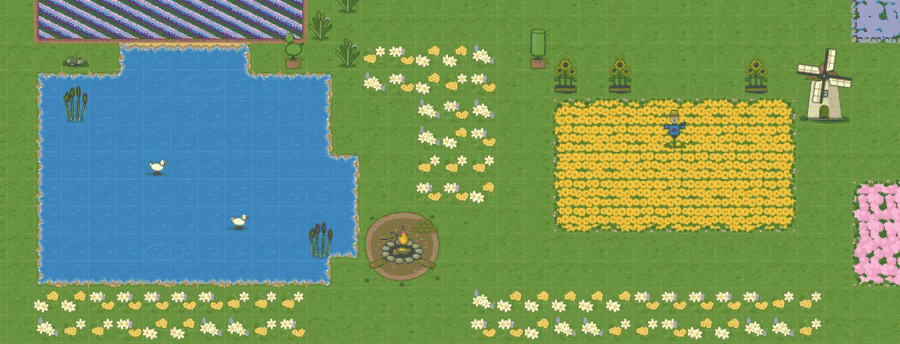
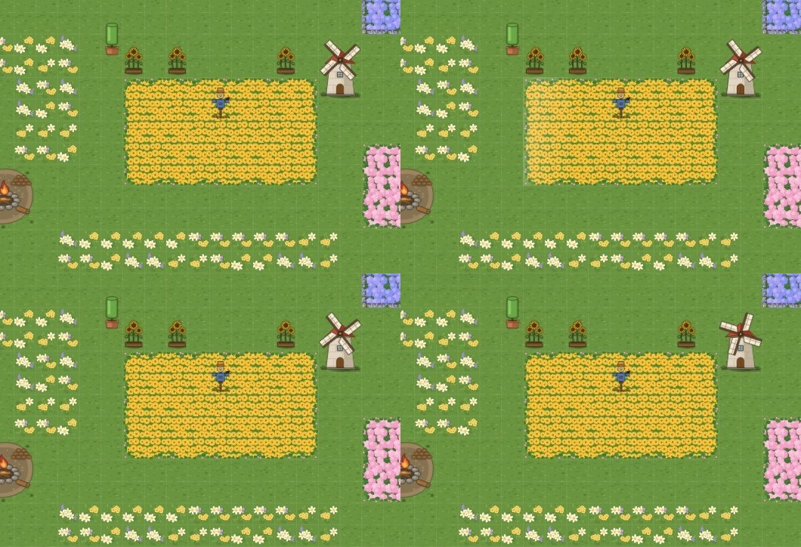
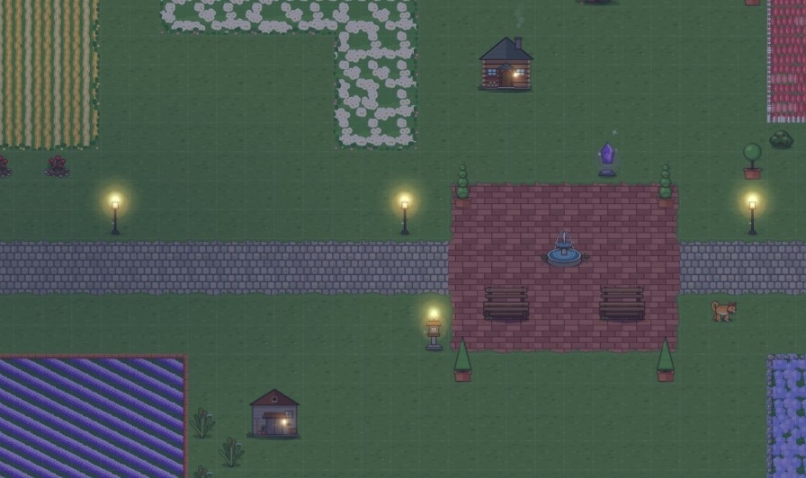
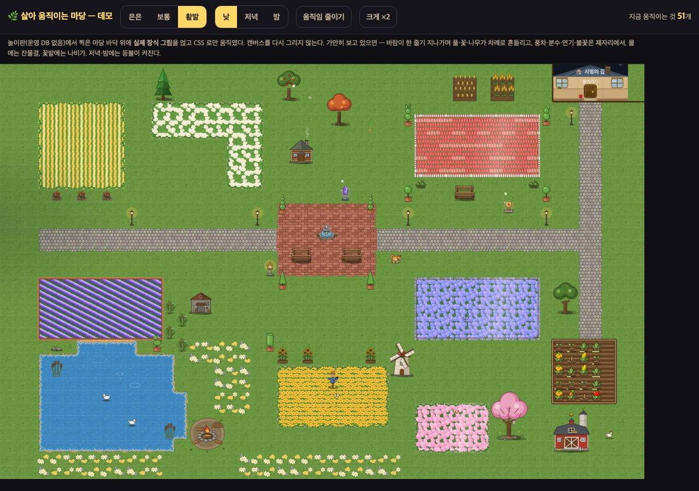

# 마당 꾸미기 — 살아 움직이는 마당: 무엇이 · 어떻게 · 얼마나 (2026-09-20)

> 마당 꾸미기 디자인 담당 · **규칙표 + 데모**. 코드·표·그림 변경 0.
> 잣대: 마당은 **'살아 있는 그림'** — 시선을 뺏는 번쩍임이 아니라, **가만히 보고 있으면 어딘가 조금씩 움직이는** 정도.
> 데모(저장소 밖): `우리반RPG/보고_20260919/마당_움직임데모/index.html` — 놀이판(운영 DB 없음)에서 찍은 본보기 마당 바닥 위에 **실제 장식 SVG 54개**를 얹고 CSS 로만 움직였다. 위쪽 토글: 세기 **은은 · 보통 · 활발** / 낮 · 저녁 · 밤 / 움직임 줄이기 / 크게 ×2 / "지금 움직이는 것 N개".
> **세기 기본값은 사용자가 데모를 보고 고른다**(디자인 담당 추천: 보통).

| 그림 | 무엇 |
|---|---|
|  | 보통 · 낮 · 가까이(6초) — 바람 한 줄기가 왼쪽에서 오른쪽으로: 풀·해바라기·허수아비가 차례로 기울고, 꽃밭에 **빛결**이 지나간다. 풍차는 제자리에서 돌고, 연못엔 잔물결, 캠프파이어 불꽃 |
|  | 같은 장면 0.6초 간격 4장 — 빛결이 해바라기 밭을 건너간다 |
|  | 보통 · 밤 — 가로등·석등·집 창에 불빛(숨쉬듯 아주 조금 밝아졌다 어두워짐), 분수 물줄기, 오두막 연기 |
|  | 데모 전체 · 활발 — 구름 그림자(왼쪽 어두운 곳)가 마당을 천천히 가로지른다 |

---

## 0. 원칙 다섯 줄

1. **대부분의 시간, 대부분의 것은 가만히 있다.** 움직임은 '바람 한 줄기'처럼 **물결로 지나가고 멈춘다** — 늘 도는 것은 원래 도는 물건(풍차·분수·불·연기)뿐.
2. **같은 것이 박자를 맞추지 않는다.** 가로등 다섯 개가 한꺼번에 숨쉬면 기계처럼 보인다 → 저마다 주기·시작을 조금씩 어긋나게(±25%).
3. **낮에 번쩍이는 것 없음.** 반짝임은 마법석·트로피 **둘뿐**이고 작다. 빛은 저녁·밤에만.
4. **늘 도는 것은 캔버스를 다시 그리지 않는다.** 캔버스에는 멈춘 몸통, 늘 움직이는 것(풍차·분수·불·연기)은 그 위 DOM 층의 **CSS transform·opacity** 만(합성기에서 돈다). 지금 동물 층(DECO-ANIM-1)과 같은 길.
   - **바람 흔들기만은 캔버스로**(보스 결정 09-24 · DECO-WIND-1): DOM 층은 앞뒤 순서가 캔버스와 안 맞아 뒷줄 꽃이 앞줄 나무 위에 뜬다(어설픔 ⓓ). 바람이 지나는 몇 초만 판을 다시 그린다 — 바닥 굽기(DECO-FLOOR-BAKE-1) 뒤로 한 번 그리기가 4배 감속에서 1~6ms 라 크롬북 예산(7번) 안이다.
5. **저장 0.** 움직임은 화면에만 있다. 무작위 값도 저장하지 않는다.

## 1. 움직임 종류 — 여섯 가지 + 떠다니는 것

| 종류 | 무엇이 | CSS | 주기(보통) | 크기(보통) |
|---|---|---|---|---|
| **돌기** | 풍차 날개 | `rotate` linear | 9초에 한 바퀴 | 날개 층 전체 |
| **그림 바꾸기** | 분수 물줄기 3장 · 불꽃 2장 | 한 장씩 `opacity` 켜기(`steps(1)`), JS 없음 | 분수 0.3초/장 · 불 0.22초/장 | 몸통과 같은 크기 |
| **뒤집기** | 헛간 풍향계 | `scaleX 1→-1→1`(아래 가운데 축) | 8초 | 층 80×80(몸통 단위) |
| **떠오르기** | 오두막 굴뚝 연기 | `translateY` −60% + `opacity` 0→.9→0, 두 개를 반 박자 어긋나게 | 4초 | 층 60×90 |
| **흔들기(바람)** | 풀·꽃·갈대·해바라기·허수아비·밀밭 | **`skewX` 밑동 고정**(회전 아님 — 화분·밑동이 같이 돌면 이상하다) | 바람 한 줄기 2.6초, 줄기 사이 11초 | 3° × 장식별 배수 |
| **기울기(나무)** | 나무 | `skewX` 밑동 고정, 느리게 | 3.4초 | 0.7° × 배수 — 거의 안 보이는 게 맞다 |
| **숨쉬기** | 저녁·밤 불빛 | `filter:brightness(.88↔1.08)` | 2.6~4초(등마다 다르게) | 불빛 원 지름 = motion.json 값 × 1.8 |
| **반짝임** | 마법석 · 트로피 | 작은 별 3개 `scale+opacity` | 3.9초에 한 번씩 번갈아 | 8px |
| 떠다니는 것 | 꽃잎 · 나비 · 잔물결 · 구름 그림자 · 새 | 아래 §3 | | |

**바람 한 줄기**가 이 데모의 핵심이다: 정해진 간격마다 마당 왼쪽에서 오른쪽으로 2.8초에 걸쳐 지나가며, **지나가는 자리의 풀·꽃·나무에 한 번씩** 흔들기를 건다(지연 = 가로 위치 ÷ 마당 폭 × 2.8초). 같은 순간 꽃밭 바닥 위로 **빛결**(아래 §3)이 같이 지나간다. 그래서 "어, 바람 부네" 가 읽히고, 흔들림은 2.6초 뒤 멈춘다 — 늘 흔들리는 풀은 멀미가 난다.

## 2. 장식 표 — 98종을 훑어서

**구현 길** — ⓐ **층 얹기**: 캔버스는 `motion.json` 의 `body` 를 그리고, 움직이는 조각만 DOM 층 `` 로 그 자리에 얹는다(풍차·분수·연기 — 그림이 이미 나뉘어 있다). ⓑ **통째로 DOM**: 캔버스는 그 장식을 건너뛰고(동물과 같이), DOM `` 한 장에 transform. ⓒ **바닥 위 얇은 층**: 장식이 아니라 바닥 칸 위(잔물결·빛결·구름). ⓓ **불빛**: 색 막 위 `glow.svg`(`plus-lighter`). ⓔ **이미 있음**: 동물 걷기(ANIM_DECO).

| id | 이름 | 움직임 | 길 | 낮/밤 | 그림 |
|---|---|---|---|---|---|
| d_y11 | 풍차 | 돌기 | ⓐ | 늘 | ✅ `d_y11_body`+`_mv` |
| d_y10 | 분수 | 그림 바꾸기(3) | ⓐ | 늘 | ✅ `_w1~3` |
| d_y68 | 캠프파이어 | 그림 바꾸기(2) + 불빛(fire) | ⓐ+ⓓ | 늘 / 불빛 저녁·밤 | ✅ `_f1~2` |
| d_y28 | 헛간 | 뒤집기(풍향계) + 불빛 | ⓐ+ⓓ | 늘 / 저녁·밤 | ✅ `_mv` |
| d_y33 | 오두막 | 떠오르기(연기) + 불빛 | ⓐ+ⓓ | 늘 / 저녁·밤 | ✅ `_mv` |
| d_y34 | 작은 창고 | 불빛 | ⓓ | 저녁·밤 | ✅ glow 자리 |
| d_y6 · d_y14 | 가로등 · 황금 석등 | 불빛 숨쉬기 | ⓓ | 저녁·밤 | ✅ glow 자리 |
| d_y7 | 해바라기 | 흔들기 ×1 | ⓑ | 낮·밤 | 그대로 |
| d_y45 · d_y29 | 키 큰 풀숲 · 갈대 묶음 | 흔들기 ×1.2 | ⓑ | 〃 | 그대로 |
| d_y8 | 허수아비 | 흔들기 ×0.8 | ⓑ | 〃 | 그대로 |
| d_y2 · d_y44 · d_y41 · d_y42 | 튤립 · 튤립 B · 라벤더 · 데이지 | 흔들기 ×0.8 | ⓑ | 〃 | 그대로 |
| d_y1 · d_y43 · d_y16 | 장미 꽃밭 · 장미 B · 큰 화단 | 흔들기 ×0.6 | ⓑ | 〃 | 그대로 |
| d_y25 · d_y35 · d_y36 | 밀밭 · 밀밭 B · 보리밭 | 흔들기 ×0.7(이삭 물결) | ⓑ | 〃 | 그대로 |
| d_y15 | 낮은 관목 | 흔들기 ×0.35(거의) | ⓑ | 〃 | 그대로 |
| d_y9 · d_y47 · d_y46 | 작은 나무 · 둥근 나무 2 · 침엽수 | 기울기 ×1.1 · ×1 · ×0.7 | ⓑ | 〃 | 그대로 |
| d_y12 · d_y19 · d_y48 · d_y64 | 벚나무 · 큰 나무 B · 과수나무 · 과수원 | 기울기 + **꽃잎**(pink · maple · white · white) | ⓑ + 떠다님 | 〃 | ✅ `petal.svg` |
| d_y13 · deco_trophy | 마법석 · 트로피 | 반짝임 | ⓐ(CSS 별, 그림 없음) | 늘 | 필요 없음 |
| d_y31 · d_y59 | 작은 연못 · 큰 연못 | 잔물결 | ⓒ | 늘 | **물 자리 목록 필요**(motion.json 에 몸통 viewBox 안 물 사각형) |
| d_y20 | 조형 분수 | 그림 바꾸기 | ⓐ | 늘 | ❌ **물줄기 3장 필요** |
| d_y63 | 놀이터 | 그네 흔들기(진자 ±12°) | ⓐ | 늘 | ❌ **그네 층 필요** |
| d_y67 | 온실 | 유리에 빛결 한 번(바람 때) | ⓐ(CSS) | 낮 | 지붕 사각형 목록만 |
| deco_garden | 비밀 정원 | 나비 1 | 떠다님 | 낮 | ✅ `butterfly_*` |
| d_y32 · d_y39 · d_y40 · d_y53~57 | 동물 8종 | 걷기 | ⓔ 이미 있음 | — | — |
| **안 움직임** | 선인장 d_y3 · 정원석 d_y4 · 벤치 d_y5·d_y18 · 정자 d_y17 · 장미 아치 d_y21 · 상자·장작·건초 d_y22·23·24·37 · 바위 d_y26·38 · 우물 d_y27 · 징검돌 d_y30 · 울타리 7종 · 우리 3종 d_y58·60·62 · 꽃길·자갈길 d_y61·65 · 큰 헛간 d_y66 · 먹이통 d_y69 · **다듬은 나무 7종 d_y85~91** | — | — | — | 단단한 것은 단단해야 한다. 다듬은 나무가 흔들리면 '다듬음'이 무너진다. 우리 안은 동물이 움직인다 |

실내 16종(d_i*)과 황금 책장은 이번 범위 밖 — 다음에: 램프 불빛 · 시계 초침(돌기) · 수족관 물고기·거품(그림 필요) · TV 깜빡임.

**새 그림이 필요한 것은 둘뿐**(조형 분수 물줄기 3장 · 놀이터 그네 층). 나머지는 지금 그림 그대로 움직인다.

## 3. 바닥 · 마당 전체

| 무엇 | 어디에 | 움직임 | 보통 |
|---|---|---|---|
| **잔물결** | 물 바닥 칸 중 **네 이웃이 모두 물인 칸**(물가 가장자리는 피한다) + 연못 장식의 물 자리 | 가는 흰 타원 테 하나가 `scale .25→1.35` + 옅어짐, 2.6초 뒤 사라짐 | 1.7초에 하나 |
| **빛결** | 꽃밭 바닥 덩어리(같은 값이 이어진 사각형)마다 한 겹 | 바람 줄기가 지날 때 밝은 띠가 가로질러 감(`soft-light`, `translateX`) | 줄기마다 한 번 · 밝기 .12 |
| **꽃잎** | 꽃잎 나무 둘레(motion.json `_ambient.petal`) | 비스듬히 떨어지며 돌고 옅어짐, 4~7초 | 한 화면 4장까지 |
| **나비** | 꽃밭 바닥 위(`_ambient.butterfly` 조건) | 날개 2장 0.14초 + 2~3초마다 조금 옮겨 앉음 | 2마리 |
| **구름 그림자** | 마당 전체 | 흐린 큰 타원 하나가 천천히 가로지름 | 70초에 한 번 · 보통·활발만 |
| **새** | 하늘(마당 위쪽) | 두 마리가 9초에 걸쳐 지나감 | **활발만** |
| **색 막 + 불빛** | 저녁 `rgba(255,150,80,.2)` · 밤 `rgba(20,30,80,.48)` | 불빛은 색 막 **위**, `plus-lighter` | `deco_showcase_yard` §3 그대로(지름만 1.8배 — 23px 칸에선 원래 값이 너무 작았다) |

## 4. 세기 셋 — 데모의 값

| | 은은 | **보통(추천)** | 활발 |
|---|---|---|---|
| 바람 줄기 간격 | 18초 | 11초 | 6초 |
| 흔들기 크기 / 나무 | 1.6° / 0.35° | 3° / 0.7° | 5° / 1.2° |
| 풀 늘 살랑임 | 없음 | 없음 | 있음 |
| 풍차 한 바퀴 · 풍향계 · 연기 | 14 · 11 · 5.5초 | 9 · 8 · 4초 | 6 · 5 · 3초 |
| 분수 · 불꽃 한 장 | 0.42 · 0.3초 | 0.3 · 0.22초 | 0.22 · 0.16초 |
| 잔물결 | 3.4초에 하나 | 1.7초 | 0.8초 |
| 꽃잎 · 나비 | 2 · 1 | 4 · 2 | 7 · 3 |
| 빛결 밝기 · 구름 · 새 | .08 · 없음 · 없음 | .12 · 70초 · 없음 | .2 · 45초 · 있음 |
| **지금 움직이는 것**(데모 카운터, 바람 사이 ~ 바람 지날 때) | 약 10~20 | 약 15~40 | 약 45~60 |

## 5. 규칙

### 5-1. 한 화면 상한 (저사양 크롬북)

잰 것 — 데모를 맥에서 **CPU 4배 느리게**(Chrome 개발자 도구의 CPU throttle) 6초씩, 여러 번:

| | 초당 그림 | 메인 스레드 바쁨 |
|---|---|---|
| 움직임 줄이기(멈춤) | 60 | 3% |
| 은은 | 60 | 약 20% |
| 보통 | 59~60 | 약 20~27% |
| 활발 | 57~60(가끔 한 번 끊김 0.1초) | 약 40%+ |

(같은 맥에서 다른 세션이 돌고 있어 흔들림이 크다. 실제 크롬북 값이 아니다 — 프로그램 담당이 학교 크롬북에서 한 번 재야 한다.)

- **늘 도는 것**(돌기·그림 바꾸기·뒤집기·떠오르기·반짝임): 한 화면 **12개까지**. 넘으면 **화면 가운데에 가까운 것부터** 12개, 나머지는 멈춘 그림(몸통 + 쉬는 층).
- **바람 흔들기**: 한 줄기에 **24개까지**(화면 안, 가로 위치 순으로 고르게 솎기). 줄기 사이는 0.
- **떠다니는 것**: 꽃잎·나비·잔물결은 위 표의 수가 상한(화면 밖에서는 안 만든다).
- **동물**: 지금 ANIM_DECO 그대로(따로 센다).
- 보통에서 동시에 도는 것은 대개 20개 안팎, 바람이 지날 때 잠깐 40개. **활발은 메인 스레드를 두 배로 쓴다** → 기본값으로 두지 않는다(고를 수는 있다).
- **움직임 층은 left/top 을 바꾸지 않는다** — `transform` 과 `opacity` 만(데모에서 나비를 left/top 전환으로 옮겼더니 바쁨이 늘었다 → transform 으로 고침).

### 5-2. 움직임 줄이기

- 기기 설정 `prefers-reduced-motion: reduce` 면(지금 `_animReduced()`) 전부 멈춘 그림. 기기마다 켜고 끄는 단추를 둔다면 **localStorage**(학생 문서에 저장하지 않는다 — 저장 0).
- 멈춘 그림 = 몸통 + **쉬는 층**: 풍차 날개는 18° 돌린 한 장, 분수는 `w2`, 불은 `f1`, 연기는 숨김. 꽃잎·나비·잔물결·구름·새는 없음.
- **불빛은 움직임이 아니다** — 저녁·밤이면 줄이기에서도 켠다(숨쉬기만 멈춤).

### 5-3. 확대 · 이동 중

- **한 손가락 이동**: 층은 동물 층처럼 `world` 한 겹만 `translate` — 움직임은 그대로 돈다(비용 없음).
- **두 손가락 확대**: 칸 크기 `C` 가 바뀌는 동안 층의 CSS 애니메이션을 **일시정지**(`animation-play-state: paused`), 위치·크기만 캔버스와 같은 프레임에 다시 맞춘다(`_animSyncLayer` 와 같은 자리에서). 손을 떼면 다시 돈다. 층을 숨기면 풍차가 날개 없이 보이므로 **숨기지 않는다**.
- 바람 줄기는 확대 중에는 새로 만들지 않는다.

### 5-4. 어디서 도나

| 화면 | 움직임 |
|---|---|
| 내 마당 꾸미기(전체화면·창) | ✅ 고른 세기 |
| **친구 마당 구경**(`ff-topview`) | ✅ **보는 아이 기기의 세기로** — 동물 층과 같은 방식. 친구 마당에서 "와!"가 나오는 자리다 |
| 홈 타일 · 서랍 카드 · 상점 카드 · 도감 | ❌ 멈춘 그림(작은 그림은 움직여도 안 보이고 값만 든다) |
| 판이 안 보일 때(다른 탭 · 꾸미기 닫힘 · 창 가려짐) | ❌ 층을 만들지 않고 타이머도 없음 — DECO-ANIM-HIDDEN-1 과 같은 규칙 |

### 5-5. 앞을 가리는 것 (ⓑ 통째로 DOM 의 한계)

DOM 층은 캔버스 **위**에 있다. 그래서 ⓑ 장식 **앞 줄에 선 장식이 그 그림 칸에 겹치면**(예: 나무 바로 아래 칸의 가로등 머리가 나무 줄기에 닿음) DOM 나무가 가로등을 덮는다. 규칙: **ⓑ 장식의 그림 사각형에, 발밑 줄이 더 아래인 장식의 그림 사각형이 겹치면 그 ⓑ 장식은 멈춘 그림으로 둔다**(캔버스에 그대로). ⓐ 층 얹기(풍차 날개 등)는 몸통 위 조각뿐이라 같은 판정을 층 사각형으로 한다.

## 6. motion.json 에 더할 것 (그림 담당 몫 — 다음 PR)

- `sway`: `{ "d_y7": 1, "d_y45": 1.2, … }` — §2 의 배수 표 그대로. `tree`: 나무 배수.
- `sparkle`: 마법석·트로피 별 자리 3개씩(몸통 viewBox 안).
- `ripple`: 연못 장식 d_y31 · d_y59 의 물 사각형(몸통 viewBox 안).
- 조형 분수 `d_y20_w1~3` · 놀이터 `d_y63_body` + `d_y63_swing` 그림.
