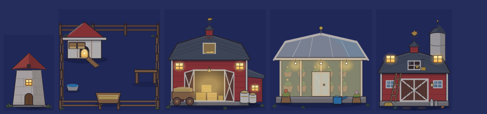

# 꾸미기 밤 그림 빈 곳 — 점검 목록과 둘째 창 불빛 (2026-09-24)

> 쓴 사람: 꾸미기 디자인 담당. 보스 추천(별빛 P0 흠 ③ 뒤): 밤에 불이 없는 장식을 모으고, `_night` 겹이 필요한 것부터 그린다.
> 이 PR 은 그림과 표(`motion.json`)만 바꾼다. **코드 · 저장 · 경제 값 변경 0.**

## 점검 방법
- 마당 장식 79종(gamedata `cat:'yard'`)의 몸통 그림을 훑었다. 몸통이 따로 있으면(`_body`) 그것을 봤다.
- 유리색(파랑) · 등불색(노랑) 칸이 있는지 보고, 그것을 `motion.json` `_ambient` 의 windows · glow · pool 과 맞춰 봤다.

| 결과 | 장식 |
|---|---|
| 이미 불 있음 | 가로등 `d_y6`(glow · pool) · 석등 `d_y14`(glow · pool) · 마법석 `d_y13`(glow #magic) · 헛간 `d_y28` · 오두막 `d_y33` · 창고 `d_y34`(창 · glow) · 캠프파이어 `d_y68`(glow #fire) · 내 집 `yard_house`(창) |
| **이번에 더함** | 풍차 `d_y11`(창 하나) · 닭장 `d_y58`(닭집 둥근 문 안 등불) · 큰 헛간 `d_y66`(창 둘 · 곁채 창 · 열린 큰 문 안 · 다락) · 온실 `d_y67`(유리 안 따뜻한 빛 · 매달린 전구 셋) |
| 불이 필요 없음(파랑이 물 · 꽃) | 분수 둘 · 연못들 · 우물 · 물통(양 목장 · 강아지 마당) · 라벤더 · 튤립 B · 풀숲 · 허수아비 · 놀이터 |

- 옛 '코드로 그린 집'은 이제 `yard_house.svg` 그림으로 그린다(`_drawYardHouseArt`). 그래서 `windows.on.yard_house` 로 창에 불이 켜진다. 별빛 P0 흠 ③ 은 코드가 windows 표를 부르면 풀린다.

## 이번 그림
- `assets/deco/d_y11_night.svg` · `d_y58_night.svg` · `d_y66_night.svg` · `d_y67_night.svg`.
  - 몸통과 **같은 viewBox 의 투명 겹**이고, 헛간 넷(#917)과 같은 결이다: 따뜻한 유리 · 창살 · 둘레 은은한 빛.
  - 풍차는 몸통(`d_y11_body`)과 같은 200×300 이다.
- `motion.json` `_ambient.windows.on` 에 넷을 더했다.
- 그리는 순서는 그대로다: 몸통 → (겨울이면) 지붕 눈 → 밤 막 → 창 불빛 → light_pool → glow.
