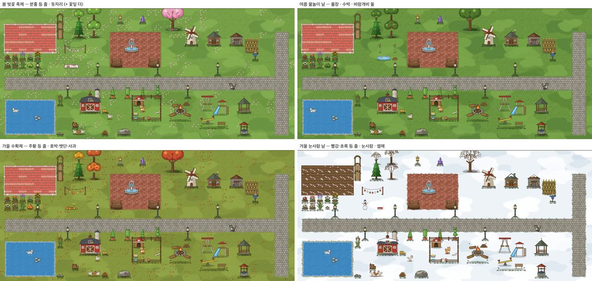
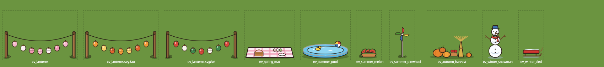

# 계절 행사 — 계절마다 며칠만 마당에 나타나는 장식 한 벌 (2026-09-24)

> 쓴 사람: 꾸미기 디자인 담당. 사용자 승인(09-24): "꾸미기는 스타듀밸리 오마주" · 손님 도감 · 친해지기 · 작은 선물 · **계절 행사**.
> - **저장 0 · 날짜로 정한다.** 행사 장식은 아이 것이 아니다. 산 것도, 놓은 것도 아니다. 그날 마당에 **잠깐 나타날 뿐**이다.
> - 이 문서와 그림 PR 에서 **코드 · 표 · 경제 값은 바꾸지 않는다.** 계절 바탕(땅 · 나무 · 눈)은 `deco_seasons_20260924.md` 에 있다.

## 행사 넷
| 행사 | 날(제안 · 학교 다니는 주) | 한 벌(3×3칸 한 덩어리) |
|---|---|---|
| 봄 **벚꽃 축제** | 4월 첫 주(4/1~4/7) | `ev_lanterns#spring`(3×1 · 분홍 · 흰 등) + `ev_spring_mat`(2×1 · 돗자리 · 도시락 · 경단). 꽃잎 흩뿌림(계절 ①)을 **두 배**로 |
| 여름 **물놀이 날** | 방학 전 주(7/8~7/14) | `ev_summer_pool`(2×1 · 풀장 · 고무 오리 · 비치볼) + `ev_summer_melon`(1×1) + `ev_summer_pinwheel`(1×1) 둘 |
| 가을 **수확제** | 추석 뒤 주(10/13~10/19) | `ev_lanterns#autumn`(주황 · 노랑 등) + `ev_autumn_harvest`(2×1 · 호박 넷 · 볏단 · 사과 바구니) |
| 겨울 **눈사람 날** | 방학 전 주(12/15~12/21) | `ev_lanterns#winter`(빨강 · 흰 · 초록 등) + `ev_winter_snowman`(1×1 · 키 1.4칸) + `ev_winter_sled`(1×1) |

- 날짜 표는 **코드 상수 한 줄**로 둔다(학생마다 저장하지 않음). 교사가 바꾸고 싶으면 그 표만 고친다.
- 등 줄 한 장 `ev_lanterns.svg` 이 주소 뒤로 세 계절 색을 낸다(주소 뒤가 없으면 봄).

## 두는 자리 (코드 몫 · 저장 0)
1. 아이 마당 장식들의 **한가운데**를 구한다(발자리 행 · 열의 평균).
2. 한가운데에서 가장 가까운 **빈 잔디 덩어리**를 찾는다.
   - 크기: 3×3 (여름은 3×2).
   - 둘레 1칸까지 다른 장식이 없어야 한다.
   - 바닥은 잔디 무리(`_floorIsGrass`)여야 하고, 집 자리는 안 된다.
   - 가까움은 가로를 0.8배로 잰다.
3. 덩어리 안 자리는 위 표의 모양 그대로 둔다. 시안 훅(`보고_20260923/계절행사_시안/그림_svg/event_hook_놀이판전용.js`)이 이 규칙을 그대로 흉내 낸다.
4. 그리기: 마당 장식을 다 그린 뒤, 행사 장식을 **발자리 아랫줄 순서**로 그린다. 동물 층 아래다.
5. 빈 덩어리가 없으면 그 해 행사는 **나타나지 않는다**(아이 마당을 밀어내지 않는다).
6. 누르면 짧은 말 하나를 보여 준다. 예: "🌸 벚꽃 축제예요! (4/7 까지)". 옮기기 · 치우기 · 팔기는 **안 된다.**

- **코드(DECO-EVENT-1 · 2026-09-24)**: 날짜 표 `DECO_EVENTS`(student.js · 끝날 포함) · 자리는 판이 바뀔 때만 다시 구한다 · 카드를 들고 누르면 놓기가 먼저(행사가 다른 빈 잔디로 비켜 간다) · 별빛 모습에는 안 뜬다 · 친구 마당도 같은 날이면 보인다 · 놀이판 `?event=spring|summer|autumn|winter` 로 미리 본다. 봄 등 줄은 주소 뒤 없이(그림에 `#spring` 이 없다 — 주소 뒤가 없으면 봄 색).

## 한계
- 칸 27px 에서 장식이 작다. '행사 모퉁이'로 읽히는지는 수업에서 확인할 일이다.
- 움직임(바람개비 돌기 · 등 흔들림)은 `motion.json` 후보로 둔다.
- 친구 구경 화면에서도 보일지는 프로그램 담당과 정한다. 제안은 **같은 날이면 보인다** — 날짜로 정하므로 저장이 필요 없다.

## 코드 붙이기 전 그림 점검 (2026-09-24)
| 그림 | 칸(폭×높이) | 그린 상자 x · y (viewBox) | 바닥 틈 | 무게 |
|---|---|---|---|---|
| `ev_lanterns` | 3×1 | 2–298 · 83–196 | 4 | 4.9KB |
| `ev_spring_mat` | 2×1 | 2–198 · 148–198 | 2 | 2.1KB |
| `ev_summer_pool` | 2×1 | 6–194 · 123–198 | 2 | 1.8KB |
| `ev_summer_melon` | 1×1 | 10–84 · 154–194 | 6 | 2.2KB |
| `ev_summer_pinwheel` | 1×1 | 21–79 · 67–192 | 8 | 1.8KB |
| `ev_autumn_harvest` | 2×1 | 10–190 · 102–196 | 4 | 3.7KB |
| `ev_winter_snowman` | 1×1 | 8–92 · 58–196 | 4 | 2.0KB |
| `ev_winter_sled` | 1×1 | 16–96 · 148–193 | 7 | 1.0KB |

- 모두 장식 규격이다: viewBox `(w×100)×((h+1)×100)`, 발자리는 아래 h 칸, 위로만 넘친다. **`_drawDecoSVG(id, px, py, bw, bh)` 로 그대로 그리면 된다.** 바닥선이 발자리 아래끝에서 2~8 안에 있다.
- 행사 장식은 표에 없으므로 `bbox.json` 줄도 없다(카드에 안 나옴). 누르면 나오는 말에 그림이 필요하면 `<id>.svg` 를 그대로 쓴다.
- 등 줄은 주소 뒤로 색을 고른다: `#spring`(기본) · `#autumn` · `#winter` · **`#star`(금 · 시안 · 보라 — 별빛 행사 P10 용, 이번에 더함)**.
  - 장식 로더가 `#` 조각을 받게 되었으니(계절 ②) 같은 길로 부른다.
- 5KB 를 조금 넘던 등 줄을 4.9KB 로 줄였다. 넷 모두 전과 픽셀 0 차이다.
