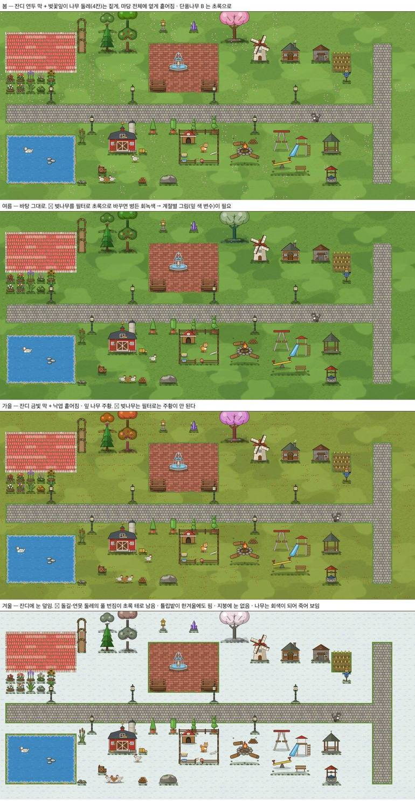
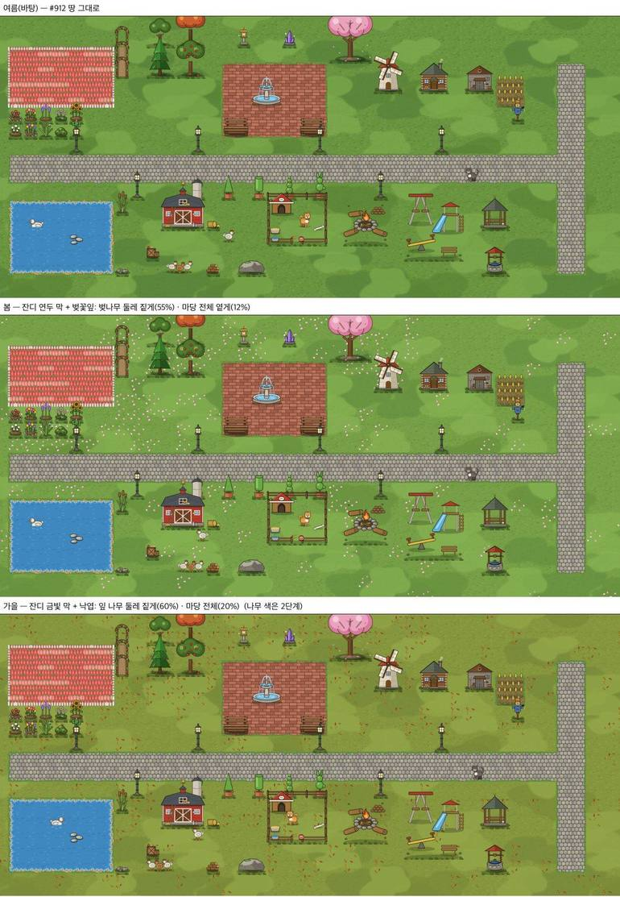
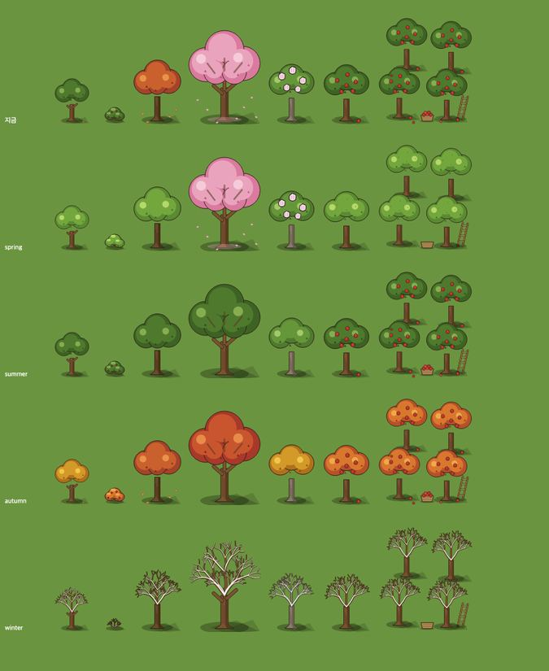
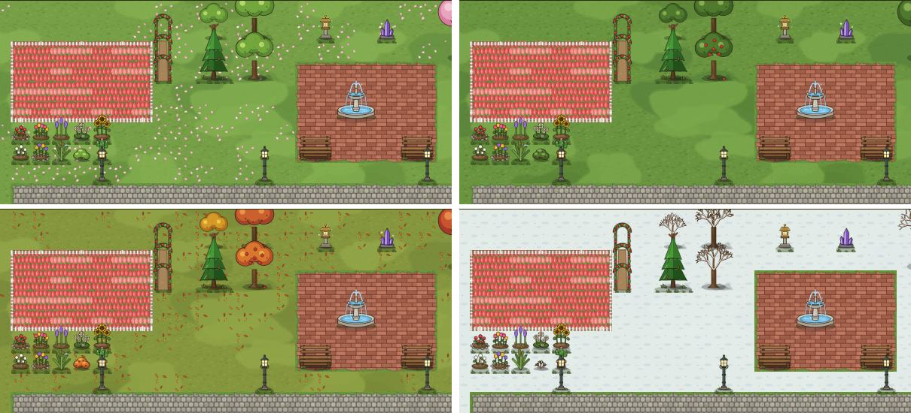
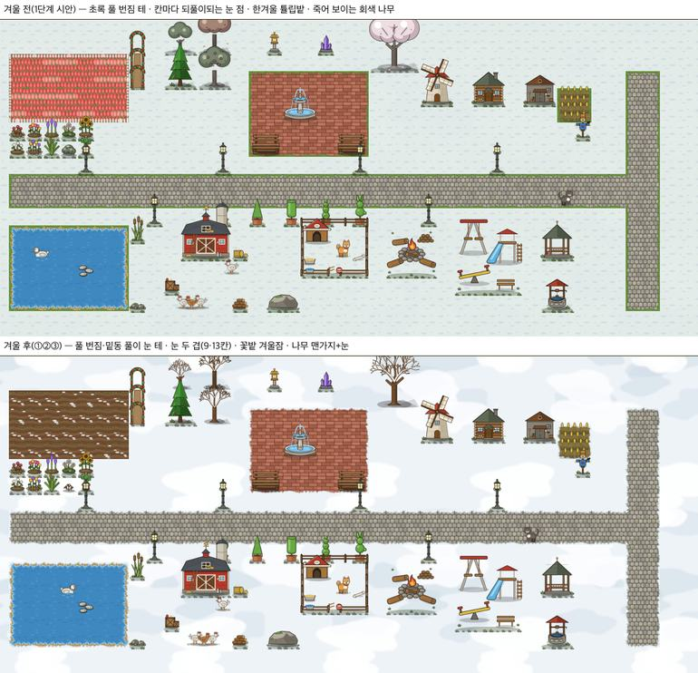
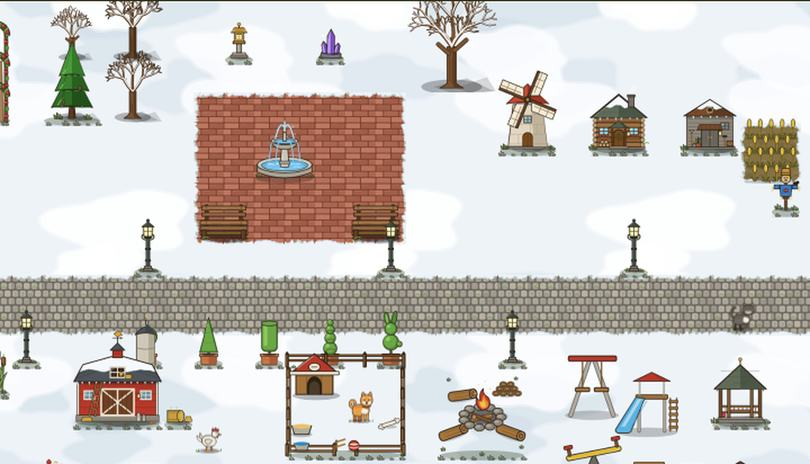
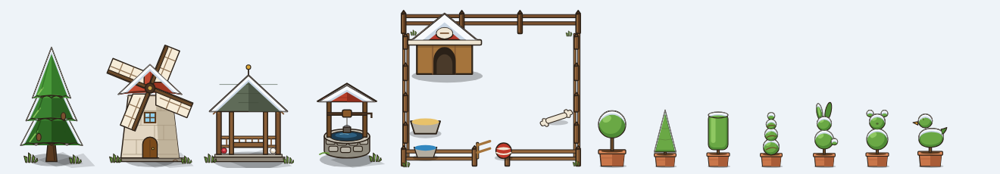
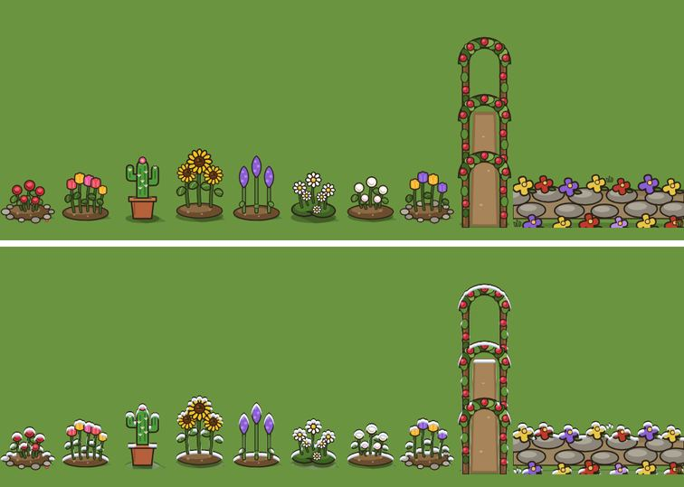
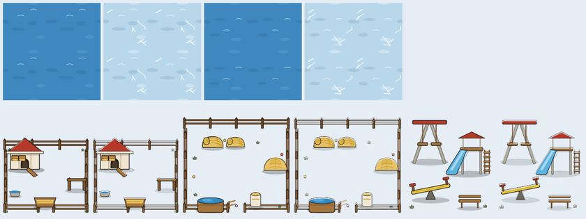
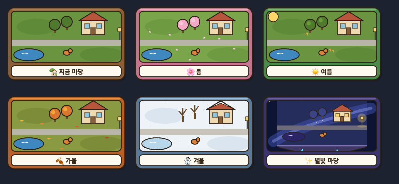

# 마당 계절 — 날짜로 바뀌는 땅 · 나무 · 꽃밭 · 눈 (2026-09-24)

> 쓴 사람: 꾸미기 디자인 담당. 보스 결정(09-24): **계절 진행**.
> - **날짜로 정한다. 저장은 0.** 마을도 나무 잎이 철 따라 바뀌므로 두 게임이 **같은 달력**을 쓴다.
> - 순서: **① 땅 → ② 나무 7종(잎 색 변수 · 겨울 맨가지) → ③ 꽃밭 겨울잠 · 풀 번짐 계절색 · 눈 조각 9·13칸 주기 → ④ 지붕 눈**. 한 단계씩 그림 PR 로 올린다.
> - 이 문서는 단계마다 덧붙인다. 그림 PR 에서 **코드 · 저장 · 표 · 경제 값은 바꾸지 않는다.** 계절 고르기와 칠하는 순서는 꾸미기 프로그램 담당이 이 사양대로 옮긴다.

## 왜 필터 한 장으로는 안 되나

- 나무에 필터를 씌우면 이렇게 된다:
  - 벚나무가 여름에 병든 회녹색이 된다.
  - 가을 주황은 필터로 만들 수 없다.
  - 겨울에 채도를 빼면 나무가 죽은 것처럼 보인다.
- 겨울에도 문제가 남는다:
  - 꽃밭이 핀 채로 있다.
  - 풀 번짐(돌길 · 연못 둘레)과 밑동 풀이 초록 테로 남는다.
  - 눈 조각이 칸마다 되풀이된다.
- 그래서 **그림 쪽에 계절 모양**을 둔다(②~④ 단계).

## 계절 고르기 (프로그램 · 저장 0)
| 달 | 계절 |
|---|---|
| 3 · 4 · 5 | `spring` |
| 6 · 7 · 8 | `summer` (바탕 — 지금 그림 그대로) |
| 9 · 10 · 11 | `autumn` |
| 12 · 1 · 2 | `winter` |

- 기기 날짜(한국 시각)로 정한다. 마을과 같은 표를 쓴다.
- 교사가 고정하는 스위치를 둘지는 따로 정한다(없으면 날짜).

## ① 땅 (그림 PR · #930)

**그림** — `assets/floor/`
| 그림 | 쓰는 곳 |
|---|---|
| `season_petals_a` · `_b` | 봄: 땅 위 벚꽃잎(6장씩 · 칸 안에서만 그림) |
| `season_leaves_a` · `_b` | 가을: 땅 위 낙엽(5장씩) |

**칠하는 법** — 잔디 무리 칸(`_floorIsGrass`) 하나마다, 잔디 얼룩(#912) **뒤에** 그린다.
1. **계절 막**을 `fillRect(px,py,C,C)` 로 칠한다.
   - 봄 `rgba(200,235,130,.10)` (`#C8EB82` · 2026-09-24 고침 — .14 는 라임빛)
   - 가을 `rgba(240,168,72,.14)` (`#F0A848` · 2026-09-24 고침 — 옛 `rgba(214,160,60,.26)` 은 잔디와 섞여 올리브빛)
   - 여름 · 겨울은 막이 없다. 겨울은 ③ 에서 눈이 덮는다.
2. **흩뿌림** — 고정 난수 `h(r,c,k) = ((r*73856093) ^ (c*19349663) ^ (k*83492791)) >>> 0) % 1000 / 1000` 을 쓴다.
   - **봄**: 칸이 켜지는 조건은 `h(r,c,1) < p` 이다.
     - `p = .55` — 벚나무(`d_y12`) 발자리에서 가로 4칸 · 세로 3칸 안
     - 나머지는 `p = 0` (2026-09-24 고침 — 마당 전체에 흩으면 색종이처럼 보였다)
     - 켜지면 `h(r,c,3) < .5 ? a : b` 조각을 `(px,py,C,C)` 에 그린다.
   - **가을**: 조건은 `h(r,c,2) < p` 이다.
     - `p = .6` — 잎 나무(`d_y9` · `d_y12` · `d_y15` · `d_y19` · `d_y47` · `d_y48` · `d_y64`) 둘레
     - 나머지는 `p = 0` (같은 까닭)
     - 조각 선택은 `h(r,c,4)` 로 한다.
3. 가장자리 조각(물가 · 풀 번짐)은 지금처럼 그 **뒤에** 그린다.
   - 가을 금빛 막 아래 풀 번짐이 초록으로 남는 것은 ③ 에서 계절색 조각으로 푼다.

**잰 것** — 놀이판(운영 DB 0) kid 마당, 칸 27px: 꽃잎 · 낙엽이 한눈에 보이고, 칸 격자로 줄지어 보이지 않았다. 흩뿌림을 켜는 칸은 1~2할뿐이라 늘어나는 drawImage 는 그만큼이다.

## ② 나무 7종 (그림 PR · #934)

대상은 작은 나무 `d_y9` · 관목 `d_y15` · 큰 나무 B `d_y19` · 벚나무 `d_y12` · 둥근 나무 2 `d_y47` · 과수나무 `d_y48` · 과수원 `d_y64`.
- 파일 하나에 네 계절이 들어 있다. **주소 뒤 `#spring` `#summer` `#autumn` `#winter`** 로 고른다.
- **주소 뒤가 없으면 지금 그림과 픽셀까지 같다**(0 차이 확인). 코드가 계절을 넘기기 전에는 게임 변화가 0 이다.
- 잎 덩어리 색은 변수 네 개(`l0` 윤곽 덩어리 · `l1` 가운데 · `l2` 밝은 · `l3` 짙은 점)다. 계절마다 값이 바뀐다.

| | 봄 | 여름 | 가을 | 겨울 |
|---|---|---|---|---|
| 잎 나무 | 새잎 연두 | 초록 | 참나무 · 둥근 나무 = 금빛, 과수 · 관목 = 주황 | **맨가지 + 가지 윗면 눈** |
| 벚나무 | 분홍 꽃 + 땅 꽃잎 | 초록 | 붉은 단풍 | 맨가지 + 눈 |
| 큰 나무 B | 연두 | 초록 | 붉은 주황(지금 그림) | 맨가지 + 눈 |
| 열매(사과 · 관목 열매) | 없음 | 있음 | 있음 | 없음 |
| 꽃(둥근 나무 2) | 있음 | 없음 | 없음 | 없음 |
| 땅 낙엽(참나무 · 큰 나무 B) | 없음 | 없음 | 있음 | 없음 |

**코드 몫**
- 이 일곱 장은 `_decoImg(id)` 를 `id + '.svg#' + 계절` 로 부른다. 구운 비트맵 키에도 계절을 넣는다.
- 겨울 맨가지는 그림 **안에서** 갈린다. 파일은 늘지 않는다.
- `motion.json` `_ambient.petal` 의 벚나무 꽃잎은 **봄에만** 띄운다. 큰 나무 B 단풍잎은 **가을에만** 띄운다.
- 상록(소나무 · 다듬은 나무 여덟)은 그대로 둔다. 눈 얹힘은 ④ 에서 지붕과 함께 한다.

## ③ 꽃밭 겨울잠 · 풀 번짐 계절색 · 눈 두 겹 (그림 PR · #936)

| 그림 | 쓰는 법 |
|---|---|
| `fringe_grass_*` 16장 · `ground_tuft_a/b` | **주소 뒤 `#spring` `#autumn` `#winter`** 로 풀 색이 바뀐다. 봄 · 가을은 계절 막과 같은 색이고, 겨울은 **눈 테**(풀 끝은 서리 낀 초록)다. 주소 뒤가 없으면 지금 그림과 픽셀 0 차이다(18장 확인) |
| `snow_patch_shade.svg` (13×13칸) · `snow_patch_bright.svg` (9×9칸) | 겨울 잔디 무리 칸에 쓴다. ① 바탕 `#eef3f8` 을 `fillRect` 로 칠한다. ② 짙은 판 `(c%13,r%13)` 조각을 붙인다. ③ 밝은 판 `(c%9,r%9)` 조각을 붙인다. 잔디 얼룩(#912)과 같은 틀이라 117칸마다만 되풀이된다. 겨울에는 잔디 얼룩 · 계절 막 대신 이것을 쓴다 |
| `tile_bed_winter_a/b` | 겨울에 **꽃밭 일곱 가족**(`_FLOOR_EDGE_COLOR` 에 있는 것, 색 상관없이)의 바탕 대신 쓴다. 흙 이랑 · 새싹 · 눈 조금. `h(r,c,5)<.5 ? a : b` 로 고른다. 가장자리 꽃잎 `bed_*` 은 **그리지 않는다.** 마감(`rim_*`)은 그대로 그린다 |

**코드 몫**
- 풀 번짐 `ring('fringe_grass_', …, '', …)` 의 색 자리(`ec`)에 계절을 넘긴다. 여름이면 빈 값이다.
- 밑동 풀도 `ground_tuft_a.svg#계절` 로 부른다.
- 들꽃 잔디(`wildflower`)는 잔디 무리라 겨울에 눈이 덮인다. 봄 · 가을에는 흩뿌림도 받는다.
- 꽃 **장식**(1×1 화분 · 꽃 무더기 `d_y1~` 등)의 겨울 모양은 이번 범위 밖이다. 다음 후보로 둔다.

## ④ 지붕 눈 (그림 PR · #939)

| 그림 | 건물 |
|---|---|
| `d_y28_snow` | 큰 헛간(갬브럴 지붕 · 건초창 자리 비움) |
| `d_y33_snow` | 오두막(굴뚝 자리 비움) |
| `d_y34_snow` | 창고(환기창 자리 비움) |
| `yard_house_snow` | 내 집(굴뚝 · 지붕창 자리 비움 + 지붕창 눈) |

- 네 장 모두 **몸통과 같은 viewBox 의 투명 겹**이다. 겨울에만 몸통을 그린 뒤 **같은 자리 · 같은 크기**로 보통 합성한다.
- 지붕 위쪽에 물결진 눈을 얹고 처마에 고드름을 달았다.
- `motion.json` `_ambient.snow.on` 에 표를 적었다(`_ambient.windows` 와 같은 모양).
- 밤 창 불빛(`_night`)과 함께 쓸 때 순서: 몸통 → 지붕 눈 → (밤이면) 색 막 → 창 불빛.

## ⑤ 상록 나무 · 작은 지붕 눈 (그림 PR · #941)

- 대상: 침엽수 `d_y46`(층마다) · 풍차 `d_y11` · 정자 `d_y17` · 우물 `d_y27` · 강아지 마당 `d_y62`(개집) · 다듬은 나무 `d_y85~91`.
- ④ 와 같은 **투명 겹**(`<id>_snow.svg`)이다. `_ambient.snow.on` 에 12줄을 더했다.
- 만든 법: 윗면을 따라 난 눈 띠 = 그 모양 − 그 모양을 아래로 옮긴 것. 띠 두께는 칸 폭의 7.5%, 밑은 푸른 그늘이다. 앞에 그려진 윤곽 있는 것(윗층 · 날개 · 창)은 비운다.
- 상록 잎 색은 그대로다(겨울에도 초록). 풍차는 몸통(`d_y11_body`)에 겹치고, 날개 층(`d_y11_mv`)은 그 위에 돈다.

## ⑥ 꽃 장식 겨울 — 눈 맞은 꽃 (그림 PR · #942)

- 대상 열 가지: `d_y1` · `d_y2` · `d_y3` · `d_y7` · `d_y41` · `d_y42` · `d_y43` · `d_y44` · `d_y21` · `d_y61`.
- 꽃밭 **바닥**은 겨울잠(③)이지만, 아이가 하나씩 놓은 꽃 **장식**은 **그대로 두고 눈만 맞힌다.** 아이가 놓은 꽃이 겨울마다 사라지면 서운하기 때문이다.
- 파일 안의 필터 하나로 한다. 주소 뒤 `#winter` 면 모든 윗면에 얇은 눈과 푸른 그늘이 얹히고, 윤곽선은 눈 위에 남는다. 겹 파일이 늘지 않는다.
- **주소 뒤가 없으면 지금 그림과 픽셀 0 차이다**(열 장 확인).
- **코드 몫**: 겨울이면 이 열 장을 `id + '.svg#winter'` 로 부른다. ② 나무 일곱 장과 같은 방식이다.

## ⑦ 연못 얼음 · 우리 지붕 눈 (그림 PR)

- `tile_water_a` · `_b`: 주소 뒤 `#winter` 면 **언 연못**이다(얼음 색 · 흰 금 · 빛 두 줄). 물가 모래(`shore_*`)는 그대로 두고, 둘레 풀 번짐은 ③ 의 눈 테를 쓴다.
- 닭장 `d_y58` · 양 목장 `d_y60` · 놀이터 `d_y63`: 꽃 장식(⑥)과 같은 파일 안 눈 필터를 쓴다. 우리는 울타리가 가늘어서 띠를 더 얇게 했다.
- 다섯 장 모두 **주소 뒤가 없으면 main 과 픽셀 0 차이**다.
- **코드 몫**: 겨울이면 물 조각은 `_floorImg('tile_water_x', 'winter')`, 우리 셋은 `id + '.svg#winter'` 로 부른다. 강아지 마당 `d_y62` 는 ⑤ 의 겹(`d_y62_snow`)을 그대로 쓴다.
- 동물(마당을 걷는 강아지 · 닭 · 양 등)은 계절에 상관없이 그대로다.

## 다음 후보
- 여름 반딧불(밤) · 가을 허수아비 · 봄 나비 늘리기 — 움직임 층(`_ambient`) 쪽.

## 모습 고르기 카드 — 계절 넷 (2026-09-24 추가)

- `assets/ui/look_card_spring/summer/autumn/winter.svg`(240×150)은 별빛 마당 카드(`look_card_base` · `look_card_star`)와 **같은 틀**이다.
  - 미리보기 창 (9,9,220,102) · 이름 띠 (9,118,220,22) — 글은 코드가 쓴다.
- 창 안 그림은 같은 마당(집 · 나무 둘 · 연못 · 길 · 가로등 · 강아지)을 계절대로 바꾼 것이다: 벚꽃잎 · 여름 해 · 단풍잎 · 눈과 맨가지.
- 테 색이 계절을 알린다: 봄 분홍 · 여름 초록 · 가을 주황 · 겨울 하늘.
- 계절을 아이가 고를지(날짜로만 할지)는 사용자 결정이다. 카드는 어느 쪽이든 쓴다(날짜로만이면 '지금 계절' 표시용).
