# 마당 안 상점 · 홈 타일 — 화면 규칙 (2026-09-20)

> 마당 꾸미기 디자인 담당 · **확정 시안 + 규칙 표**. 보스 결정(사용자에게도 시안을 보냄 — 사용자가 다른 것을 고르면 그쪽이 우선).
> **프로그램 담당이 이 문서만 보고 만들 수 있게** 썼다. 코드·표·그림 변경 0.
> 시안은 놀이판(운영 DB 미접속)에서 **지금 화면을 그대로 찍고**, 그 위에 **지금 화면에서 뽑은 스타일 값**으로 얹어 만들었다(새 디자인 언어 없음). 그림: `docs/img/deco_screens_20260920/`.

---

## ① 마당 안 상점 — A안 "탭 하나 더"

꾸미는 화면을 떠나지 않고 RPG 골드로 장식을 산다. **지금 아래 서랍(가진 장식 줄)에 탭 하나를 더 다는 것**이 전부다.

| 그림 | 무엇 |
|---|---|
| 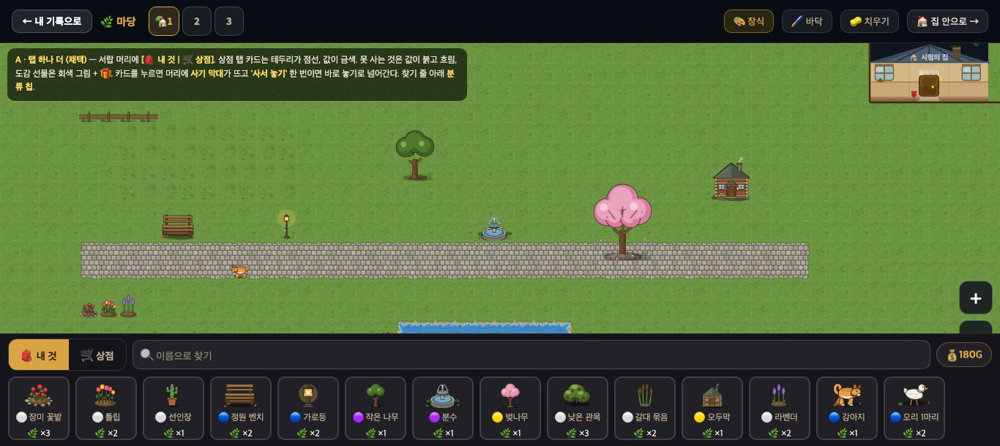 | **🎒 내 것** 탭 — 지금 서랍 그대로(+ 머리에 탭·골드 배지) |
| 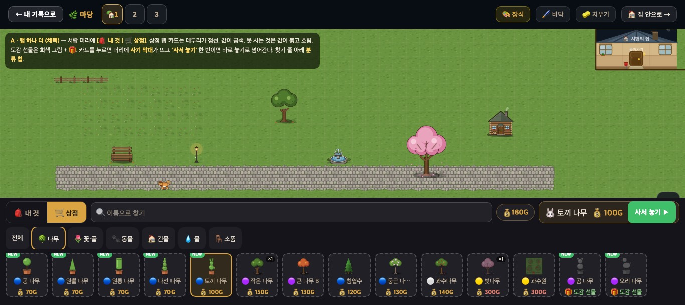 | **🛒 상점** 탭 · 카드를 골랐을 때(사기 막대) — 1366×610 |
| 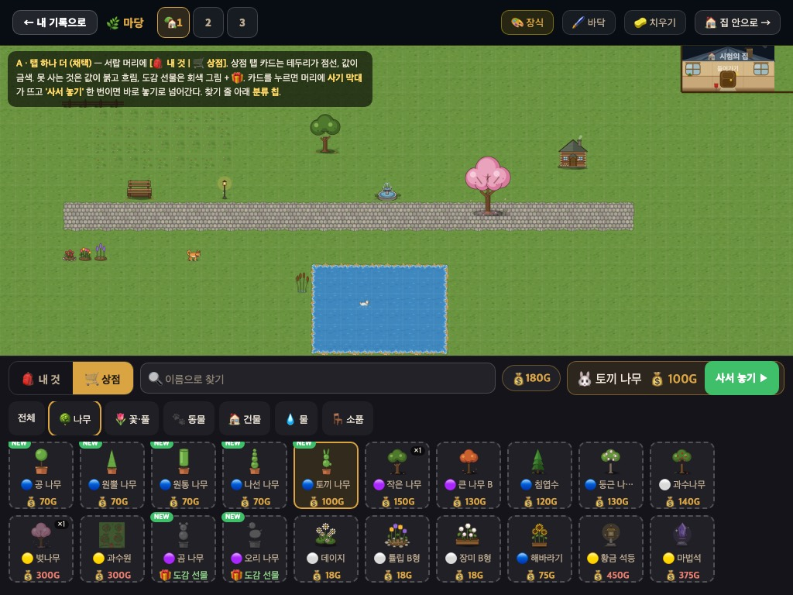 | 같은 장면 1024×768 |
| 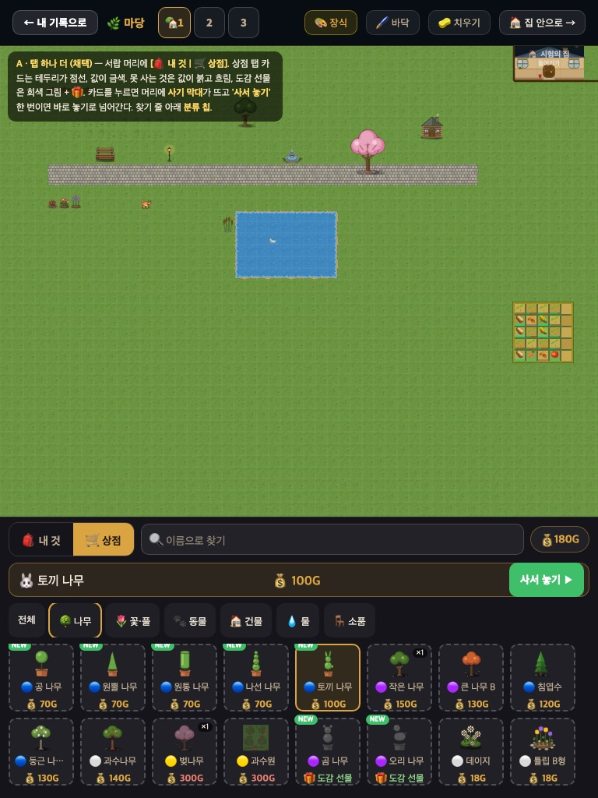 | 같은 장면 768×1024 — 사기 막대가 머리 아래 한 줄로 |
| 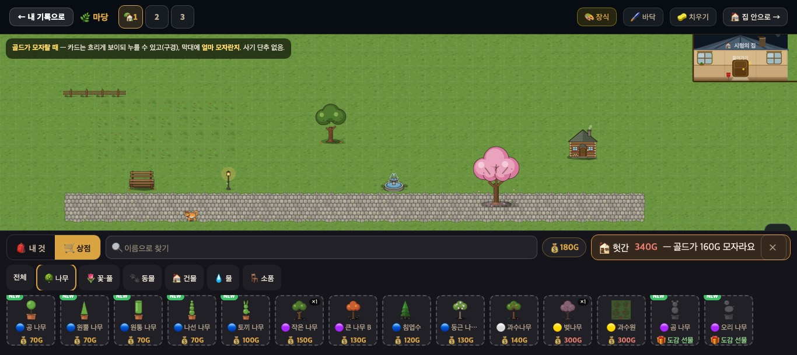 | 골드가 모자란 것을 골랐을 때 |
| 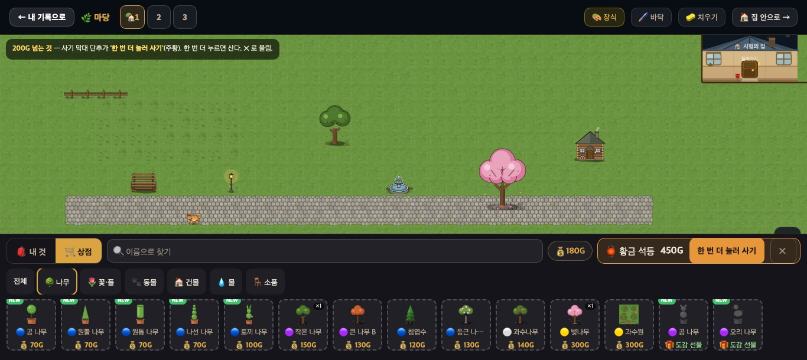 | 200G 이상 — '한 번 더 눌러 사기' |
| 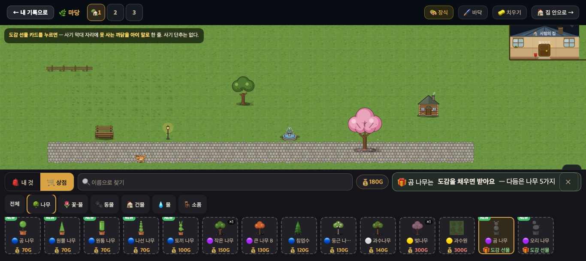 | 도감 선물 카드를 골랐을 때 |
| 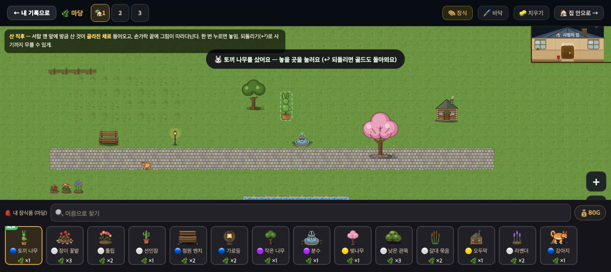 | 산 직후 — 골라진 채로 + 손끝에 그림 + 토스트 |

(그림 속 까만 설명 상자는 시안 설명이다 — 실제 화면에는 없다.)

### 1. 서랍 머리

| 자리 | 🎒 내 것 탭 | 🛒 상점 탭 |
|---|---|---|
| 왼쪽 | `[🎒 내 것 \| 🛒 상점]` 두 칸 탭(높이 44px, 고른 쪽은 금색 바탕 `#d9a441` · 글자 `#231c12`) | 같음 |
| 가운데 | 🔍 이름으로 찾기(지금 그대로) | 같음(상점 전체에서 찾기) |
| 오른쪽 | **골드 배지 하나** | 같음 + 카드를 고르면 **사기 막대** |
| 그 아래 | — | **분류 칩 한 줄**: 전체 · 🌳 나무 · 🌷 꽃·풀 · 🐾 동물 · 🏠 건물 · 💧 물 · 🪑 소품(길·울타리 포함) — `kind` 값(`docs/deco_place_table.md`) 그대로. 높이 44px, 넘치면 옆으로 넘김 |

- **골드 배지**는 홈 HUD 의 `.badge.gold` 와 똑같이: 바탕 `rgba(255,255,255,.05)` · 테두리 `1px solid rgba(217,164,65,.4)` · 반지름 20px · 14px 굵게 · 색 `#d9a441` · `💰 180G`. **지금 꾸미기 화면 위쪽 막대에는 골드가 없다** — 이 배지 하나로 충분(두 군데 두지 않는다).
- 두 탭 사이를 오가도 스크롤·고른 카드는 탭마다 기억.

### 2. 카드 — 상태 다섯 가지 (크기·모양은 지금 서랍 카드 그대로: 84×87 · 반지름 10 · 바탕 `rgba(255,255,255,.05)`)

| 상태 | 어디 | 테두리 | 그림 | 아래 줄 | 누르면 |
|---|---|---|---|---|---|
| **가진 것** | 내 것 탭 | `2px solid rgba(255,255,255,.15)`(지금 그대로) | 그대로 | `🌿 ×3` | 지금처럼 고르기 → 놓기 |
| **살 수 있음** | 상점 탭 | `2px dashed rgba(255,255,255,.22)` | 그대로 | `💰 70G` 금색 `#d9a441` 굵게 | 사기 막대 |
| **골드 부족** | 상점 탭 | 점선 | **흐리게**(불투명 .5) | `💰 340G` **붉게** `#e57c6e` | 사기 막대 — 모자란 만큼 알림 |
| **도감 선물** (`price:0`, 살 수 없음) | 상점 탭 | 점선 | **회색**(`grayscale(1) brightness(.7)`, 불투명 .75) | `🎁 도감 선물` 연두 `#8fd18a` | 사기 막대 — 받는 법 한 줄 |
| **골라짐** | 두 탭 | `2px solid #d9a441` + 바탕 `rgba(217,164,65,.16)` | 그대로 | — | 다시 누르면 풀림 |

덧: 상점 카드에서 이미 가진 것은 오른쪽 위 작은 알약 `×1`, 새 것은 왼쪽 위 바깥 `NEW`(초록) — 그림 칸에는 아무것도 얹지 않는다. 카드를 죽이지 않는다(골드 부족·선물도 눌러서 구경할 수 있다).

### 3. 사기 막대 — 카드를 고르면 머리 오른쪽(좁은 폭은 머리 아래 한 줄)

| 고른 것 | 막대 | 단추 |
|---|---|---|
| 살 수 있음, **200G 미만** | `🐰 토끼 나무 💰 100G` (금색 테) | **[사서 놓기 ▶]** 초록 `#3fbf6a`, 44px — 한 번에 산다 |
| 살 수 있음, **200G 이상** | `🏮 황금 석등 450G` (주황 테) | **[한 번 더 눌러 사기]** 주황 `#e8963a` → 누르면 산다 · [✕] |
| 골드 부족 | `🏚️ 헛간 340G — 골드가 160G 모자라요` (주황 테) | [✕] 만 (사기 단추 없음) |
| 도감 선물 | `🎁 곰 나무는 도감을 채우면 받아요 — 다듬은 나무 5가지` (연두 테) | [✕] 만 — 받는 조건은 표의 `gift` 필드(`{need:'topiary', count:5}` → "다듬은 나무 5가지") |

- **'한 번 더' 조건은 값 200G 이상** — 지금 상점 87종 중 **22종**(제일 싼 것이 210G 라 사실상 epic·legend 큰 것들).
- 무료 기간(`decoFreeNow()`)이면 값 자리에 지금 상점처럼 `🎁 무료` + 원래 값 취소선, '한 번 더'는 없다.

### 4. 산 직후 — 바로 놓기로

1. 골드를 빼고(지금 상점과 같은 지출 기록) 인벤토리 +1.
2. **내 것 탭으로 돌아가고, 방금 산 카드가 맨 앞에 골라진 채로** — 지금의 '고르기 → 놓기' 상태 그대로.
3. 손가락(마우스) 끝에 그 그림이 반투명으로 따라다닌다 — 마당 한 곳을 누르면 놓임.
4. 토스트 한 번: `🐰 토끼 나무를 샀어요 — 놓을 곳을 눌러요 (↩ 되돌리면 골드도 돌아와요)`.
5. **되돌리기(↩)** 에 '사기'도 한 단계로 들어간다 — 놓기 전에 ↩ 하면 인벤토리 −1, 골드 +값. (놓은 뒤 ↩ 는 지금처럼 놓기만 무름.)

### 5. 세 폭 배치 — 마당이 절반 넘게 보이게

| 폭 | 카드 줄 | 사기 막대 | 분류 칩 | 마당이 보이는 높이(시안에서 잰 것) |
|---|---|---|---|---|
| 1366×610 (크롬북) | **1줄**(나머지는 서랍 안에서 넘김) | 머리 오른쪽 | 찾기 줄 아래 한 줄 | 상점 탭 **55%** · 내 것 탭 65% |
| 1024×768 (태블릿 가로) | 2줄 | 머리 오른쪽 | 〃 | 상점 52% · 내 것 60% |
| 768×1024 (태블릿 세로) | 2줄 | **머리 아래 한 줄**(폭 전체) | 〃 | 상점 59% · 내 것 70% |

- 잰 것 = (서랍 윗변 − 위쪽 막대 59px) ÷ 화면 높이.
- **처음 시안은 1366×610 에서 카드 두 줄이라 마당이 절반 아래로 떨어졌다** → 낮은 화면은 한 줄. 앞으로 머리에 뭔가 더해져 1366×610 에서 절반 밑으로 떨어지면 **분류 칩을 찾기 줄 안(드롭다운)으로 접는다**.
- 누르는 것 전부 44px 이상(탭·칩·사기 단추·✕). 카드 자체는 지금 크기(84×87).

---

## ② 홈 — 마당 꾸미기 · 우리 마을 나란히

| 그림 | 무엇 |
|---|---|
| 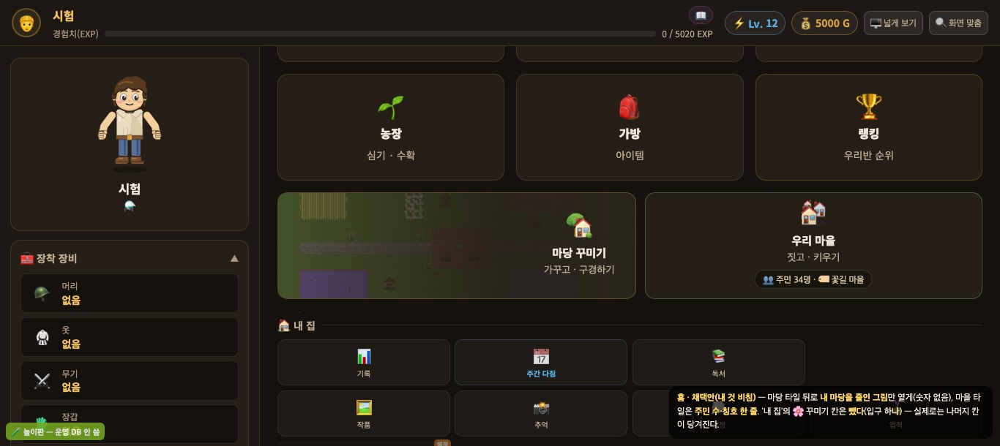 | **채택: 내 것 비침** — 1366×610 |
| 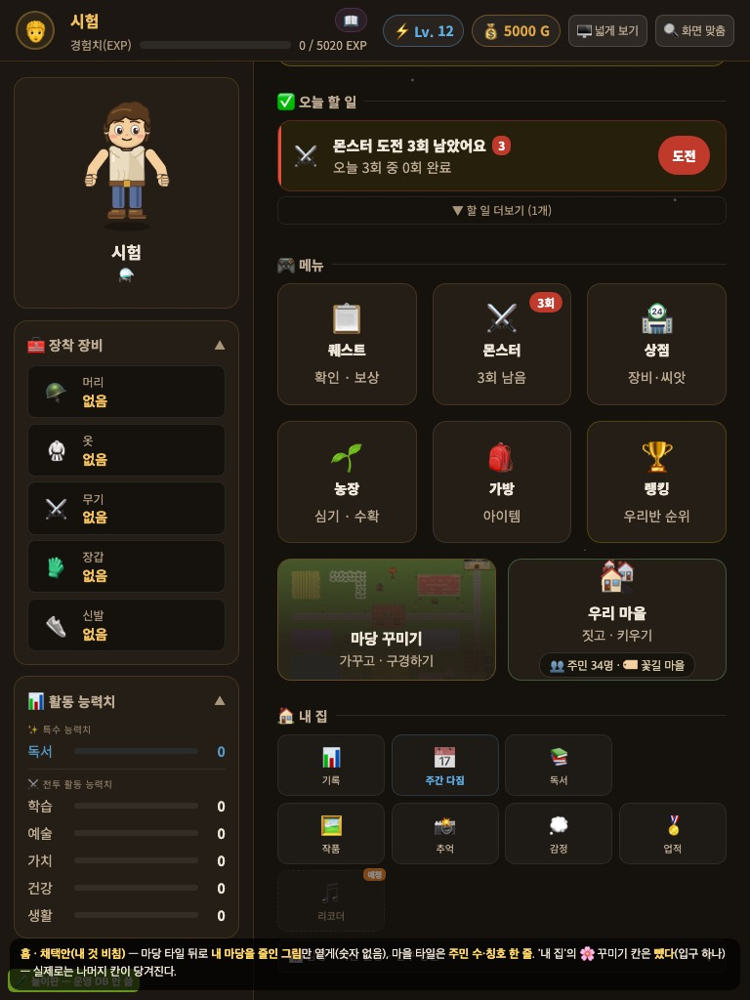 | 같은 것 768×1024 |
| 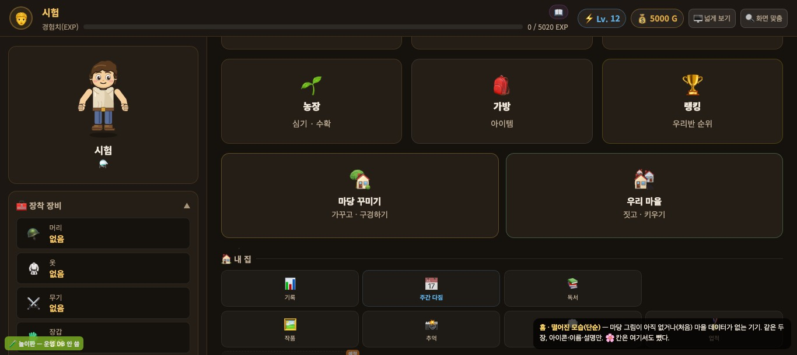 | **떨어진 모습(단순)** — 마당 그림·마을 데이터가 없을 때 |

### 1. 자리
- 지금 한 줄 전체인 **'우리 마을' 타일 자리를 같은 크기 두 장**으로: 왼쪽 🏡 **마당 꾸미기**, 오른쪽 🏘️ **우리 마을**, 사이 12px.
- **'🏠 내 집' 줄의 🌸 꾸미기 칸은 뺀다** — 입구가 둘이면 어느 게 진짜인지 헷갈린다. 집 안 꾸미기는 마당 화면 위쪽의 `🏠 집 안으로 →` 단추로 들어가므로 따로 입구가 필요 없다. 뺀 뒤 나머지 칸은 당겨진다(시안은 그 자리를 비워 둔 모습).

### 2. 타일 모양 — 지금 홈 타일 값 그대로
| | 값 |
|---|---|
| 바탕 · 반지름 · 안쪽 여백 | `rgb(36,30,22)` · 14px · 24px 16px |
| 아이콘 · 이름 · 설명 | 36px · 16px 굵게(800) `rgb(239,231,217)` · 14px `rgb(188,171,146)` |
| 테두리 | 마당 `1px solid rgba(217,164,65,.35)`(금색) · 마을 `1px solid rgba(120,200,140,.35)`(지금 초록 그대로) |
| 설명 줄 | 마당 `가꾸고 · 구경하기` · 마을 `짓고 · 키우기`(지금 그대로) |

### 3. '지금 내 것'이 비치는 법
| 타일 | 무엇이 비치나 | 없으면 |
|---|---|---|
| 🏡 마당 꾸미기 | **내 마당을 줄인 그림**을 타일 바탕에 옅게(불투명 .55). 가로 화면은 왼쪽에서 오른쪽으로 타일 색에 녹아들고(글자는 오른쪽), 세로 화면은 위에서 아래로(글자는 아래). **숫자·개수 줄은 두지 않는다** — 마당엔 점수·자랑이 없다. | 그림이 아직 없으면(처음) 단순 모양(아이콘 + 이름 + 설명) |
| 🏘️ 우리 마을 | 이름·설명 아래 작은 알약 한 줄 `👥 주민 34명 · 🏷 꽃길 마을`(바탕 `rgba(0,0,0,.35)`, 테두리 `rgba(255,255,255,.12)`, 12px) | 마을 데이터가 없으면(다른 기기 등) 알약 없이 단순 모양 |

- **마당 그림은** 꾸미기를 닫을 때 지금 보이는 판을 한 장 작게 찍어 **기기 안에만** 둔다(서버 저장 0 — 통짜 저장이 커지지 않게). 다른 기기에서는 처음엔 단순 모양 → 그 기기에서 한 번 꾸미기를 열고 닫으면 생긴다.
- 마을 데이터는 지금 기기 localStorage(`rpg.village.<학생id>`)뿐이다(서버 저장 #214 전). 그래서 폴백이 반드시 필요하다.

---

## 확인
- 시안 그림 11장은 모두 놀이판의 가짜 학생('시험')으로 찍었다 — 실제 학생 이름·학교명 없음. 문서에도 없음(검색 확인).
- 그림은 `docs/` 아래라 사이트 빌드에서 빠진다(`_config.yml` 의 `exclude: docs`) — 아이 화면 무게 0.
- 장식 이름·값(토끼 나무 100G, 곰 나무 선물 등)은 #522(다듬은 나무 표 줄, 머지됨) 기준. 상점 종 수는 main 의 `gamedata.js` 를 vm 으로 불러 잰 것.
