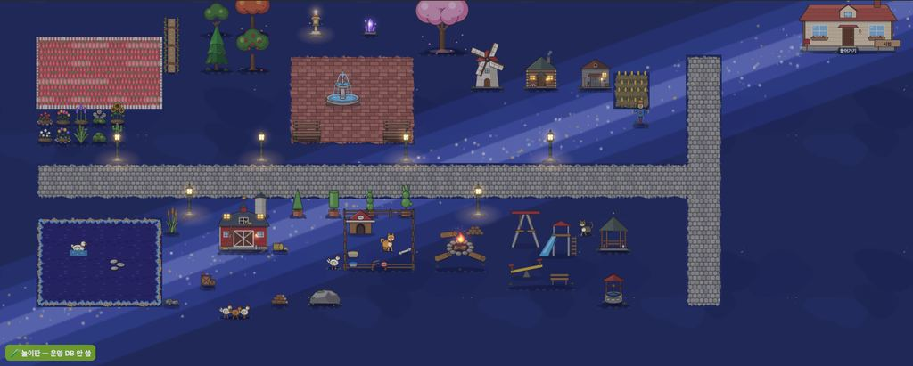
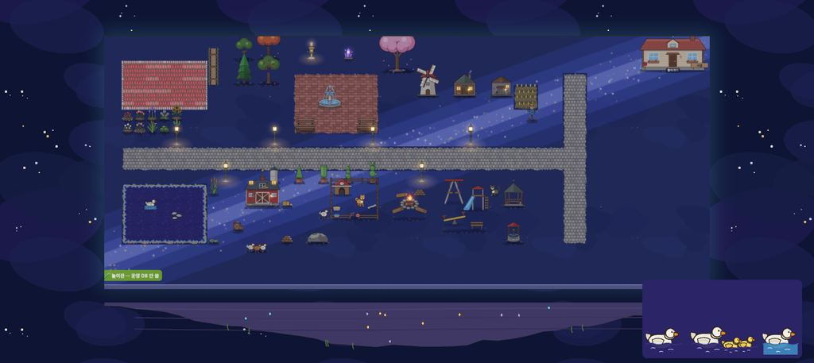
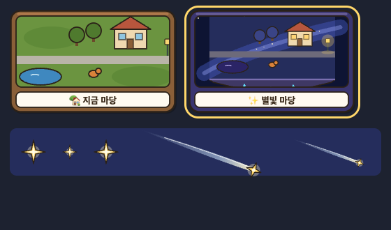

# 별빛 마당 그림 (P2) — 은하수 띠 · 남색 땅 · #star · 떠 있는 섬 · 별하늘 (2026-09-24)

> 쓴 사람은 꾸미기 디자인 담당이다.
> - 계획: 보스 정리 `보스함/별빛마당_계획_20260924.md`(저장소 밖).
> - 시안: `보고_20260924/별빛마당_P0시안/`.
> - **보스 결정(09-24): A 은하수 띠 + 밤 막 .30.** 사용자가 돌아와 바꿀 수 있다.
> - 이 PR 은 그림만이다. **코드 · 저장 · 표 · 경제 값 변경 0.** 그리는 코드(P3 · P5)는 꾸미기 프로그램 담당 몫이다.

## 새 그림
| 파일 | 크기 · 무게 | 그리는 법 |
|---|---|---|
| `assets/floor/star_ground.svg` | 900×900 = **9×9칸 주기** · 3.7KB | 잔디 무리 칸(`_floorIsGrass`)의 바탕이다. **불투명**(바탕 `#252d5c` 포함)이라 이것 하나로 칸이 채워진다. `(c%9, r%9)` 조각을 붙이고, 잔디 얼룩(grass_patch)은 건너뛴다 |
| `assets/floor/star_band.svg` | 800×440 = **판 80×44칸 한 장**(칸 = 10) · 5.7KB | **판에 한 번 굽는다.** 판 전체 크기(`cols·C × rows·C`)로 늘려 한 장을 만들고, 잔디 무리 칸마다 그 자리를 떼어 `star_ground` **위에** 붙인다. 조각 되풀이 금지(줄무늬가 된다). 별은 띠 안에만 있다 |
| `assets/floor/island_rim.svg` | 100×40 · 0.8KB | 판 아래끝 **바로 밑** 칸마다 한 장(칸 폭 × .4칸). 좌우 끝이 같아 이어진다 |
| `assets/floor/island_under.svg` | 1600×120 = **판 80칸 × 6칸**(칸 = 20) · 1.8KB | `island_rim` 바로 밑에 **판 폭 그대로 한 장**(고르게 늘림). 가운데로 좁아지는 바위 · 발광 수정 · 뿌리 |
| `assets/ui/sky_stars.svg` | 400×400 · 3.5KB | 판 밖 배경 무늬(화면 px 그대로 반복). 전체화면 틀 배경 class 로 칠한다(캔버스 비용 0) |

- 계획서는 `island_under` 를 1000×260 으로 적었는데, **1600×120(판과 같은 80:6 비율)**으로 바꿨다.
  - 1000×260 을 판 폭으로 늘리면 가로만 4배 가까이 늘어나 수정 · 윤곽이 찌그러진다(시안에서 확인).
  - 판 칸 수(80×44)가 바뀌면 이 두 장(`star_band` · `island_under`)도 같은 비율로 다시 그린다.

## `#star` 한 줄 (새 파일 0 · 주소 뒤가 없으면 main 과 같음)
| 파일 | `#star` 에서 |
|---|---|
| `fringe_grass_*` 16 · `ground_tuft_a/b` | 풀 번짐 · 밑동 풀이 남색 땅 결이 된다(`--b:#252d5c` 등) |
| `tile_water_a/b` | 보랏빛 별물(`--w0:#2b2466` 등) |
| `d_y56_swim` · `d_y32_swim` | 오리 헤엄 그림의 물 띠가 별물 색이 된다(시안 흠 ①) — 물 칸이 `#star` 면 헤엄 그림도 `#star` 로 부른다 |

- 픽셀 확인: 주소 뒤가 없을 때 fringe · tuft · water 20장은 main 과 **0 차이**다.
- 헤엄 두 장은 움직이는 그림이라 찍을 때마다 달라서 픽셀로는 못 쟀다. 대신 **글자 비교**를 했다: 더한 줄과 `var()` 를 걷어 내면 main 과 한 글자도 다르지 않다.

## 갈색 윤곽 규칙은 맞나
| 그림 | 윤곽 | 까닭 |
|---|---|---|
| `island_under` | **있음**(칸 100 기준 2.5 와 같은 굵기) | 판 위 물건처럼 **모양이 있는 덩어리**다 — 규격 그대로 |
| `island_rim` | 위아래 선만 | 바닥 가장자리 조각(물가 `shore_*` · 꽃밭 마감)과 같은 자리 — 칸 사이 세로 선은 두지 않는다(이음매가 된다) |
| `star_ground` · `star_band` | 없음 | **바닥**이다 — 잔디 · 물 조각과 같다(바닥에 윤곽선을 그리면 칸 격자가 보인다) |
| `sky_stars` | 없음 | 판 **밖 배경**이다 — 윤곽이 있으면 판 위 물건과 구별이 안 된다 |

## 코드 몫 요약 (꾸미기 프로그램 · P3 · P5)
- 잔디 무리 칸은 순서대로 그린다: `star_ground` 조각 → `star_band` 판 한 장에서 떼어 온 조각. 잔디 얼룩은 건너뛴다.
- 풀 번짐 · 밑동 풀 · 물 조각 · 헤엄 그림은 `#star` 로 부른다.
- 밑동 그림자 색은 남색으로(시안 `rgba(8,10,34,.4)`).
- 판 아래에는 `island_rim` 한 줄과 `island_under` 한 장을 둔다. 판 밖에는 `sky_stars` 를 깐다.
- 밤 막 `rgba(20,30,80,.30)` 위에 창 불빛 → `light_pool` → `glow`(이미 main 에 있는 그림)를 올린다.

## P7 반짝임 · P6b 모습 고르기 카드 (2026-09-24 추가)

| 파일 | 크기 | 쓰는 법 |
|---|---|---|
| `assets/deco/fx_twinkle.svg` | 40×40 · 0.8KB | 별빛 마당 DOM 층 반짝임(최대 8개). **그림 안 CSS 로 스스로 1.6초 반짝**인다. `prefers-reduced-motion` 이면 멈춘다 |
| `assets/deco/fx_shooting_star.svg` | 200×40 · 1.0KB | 별똥별. 머리가 오른쪽이고 꼬리는 왼쪽으로 옅어진다. 코드가 **약 20° 기울여 오른쪽 아래로 0.9초 한 번** 옮긴다. 누르면 소원 토스트 + `fx_first_meet` |
| `assets/ui/look_card_base.svg` | 240×150 · 2.9KB | 모습 카드 — 지금 마당 |
| `assets/ui/look_card_star.svg` | 240×150 · 4.3KB | 모습 카드 — 별빛 마당(별하늘 속 떠 있는 섬 · 은하수 · 불 켜진 창) |

**카드 틀**(계절 넷도 이 틀로 — 창 안 그림만 바꾼다):
- 바깥은 둥근 판(테 색은 모습마다 다르다: 기본 `#8a5f38` · 별빛 `#3a3570`).
- **미리보기 창** `(9, 9, 220, 102)` 둥근 8.
- **이름 띠** `(9, 118, 220, 22)` — 글은 코드가 쓴다(그림 안에 한글 글자를 넣지 않는다. 기기 글꼴 차이 때문).
- 고른 카드는 코드가 금테(`outline 3px #ffd76a`)를 두른다.
