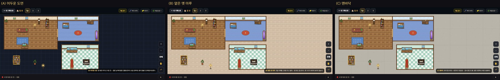
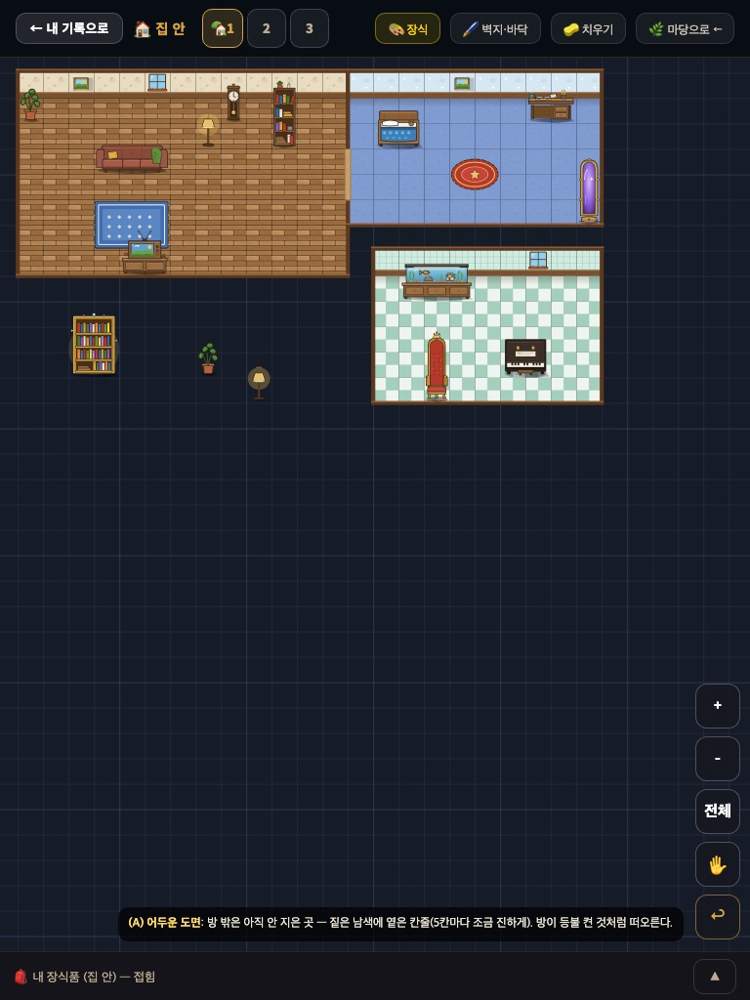
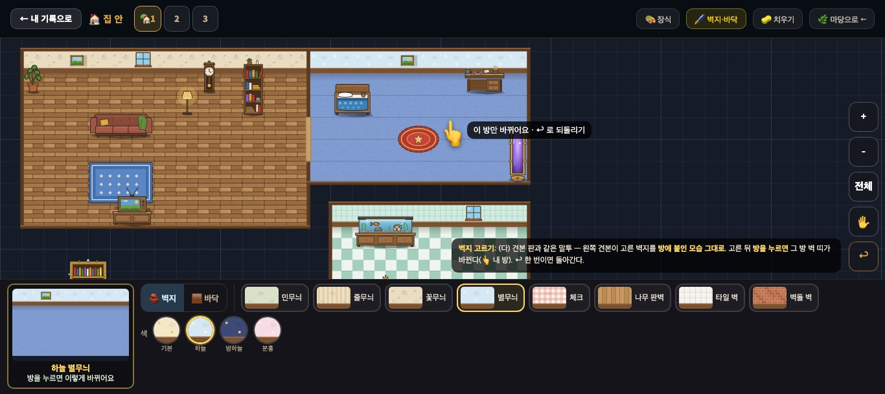
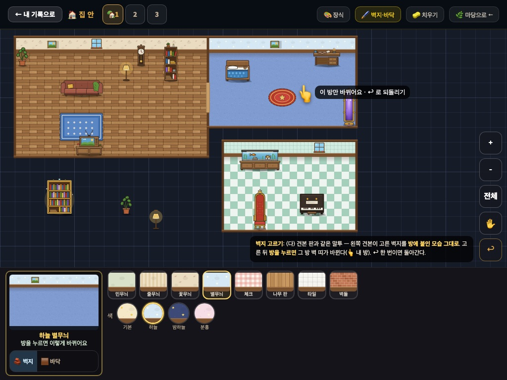
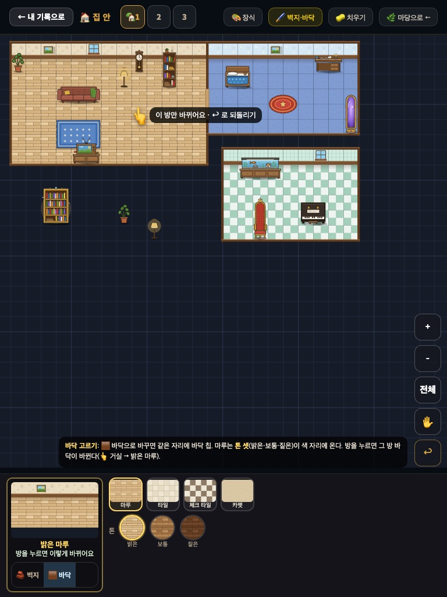
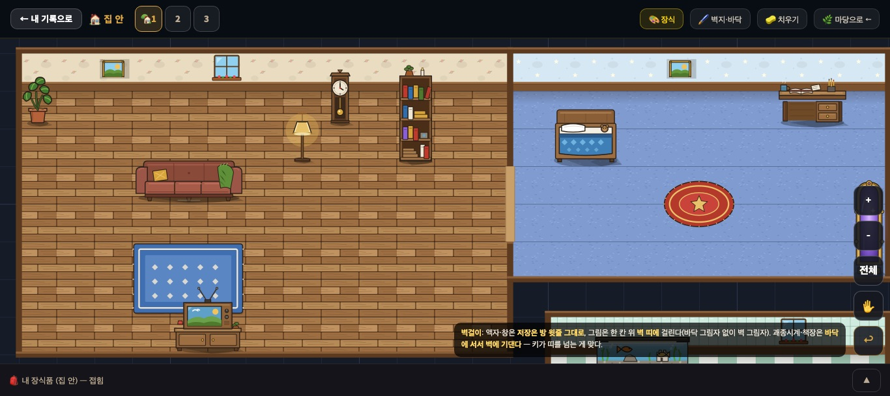
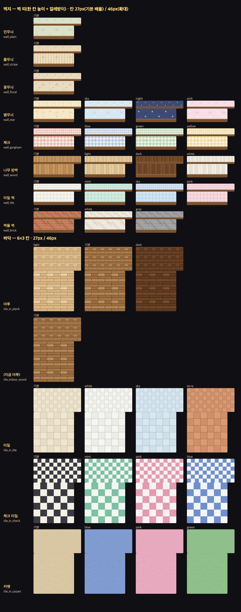

# 집 안 — 벽지·바닥 고르기 · 방 밖 빈 터 · 벽걸이 규칙 (2026-09-20)

> 마당 꾸미기 디자인 담당 · **규칙 문서**. 코드·표 변경 0. 그림은 #644(새 9장).
> 기준: `docs/indoor_rooms_proposal_20260920.md` (나) 네모로 방 만들기 — 이 문서는 그중 **IN-2(벽지·바닥 고르기 + 벽걸이를 벽 띠에)** 와 IN-3 의 **겉모습**(빈 터·벽·문)을 정한다.
> 시안 전부(세 폭 · 세 안): 저장소 밖 `우리반RPG/보고_20260919/집안_벽지바닥_시안/`. 위쪽 막대는 놀이판(운영 DB 미접속)에서 찍은 지금 집 안 화면, 판은 실제 가구 SVG + 벽지·바닥 그림으로 그렸다(좌표는 지금 판 50×28 그대로).

## 0. 정해진 것 · 기다리는 것

| | 결정 |
|---|---|
| 괘종시계 `d_i3` | **`DECO_WALL` 에서 뺀다** — 서 있는 시계다(그림에 바닥 그림자). 어느 줄에나 놓이고, 방 윗줄에 놓으면 벽에 기대 선다(키가 벽 띠를 넘는 게 맞다). 보스 승인 |
| 그림 액자 `d_i4` | 벽걸이 그대로. 벽 띠에는 **`d_i4_wall.svg`**(벽걸이 판)를 그린다(§4) |
| 벽지·바닥 고르기 화면 | 마당 바닥 고르기 (다)와 **같은 부품**(§3) |
| 방 밖 빈 터 | **(A) 어두운 도면 확정** — 사용자 "추천대로"(2026-09-20). `INDOOR_OUTSIDE` 기본값 = `'blueprint'`. 나머지 두 안은 스위치 값으로 남긴다(§1) |

---

## 1. 방 밖 빈 터 — 스위치 하나

**언제 보이나**: **방이 하나도 없는 집 안 = 지금 마루 그대로**(빈 터 없음 — 지금 아이들 집 안은 한 픽셀도 안 바뀐다). **첫 방을 만든 순간부터** 방 밖이 빈 터가 된다. 옛 가구가 어둠에 떠 보이지 않게 첫 방은 제안서 §3 손놀림 7('가구 둘레를 첫 방으로')이 먼저 권한다.

`INDOOR_OUTSIDE = 'blueprint' | 'oldfloor' | 'concrete'` — **기본값 `'blueprint'`(확정)**. 아이가 고르는 것 아님 · 저장 0.

| 값 | 생김새 | 그리는 법 |
|---|---|---|
| **`blueprint`** (A) **확정** | 짙은 남색 + 옅은 칸줄, 5칸마다 조금 진하게. 방이 등불 켠 것처럼 떠오른다 — '도면 위에 방을 짓는다' | 바탕 `#161b28` · 칸줄 1px `rgba(140,170,220,.09)` · 5칸마다 `rgba(140,170,220,.2)` |
| `oldfloor` (B) | 지금 마루를 옅게 — 방 밖도 집 안. 옛 가구가 버려져 보이지 않는다. 방은 덜 도드라진다 | `tile_indoor_wood` 를 깔고 위에 `rgba(238,231,218,.66)` 한 겹 |
| `concrete` (C) | 회색 콘크리트 + 4칸마다 이음 줄 — 공사 중인 빈 층. 조용하지만 조금 차갑다 | 바탕 `#b9b4aa` · 4칸마다 1px `rgba(0,0,0,.09)` · 잔 얼룩(시안은 칸마다 점 3개를 캔버스로). **고르면 `tile_concrete.svg` 한 장을 그린다**(칸마다 무작위 점은 비트맵 굽기와 안 맞는다) |

- 방 밖에도 가구는 **그대로 보이고 그대로 놓인다**(막다른 길 0 — 제안서 §3 규칙).
- 칸줄·이음 줄은 바닥 그림 위, 가구 아래.

## 2. 방의 껍데기 — 벽 띠 · 벽 · 문

| 부분 | 자리 | 그림 |
|---|---|---|
| **벽 띠** | 방 윗줄 **바로 위 한 줄**(방 없는 큰 방은 지금처럼 판 위 여백) | 칸마다 벽지 조각(100×100) → 그 위에 `wall_baseboard` |
| 벽 윗면(두께) | 벽 띠 위 끝 | 막대 두께 `t = max(3px, 0.16C)` · `#5b3a20` + 위쪽 `0.35t` 밝은 줄 `#8a5e36` |
| 옆벽 · 아래벽 | 칸 경계선 가운데 | 같은 막대 — **칸을 차지하지 않는다** |
| 벽 그림자 | 방 윗줄 위쪽 `0.35C` | 세로 그라데이션 `rgba(40,20,5,.22) → 0` — 벽 띠가 바닥에서 떨어져 서 있어 보이게 |
| **저절로 난 문** | 두 방이 옆으로 맞닿은 벽의 가운데 **2줄** | 벽 막대를 비우고 문턱 `#c9a06a`, 폭 `1.6t`, 양옆 1.2px `rgba(0,0,0,.18)` |

- 옆벽·모퉁이는 **막대로 충분했다**(시안 세 폭에서 방으로 읽힌다) — 새 그림 없음. 위아래로 이웃한 방의 아치 문은 IN-3 에서 따로 시안.
- 방 없는 큰 방(IN-2): 벽 띠 자리·걸레받이·창 3개는 **지금 코드 그대로**, 벽지·바닥 그림만 고른 것으로 바뀐다.

## 3. 벽지·바닥 고르기 — 마당 (다)와 같은 부품

| 1366×610 · 벽지 | 1024×768 · 벽지 | 768×1024 · 바닥 |
|---|---|---|
|  |  |  |

### 3-1. 공용 부품 (마당 ④가 떼어 두는 함수)

| 부품 | 마당 바닥 고르기 (`deco_floor_picker_20260920.md`) | 집 안 벽지·바닥 |
|---|---|---|
| **견본 판** | 7×5 판에 고른 꽃밭 + 가장자리/마감 | **작은 방**: 벽 띠 한 줄 + 바닥 3줄, 벽에 액자 하나. 고른 쪽(벽지 또는 바닥)만 바뀌고 다른 쪽은 **지금 고른 방의 것**(방이 없으면 큰 방) |
| 견본 이름 줄 | `빨강 튤립 · 흰 말뚝` | `하늘 별무늬` · `밝은 마루` |
| 견본 캡션 | `이렇게 칠해져요` / `테두리는 저절로 둘러져요` | **`방을 누르면 이렇게 바뀌어요`** |
| **토글**(1줄 앞 · 폭 <1200 이면 견본 아래) | `[✏️ 끌어서 \| ⬛ 네모로]` | **`[🧱 벽지 \| 🟫 바닥]`** |
| **칩**(1줄) | 가족 8(기본 + 정원 7) | 벽지 8 · 바닥 4(아래 순서 고정) |
| 칩 그림 | 3×2 꽃밭 | 벽지 = **벽 띠 조각 + 걸레받이**, 바닥 = 바닥 2줄 |
| **색 동그라미**(2줄) | 44px · 🔒 잠김 | 44px · **아래에 이름 10px**(벽지 색은 그림만으로 헷갈린다) · 마루는 줄 이름이 `톤` |
| 3줄 | 테두리(정원만) | **없음** — 서랍이 두 줄이라 판이 더 넓다 |
| 크기·상태 색 | 칩 44 / 58×58 · 고름 `#ffd866` | 같음 |

위 막대: 집 안에서 숨겨 둔 🖌️ 자리(#631)에 **`🖌️ 벽지·바닥`** — 누르면 이 서랍이 열린다(마당에서는 지금처럼 `🖌️ 바닥`).

### 3-2. 칩 순서와 저장 이름

저장은 제안서의 `indoor.<공간>.look = "바닥,벽지"`(방은 `rooms` 의 끝 두 칸) 그대로, 각 값은 마당 바닥과 같은 **`이름#색`**(기본색이면 `#` 없음).

| 벽지 칩 | 이름 | 그림 | 색 |
|---|---|---|---|
| 민무늬 | `plain` | `wall_plain` | — |
| 줄무늬 | `stripe` | `wall_stripe` | — |
| 꽃무늬 | `floral` | `wall_floral` | — (**없으면 이것 = 지금 벽**) |
| 별무늬 | `star` | `wall_star` | `sky` `night` `pink` |
| 체크 | `gingham` | `wall_gingham` | `blue` `green` `yellow` |
| 나무 판벽 | `wood` | `wall_wood` | `light` `dark` `white` |
| 타일 벽 | `tile` | `wall_tile` | `mint` `sky` `pink` |
| 벽돌 벽 | `brick` | `wall_brick` | `white` `gray` |

| 바닥 칩 | 이름 | 그림 | 색(톤) |
|---|---|---|---|
| 마루 | `plank` | `tile_in_plank` | `light` · (보통) · `dark` — **없으면 이것 = 지금 마루** |
| 타일 | `tile` | `tile_in_tile` | `white` `sky` `terra` |
| 체크 타일 | `check` | `tile_in_check` | `mint` `pink` `blue` |
| 카펫 | `carpet` | `tile_in_carpet` | `blue` `pink` `green` |

- `look` 이 없는 집 안은 **지금 그림 그대로** 그린다(`tile_indoor_wood` + `wall_floral`). `plank` 보통 톤은 `tile_indoor_wood` 와 픽셀 차 최대 1이지만, '고르지 않은 아이는 한 픽셀도 안 바뀐다'를 지키려면 없을 때는 옛 파일 이름을 그대로 쓴다.
- 이름표에 없는 값·못 읽는 값은 조용히 기본으로(마당 `_floorParse` 와 같은 태도).

### 3-3. 누르면

1. 칩·색을 누르면 **견본만** 바뀐다(고르기 = 미리 보기).
2. **방을 누르면** 그 방의 벽지(🧱 탭) 또는 바닥(🟫 탭) 하나만 바뀐다. 👆 옆에 `이 방만 바뀌어요 · ↩ 로 되돌리기`. 확인 창 없음 · ↩ 한 단계.
3. 방이 없으면(IN-2) 판 어디를 눌러도 큰 방이 바뀐다.
4. 벽 띠를 눌러도 방을 누른 것으로 친다(벽지를 바꾸려는 아이는 벽을 누른다).

## 4. 벽걸이

| 장식 | 규칙 | 그림 |
|---|---|---|
| 그림 액자 `d_i4` · (IN-4 의 창·선반·벽등) | 저장은 **방 윗줄 그대로**, 그림은 **한 칸 위 벽 띠에** | **`d_i4_wall.svg`**(100×100 = 벽 띠 한 칸) 를 벽 띠 칸에 `C×C` 로 그린다 — 못과 끈 · 벽 그림자 · 걸레받이(y76~) 위. 서랍 카드·상점·도감은 지금 `d_i4.svg` 그대로. 규칙: 벽걸이 장식은 `<id>_wall.svg` 가 있으면 벽 띠에 그것, 없으면 몸통을 자르지 말고 그대로(창처럼) |
| 창 `wall_window` | 벽 띠 칸에 그대로(위로 `0.08C`) | 있음 |
| **괘종시계 `d_i3`** | **벽걸이 아님** — 보통 가구. 방 윗줄에 놓으면 벽에 기대 선 모습(띠를 넘는다) | 그대로 |
| 책장 `d_i6` · 황금 책장 · 침대 | 보통 가구 — 윗줄에 두면 벽에 붙는다 | 그대로 |

- 지금 `DECO_WALL = { d_i3: 1, d_i4: 1 }` → **`{ d_i4: 1 }`**. 이미 0번 줄에 선 시계는 그림이 **그대로**(시계는 지금도 제 칸에 서서 그려진다). 달라지는 것은 '맨 윗줄에만' 막힘이 풀리는 것뿐.
- 이미 0번 줄에 놓인 액자는 IN-2 부터 한 칸 위 벽 띠로 올라가 그려진다(저장 불변) — 제안서 §8-4 가 말한 '있는 그림이 바뀜'. 큰 방의 고정 창(1·5·9번 칸)과 같은 칸이면 **그 칸의 고정 창은 그리지 않는다**.

## 5. 새 그림 (#644)

벽지 5 + 바닥 4 = 9장, 약 15.9KB. 색은 한 파일 안 `#색`. 모든 색을 27px·46px 로:

## 6. 남은 그림 일

1. ~~`d_i4` 벽걸이 모양~~ → `d_i4_wall.svg` 로 끝.
2. (C) 맨바닥을 고르면 `tile_concrete.svg`(§1).
3. IN-3: 위아래로 이웃한 방의 아치 문 시안 · 끄는 중 네모 미리보기 색(마당 네모로의 금색 점선을 그대로 쓰면 된다).
