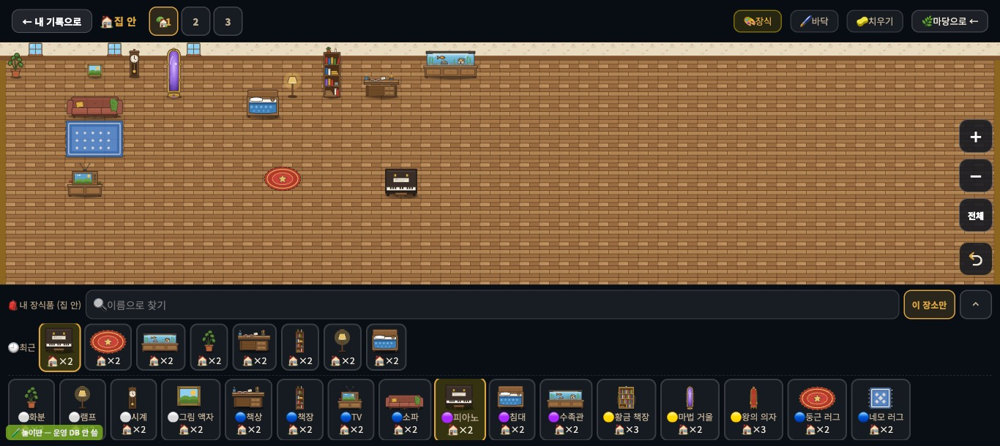
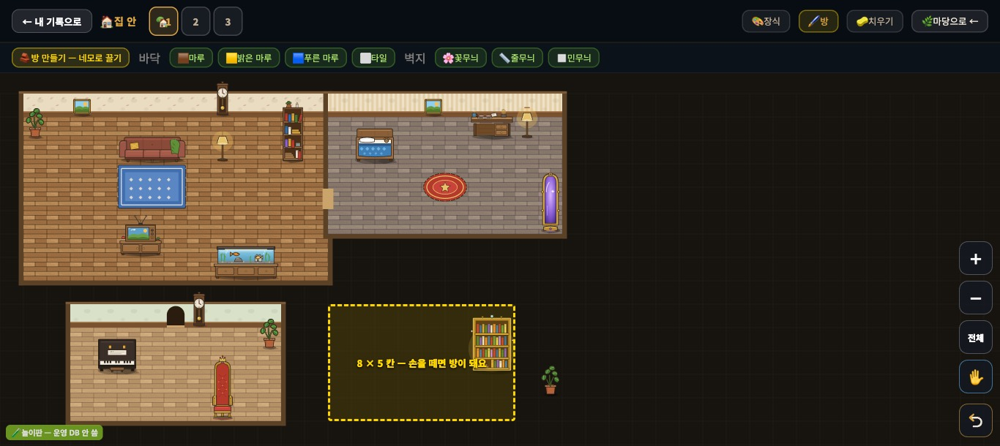
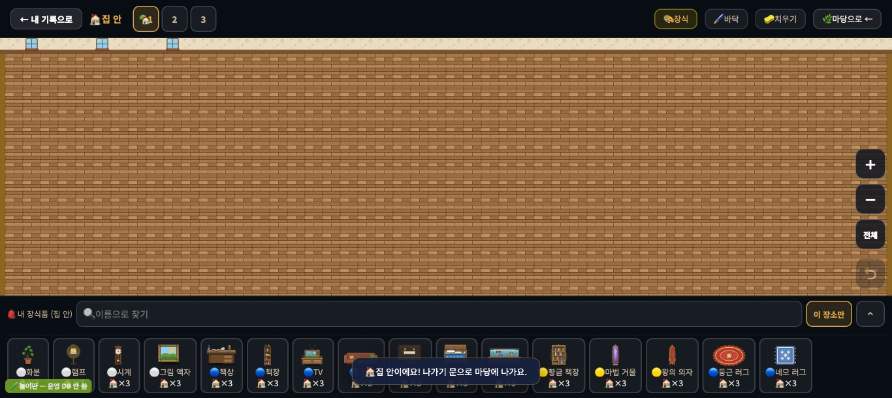
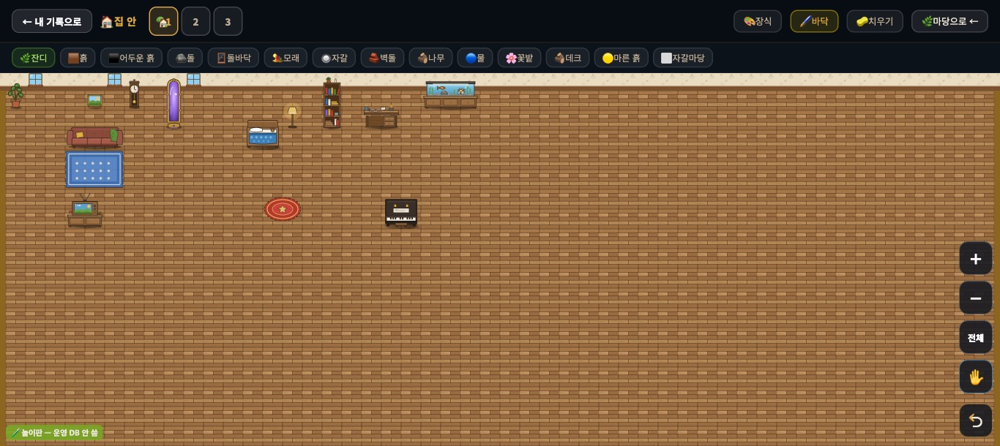
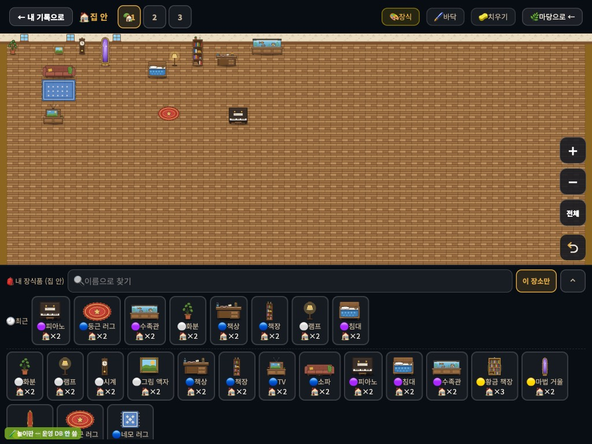
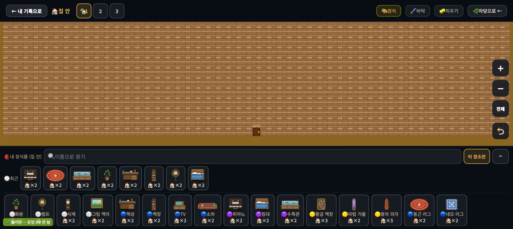
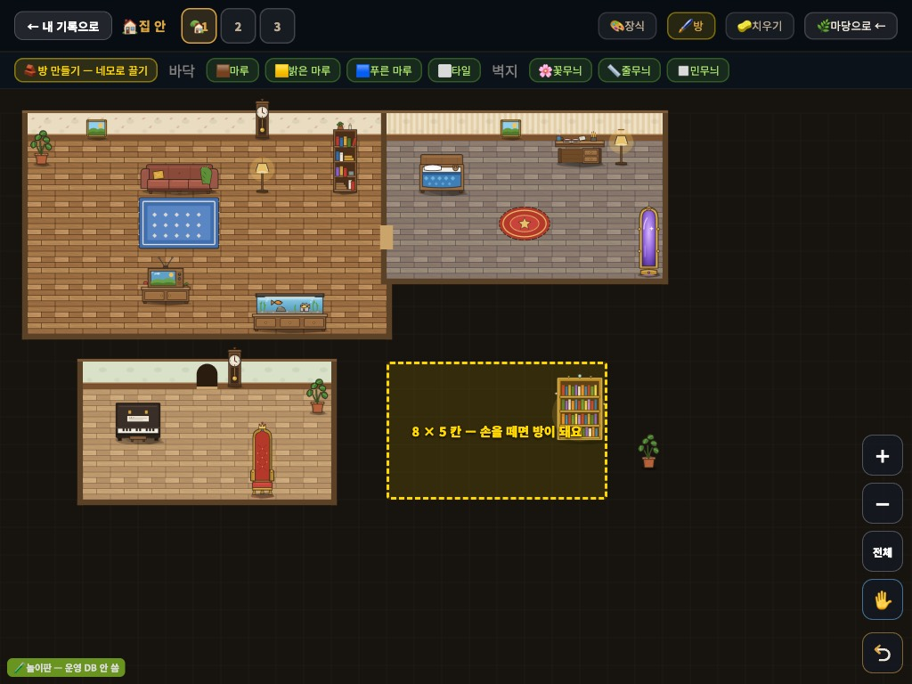
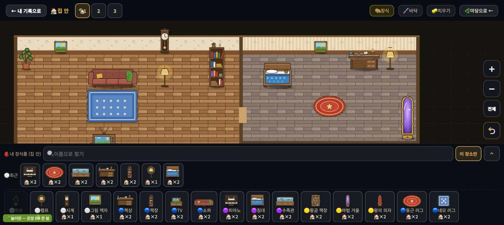

# 집 안 꾸미기 — '방 만들기' 제안 (INDOOR-ROOMS-0)

> 2026-09-20 · 집 안 꾸미기 설계 담당(mc) · **조사 + 제안서(구현 전)**. 제품 코드·표·그림 변경 0.
> 사용자 말: "집 안도 발전시켜라. 집은 **방을 만들 수 있거나** 그런 기능이 필요해 보인다."
> 잣대는 마당과 같다(`docs/vision_home_village_20260919.md`): ①더 예뻐지는가 ②살아 움직이는가 ③"이런 것도 돼?" 하고 놀라는가 · 점수·순위·돌봄 의무 없음 · 태블릿 터치가 기본.
> 코드 줄 번호는 `origin/main` `7de7fbe` 기준. 화면은 전부 **놀이판**(`scripts/unit/deco-save-count/play.mjs` · 운영 DB 미접속 · 가짜 학생 '시험')에서 찍었다. 그림: `docs/img/indoor_rooms_20260920/`.

---

## 0. 한 장 요약

- **지금 집 안은 '방'이 아니라 50×28칸(1,400칸)짜리 마루 창고다.** 벽은 맨 위 띠 하나, 창은 왼쪽 구석에 고정 3개, 바닥·벽지는 못 바꾼다. 집 안 장식은 17종 — 17종을 3개씩 다 놓아도 129칸 = 판의 9% 다. 그래서 무엇을 놓아도 '빈 강당 구석에 가구를 쌓은 모습'이 된다.
- **🖌️ 바닥 단추가 집 안에서는 막다른 길이다** — 마당 바닥(잔디·흙·물…) 14종이 뜨고, 눌러도 끌어도 아무 일이 없다(알림도 없다).
- **추천 = (나) 네모로 끌어 방 만들기.** 좌표·판은 그대로 두고(있는 가구는 한 칸도 안 움직인다), 아이가 **네모로 끌면 그 자리가 벽·벽지·바닥을 가진 방**이 된다. 방과 방이 맞닿으면 문이 저절로 난다. 저장은 방 하나 ≈ 28B(장식 1개 46.5B 보다 작다). 마당 바닥 고르기에서 확정된 **[⬛ 네모로]** 손짓(#604)을 그대로 쓴다.
- 작은 PR 다섯으로 나눈다: ① 러그 위에 가구 → ② 벽지·바닥 고르기 + 벽걸이가 진짜 벽에 → ③ 방 만들기 → ④ 문·창·낮밤 → ⑤ 살아 있는 집 안. **앞의 둘은 '방'이 없어도 그 자체로 보이는 변화**이고 저장 위험이 거의 없다.

| 지금 (놀이판 1366×610 · 가구 14개를 놓은 뒤) | 추천 안 목업 (같은 놀이판 · 같은 그림 자산만 써서 그림) |
|---|---|
|  |  |

(오른쪽 목업은 놀이판 브라우저 안에서만 `_drawIndoor` 를 잠깐 바꿔 그린 것이다 — 저장소의 코드는 안 바뀌었다. 벽지 3종·걸레받이·마루는 **이미 저장소에 있는 그림**이다. 바닥 색만 임시로 덧칠했다.)

---

## 1. 지금 집 안은 무엇인가 (코드로 확인)

| 물음 | 답 | 근거 (`student.js`) |
|---|---|---|
| 판 크기 | 전체화면 **50×28** · 내 집 창 안 작은 판 **12×8**(같은 좌표의 왼쪽 위만 보임) | `DI_FULL`·`DI_NORMAL` 4680~4681 |
| 그리기 | 단색 벽 → 마루(`tile_indoor_wood` 를 **칸마다 drawImage — 다시 그릴 때마다 1,400번**, 보이는 칸 고르기 없음) → 벽 띠(`wall_floral` + `wall_baseboard`) → **창 3개를 1·5·9번 칸 위에 고정**(12칸 시절 값 그대로) → 러그 → 격자 → 가구 → 나가기 문(판 맨 아래 가운데) | `_drawIndoor` 8397~8485 · `_drawIndoorFloorSVG` 8021~8034 |
| 벽 | **북쪽 띠 하나뿐**(높이 약 0.9칸, 판 바깥 여백에 그림). 옆벽·아래벽·칸막이 없음 | 8400~8404 |
| 바닥·벽지 바꾸기 | **안 된다.** 저장 필드도 없다. `wall_plain.svg`·`wall_stripe.svg` 는 저장소에 있는데 **코드 어디서도 안 쓴다** | `grep wall_plain` → 0건 |
| 🖌️ 바닥 모드 | 집 안에서도 단추가 켜지고 마당 바닥 14종 줄이 뜬다. 끌기는 `cell.area !== 'yard'` 에서 조용히 빠지고, 누르기는 "먼저 아래 장식품을 선택해주세요!" — **서랍은 접혀 있어 고를 수도 없다** | `_decoStrokeApply` 7281~7282 · `_decoClick` 8512~8517 |
| 저장 | `houseDecorations` 의 `{id, area:'indoor', row, col, sp?}` **그것뿐.** 집 안 바닥·벽지 필드 없음(`yardFloor`/`yardFloors` 는 마당 것) | `_decoNew` 4577 |
| 공간 1·2·3 | **집 안에도 적용된다** — `_decoList` 가 `sp` 로 거르고 집 안 그리기·놓기·겹침 검사가 전부 `_decoList` 를 쓴다. 단 **마당과 한 몸**(2를 누르면 마당도 집 안도 2) | 4571~4581 · 8443 |
| 집 안 전용 장식 | **17종**(전체 98종 중 · `gamedata.js` 를 vm 으로 불러 셈): 화분·램프·시계·액자·책상·책장·TV·소파·피아노·침대·수족관·황금 책장·마법 거울·왕의 의자·둥근 러그·네모 러그·황금 책장(업적). 그림은 `assets/deco/d_i1~16.svg` 16장(+러그 썸네일 1) | |
| 놓는 규칙 | 벽걸이 = **id 두 개를 코드에 적어 둔 예외**(시계·액자 → 0번 줄만). 러그는 `layer:'floor'` 로 **먼저 그려질 뿐, 칸은 차지한다** → **러그 위에 소파를 못 놓는다**("여기엔 이미 🟦 네모 러그이(가) 있어요"). `docs/deco_place_table.md` 의 "가구 밑에 깔린다"는 그리기 순서 얘기였고 놓기는 막혀 있다 | `DECO_WALL` 4621 · `canPlaceDeco` 4653~4659 |
| 움직임 | 없다. 동물 층은 마당 전용(`scene !== 'yard'` 면 층을 없앰 · `DY`·`area==='yard'` 고정 · 집 안의 `offX/offY` 를 모름). `assets/deco/motion.json`(움직임 층 표)은 그림 쪽에만 있고 **코드에 아직 안 물려 있다** | `_animSyncLayer` 7770~7779 |
| 친구 구경 | **집 안도 보인다**(`🏠 집 안 보기 →`). 공간 1만, 50×28 을 폭에 맞춰 한 장으로 — 1366×610 에서 칸 27px·높이 512px 라 **위 18줄쯤만 보이고 밀 수 없다.** 방문 창 안 작은 미리보기는 왼쪽 위 12×8 만 | `_renderFriendCanvas` 10770~10835 · `renderDecoCanvas` 10847~ |
| 보던 자리 기억·전체 보기 | 자리 기억은 마당 전용 — 집 안은 늘 왼쪽 위에서 열린다. '전체'는 집 안에서 배율 1(폭 맞춤)로 돌아갈 뿐이라 **아래 14줄은 여전히 화면 밖**이다(1366×610: 보이는 높이 395px = 14줄) | `_decoViewSave` 7070 · `decoZoomFit` 7113 |
| 옛 저장본 호환 | 모르는 필드는 `_migrate` 의 `...s` 로 그대로 실려 다니고 통짜 저장에 같이 나간다. **배열은 `_normalizeArrays` 에 적힌 것만 배열로 되돌린다** → 새 필드는 배열이 아니라 **객체 맵·문자열**이어야 안전 | `gamedata.js` 1016~1029 · 1098~1116 |

## 2. 아이 눈으로 본 빈 곳 (놀이판에서 직접 꾸며 봄)

| 그림 | 본 것 |
|---|---|
|  | **처음 들어온 모습(1366×610).** 끝없는 마루. 벽은 위에 얇은 띠, 창 3개는 왼쪽 구석에 몰려 있다. "여기가 내 방"이라는 느낌이 없다 |
|  | **가구 14개를 놓은 뒤.** 액자·시계가 벽이 아니라 **마루 첫 줄 바닥에** 서 있다. 가구를 모아 놓아도 둘레에 벽이 없어 방으로 안 읽힌다 |
|  | **🖌️ 바닥을 누르면** 마당 바닥(잔디·흙·물…)이 뜬다. 눌러도 끌어도 **아무 일도 없다**(알림도 없음) |
|  | 1024×768. 같은 문제 + 서랍이 화면 절반이라 판은 400px |
|  | **나가기 문은 판 맨 아래 가운데** — 세 번을 밀어 내려야 나온다(위 단추 '마당으로 ←'가 있어 막히지는 않는다) |

아이가 하고 싶은데 안 되는 것(해 보며 적음):

1. **"내 방을 만들고 싶다"** — 벽으로 둘러싼 '여기까지가 내 방'을 만들 방법이 없다. 방·부엌·거실을 나눌 수 없다.
2. **벽지·바닥을 바꾸고 싶다** — 못 한다. 단추는 있는데 눌러도 아무 일이 없어 고장처럼 보인다.
3. **러그 위에 소파·탁자를 올리고 싶다** — "이미 러그가 있어요". 러그는 방 꾸미기의 기본인데 가구와 같이 못 쓴다.
4. **액자·시계를 벽에 걸고 싶다** — 맨 윗줄에만 놓이기는 하는데 **바닥에 서 있는 것처럼** 그려진다. 옆벽이 없으니 걸 곳도 윗줄 하나뿐.
5. **창을 내가 달고 싶다** — 창은 고정 3개, 위치도 구석.
6. 집 안에는 **움직이는 것이 하나도 없다**(수족관 물고기도, 시계도, 마당에서 키우는 고양이도).
7. 친구 집 안을 구경하면 위쪽만 보이고 밀 수 없다.

---

## 3. '방 만들기' 세 안

공통 전제 — 세 안 모두 **지금 판(50×28)과 좌표를 그대로 둔다.** 판을 줄이거나 방마다 판을 따로 두면 이미 놓인 가구가 가려지거나 옮겨져야 한다(품질 기준 6번 위반).

### (가) 칸막이 벽을 선으로 긋는다 — 마당 '테두리' 층을 집 안에

```
   칸 경계를 따라 끌면 벽이 선다          가로 벽은 '얼굴'(1칸 높이)이 있어 뒷줄을 가린다
   ┌───────────┬──────┐                 ▒▒▒▒▒▒▒▒▒▒▒▒   ← 가로 벽의 얼굴(벽지)
   │           │      │                 ░░░░░░░░░░░░   ← 그 앞 줄
   │     ╶─────┤      │   ← ㄱ·ㄴ 모양도 됨
   └───────────┴──────┘
```

- **손놀림**: 🧱 벽 도구 → 칸 **경계선**을 따라 끈다. 놓인 벽 조각을 누르면 문·창으로 바뀐다. (`placement_classes_design` 의 `edge` 그대로)
- **저장**: 변 맵 `indoorWalls: { "<공간>": { "r_c": "n"|"w"|"nw"|… } }` — 변 하나 ≈ 10B. 10×6 방 하나를 두르면 변 32개 ≈ **320B**. 방마다 벽지·바닥을 다르게 하려면 (a) 닫힌 영역 찾기(flood fill)로 '방'을 알아내 방 단위로 저장하거나 — 벽을 하나 지우면 방 번호가 흔들린다 — (b) 바닥을 마당처럼 칸마다 칠한다(칸당 ≈ 12B → 60칸 방 **720B**).
- **건드릴 곳**: 새 변 층 전부(`_decoCellAt` 에 '가까운 변' 판정 · 경계 끌기 손짓 · 되돌리기 비교에 변 필드 · 그리기를 한 줄씩 [윗변 → 물건 → 아랫변] 세 번으로) + 닫힘 판정 + 벽걸이 규칙을 '가로 벽 바로 아랫줄'로. worklog §7 이 마당 테두리에 대해 적은 어려움이 전부 그대로 온다.
- **비용**: 그리기 = 변 수만큼 drawImage + 줄 단위 3단 정렬. 저장 = 셋 중 가장 크다.
- **위험**: ① **손가락으로 변을 겨누기 어렵다** — 설계안 스스로 "손가락으로 변을 겨누게 하지 않는다 · 네모로 끌면 둘레에 두른다"고 적었다. 즉 터치에서 방을 두르는 손짓은 결국 **네모 끌기 = (나)** 로 모인다. ② 마당 테두리 층이 아직 없다(10월 · '설계 먼저'). 집 안이 먼저 가면 같은 것을 두 번 만든다. ③ 한 칸 틈이 남은 '안 닫힌 방'을 어떻게 볼지(벽지가 안 칠해짐?) — 아이에게 설명하기 어렵다.
- **기존 집 안 보호**: 필드가 없으면 지금과 같다 → 지킨다.
- **좋은 점**: 가장 자유롭다(ㄱ자 방·복도·반쪽 칸막이).

### (나) 네모로 끌어 방을 만든다 — **추천**

```
        ▒▒▒▒▒▒▒▒▒▒▒▒▒▒   ← 벽 띠: 방 윗줄 '바로 위 한 칸'에 벽지+걸레받이. 벽걸이·창이 붙는 곳
       ┃░░░░░░░░░░░░░░┃  ← 방 윗줄(벽 앞 줄) — 책장·침대 머리가 벽에 붙는 줄
       ┃░░░░░░░░░░░░░░   ← 옆방과 맞닿은 곳은 옆벽이 저절로 뚫린다(문)
       ┃░░░░░░░░░░░░░░┃
       ┗━━━━━━━━━━━━━━┛  ← 옆벽·아래벽은 얇게(칸을 차지하지 않는다)
   방 밖 = '빈 터'(어두운 도면). 거기 있던 가구는 그대로 보이고 그대로 놓인다.
```

| 그림 | 무엇 |
|---|---|
|  | 🧱 방 도구 · 1366×610 — 방 셋(꽃무늬 거실 · 줄무늬 내 방 · 민무늬 음악실) + **끄는 중인 네모**(노란 점선) + 방 밖에 남은 옛 가구(황금 책장·화분) |
|  | 같은 장면 1024×768 |
|  | 🛋️ 장식 모드로 돌아와 가까이서(배율 1.75) — 옆벽의 문, **벽 띠에 걸린 액자·시계** |

- **손놀림**
  1. 집 안에서 🖌️ 자리의 단추가 **🧱 방**이 된다(마당에서는 지금처럼 🖌️ 바닥). 누르면 서랍이 접히고 도구 줄이 뜬다: `[🧱 방 만들기] · 바닥 견본들 · 벽지 견본들`.
  2. **빈 터를 네모로 끈다** → 끄는 동안 노란 점선 네모 + "8 × 5 칸 — 손을 떼면 방이 돼요" → 떼면 방. 확인 창 없음 · ↩ 한 단계. (마당 바닥 고르기의 **[⬛ 네모로]** 와 같은 손짓·같은 미리보기 — `docs/deco_floor_picker_20260920.md` §5)
  3. 네모 끌기가 어려운 아이를 위해 **크기 칩**도 둔다: `[작은 방 6×4] [보통 방 9×5] [큰 방 13×7]` → 칩을 고르고 빈 터를 누르면 그 크기로 놓인다(사용자 예시의 '방 조각'이 이것 — 저장은 같다).
  4. **견본을 고르고 방을 누르면** 그 방의 바닥·벽지가 바뀐다(칠하기가 아니라 '방 한 번 누르기').
  5. **방을 길게 누르면 작은 메뉴**: `[크기 바꾸기(모서리 손잡이 44px)] [방 없애기]`. 없애도 **가구는 그 자리에 남는다**(빈 터 위에).
  6. **방과 방이 옆으로 맞닿으면 옆벽 가운데에 문이 저절로** 뚫리고, 위아래로 이웃하면(사이 한 줄 = 아랫방의 벽 띠) 그 띠에 **아치 문**이 난다 — 아이가 방을 붙이는 순간 "어, 문이 생겼어!"가 이 안의 놀람이다. 문 자리 옮기기는 뒤 단계.
  7. **처음 한 번**: 이미 가구가 있는 아이가 🧱 방을 처음 열면, 가구들이 놓인 둘레에 점선 네모를 미리 보여 주고 "여기를 첫 방으로 만들까요? [만들기] [내가 끌래요]" — 첫 방을 만드는 순간 나머지가 어두워져 '내 가구가 밖에 버려진' 느낌이 들지 않게.
- **규칙(가볍게)**: 방은 서로 안 겹친다(벽 띠 줄 포함) · 최소 4×3 · 최대 20×12(1366×610 기본 배율에서 한 화면에 들어오는 크기) · 공간마다 8개까지 · **가구는 방 안이든 빈 터든 어디나 놓인다**(막다른 길을 만들지 않는다) · 방을 하나도 안 만들면 **지금 큰 방 그대로**.
- **저장** — 새 필드 하나, 객체 맵 + 짧은 문자열:

  ```
  indoor: {
    "1": {                                   // 공간 번호
      look:  "oak,stripe",                   // 방이 하나도 없을 때 큰 방의 바닥,벽지 (없으면 지금 그림 그대로)
      rooms: { "a": "1,1,13,7,wood,floral",  // r,c,w,h,바닥,벽지
               "b": "1,14,10,5,blue,stripe" }
    }
  }
  ```
  방 하나 ≈ **28B**(장식 1개 46.5B 의 0.6배). 공간 셋에 8개씩 꽉 채워도 ≈ 0.7KB. 문은 저절로 나므로 저장 0. 읽기는 `_floorParse` 처럼 **해석 한 곳**(`_indoorRooms(student) → [{id,r,c,w,h,floor,wall}]`) — 못 읽는 값·판 밖 값은 조용히 버린다.
- **건드릴 곳(`student.js`)**

  | 자리 | 무엇 |
  |---|---|
  | `_drawIndoor` 8397~ · `_drawIndoorFloorSVG` 8021~ | '껍데기 그리기'를 떼어 낸다: 방이 없으면 **지금 코드 그대로**(픽셀 동일), 있으면 빈 터 → 방마다 [바닥 → 벽 띠 → 옆·아래 벽 → 문]. 가구 그리기는 그대로 |
  | `_decoRuleWhy` 4629 | 벽걸이 = `0번 줄` → **`0번 줄 또는 어느 방의 윗줄`**(`_indoorWallRow(r,c)`). 말도 그대로 "맨 윗줄(벽 앞)" |
  | 손짓(`_decoAttachGestures` 의 pointerdown 분기 · `_decoStrokeBegin/Apply`) | 집 안 + 방 모드의 한 손가락 끌기 = **네모 끌기**(마당 [⬛ 네모로] 와 같은 상태 기계를 쓴다 — 그쪽이 먼저 들어오면 재사용, 아니면 여기서 만들고 그쪽이 재사용) |
  | `_decoUndoOne` 8577~ | 기록 종류 `room`(`{id, prev, next}`) 하나 추가 — 만들기·크기·바닥/벽지·없애기가 전부 이 한 꼴 |
  | `setDecoMode`·`ifSyncModeBtn` 4518·4753 · `student.html` `#if-floor-row` | 집 안이면 도구 줄을 방 줄로. worklog §9-5 의 "바닥 단추 14개를 JS 표에서 그리게" 정리에 얹는다 |
  | 나가기 문 8476 | 방이 있으면 **가장 아래 방의 아래 벽 가운데**로(없으면 지금 자리) |
  | 열 때 자리 · '전체'(`decoZoomFit` 7113) | 집 안은 **방들의 둘레에 맞춰** 연다/맞춘다(지금 '전체'는 폭만 맞춰 아래쪽이 안 보인다) |
  | 친구 구경 10770~ · 10847~ | `_drawIndoor` 를 그대로 부르니 **방은 저절로 보인다.** 다만 '방 둘레에 맞춰 한 장'으로 바꿔야 아래쪽 방이 안 잘린다 |
  | `student.js` 밖 | `admin.js` 784·803(꾸미기 초기화에 `indoor` 추가) · `scripts/unit/deco-save-count/`(하네스 줄) |

- **비용**: 그리기 — 지금은 다시 그릴 때마다 마루 1,400칸을 칠한다. 방이 생기면 **방 칸만**(목업 방 셋 = 177칸 + 벽 띠 32칸) 칠하니 오히려 가벼워진다(방 없는 아이는 지금과 같다 — 같이 고치려면 보이는 칸만 그리기). 재는 법: `deco-perf` 에 집 안 장면이 없다 → 한 줄 추가가 먼저. 저장 — 위 표.
- **위험**
  1. **옛 캐시 JS**: 방을 모른다 → 지금처럼 큰 방으로 그린다. 가구 좌표는 같으니 **겹치거나 사라지는 것 0**, 통짜 저장에 `indoor` 가 그대로 실려 나가 보존된다(`...s`). 확인은 `deco-save-real-sdk` 로 '옛 JS 왕복 뒤 `indoor` 그대로' 한 줄. 테두리 층(가)보다 훨씬 안전하다 — 옛 화면에서 눌러 지울 '가짜 칸 장식'이 안 생긴다.
  2. **벽 띠 줄에 서 있던 가구**: 방의 벽 띠는 방 윗줄 바로 위 한 칸에 그려진다. 거기 가구가 있으면 **가구가 띠 앞에** 그려진다(가구는 늘 나중에 그린다) — 사라지지 않고, 벽 앞에 선 것처럼 보인다. 새 방을 만들 때 띠 줄이 다른 방 바닥과 겹치면 "방 사이에 벽 한 줄이 필요해요"로 막는다.
  3. **빈 터의 생김새**가 어두우면 옛 가구가 '버려진' 것처럼 보일 수 있다 → 위 손놀림 7(첫 방 제안) + 빈 터 색은 시안으로 고른다(§8).
  4. 방 8개·최대 20×12 같은 숫자는 놀이판에서 만져 보고 정해야 한다(지금 값은 1366×610 한 화면 기준의 어림).
- **기존 집 안 보호**: `indoor` 필드가 없는 아이 = **한 픽셀도 안 바뀐다**(하네스에 `옛집안_그림지문` — worklog §11 의 마당 지문 방식 그대로). 방을 만든 뒤에도 가구 좌표·가진 개수는 안 건드린다. ↩ 와 '방 없애기'로 언제든 큰 방으로 돌아간다.

### (다) 공간 1·2·3 을 '이름 있는 방'으로

```
  [🛋️ 거실] [🛏️ 내 방] [🍳 부엌]      ← 지금의 🏡1·2·3 단추가 집 안에서는 방 이름으로
   방마다 벽지·바닥을 고른다. 판은 방마다 따로(지금도 그렇다).
```

- **손놀림**: 집 안에서 위 단추로 방을 오간다. 🖌️ → 그 방의 벽지·바닥 견본을 고른다.
- **저장**: `indoor: { "<공간>": { look: "바닥,벽지" } }` 뿐 — 셋 중 가장 작다(방당 ≈ 20B). 가구는 이미 `sp` 로 나뉘어 있다.
- **건드릴 곳**: `_drawIndoorFloorSVG` 에 look · 도구 줄 · 단추 글자(`ifSyncScene`). 가장 적다.
- **위험·한계**
  1. **방이 여전히 50×28 창고다.** '방 느낌'의 뿌리(둘러싼 벽·알맞은 크기)를 못 고친다. 판을 줄여 보이면 멀리 놓은 가구가 가려진다(기준 6번).
  2. 공간은 **마당과 한 몸**이다 — '내 방'으로 가면 마당도 공간 2 로 바뀐다. 떼어 내려면 `DECO_SPACE` 를 장면별로 둘로 나눠야 하고, 그러면 '공간 1에 쓴 것은 다른 공간에서 못 쓴다'는 셈(모든 공간 합산)과 엉킨다.
  3. 친구는 **공간 1만** 본다 → 내 방·부엌은 아무도 못 본다.
  4. 방이 이어져 있지 않다(문을 열고 옆방으로 가는 그림이 없다) — 놀람이 없다.
- **기존 집 안 보호**: 완전(필드 없으면 지금 그대로).
- (다)의 **벽지·바닥 고르기**는 (나)의 2단계와 같은 것이다 → 버리는 게 아니라 (나) 안에 들어간다.

### 나란히

| | (가) 벽 긋기 | **(나) 네모로 방 만들기** | (다) 공간 = 이름 있는 방 |
|---|---|---|---|
| 아이 손놀림 | 경계선 따라 끌기(손가락으로 어렵다) | **네모로 끌기 / 크기 칩 누르기** | 단추로 방 바꾸기 |
| '방 느낌'(둘러싼 벽·알맞은 크기) | ◎ | ◎ | ✕ (여전히 큰 강당) |
| "이런 것도 돼?" | ㄱ자 방·복도 | **방을 붙이면 문이 저절로** · 방마다 다른 벽지 | 거의 없음 |
| 저장(방 하나) | 320B~1KB | **≈ 28B** | ≈ 20B |
| `student.js` 손대는 폭 | 가장 큼(새 변 층·닫힘 판정·3단 그리기) | 중간(껍데기 그리기·네모 손짓·되돌리기 한 종류) | 가장 작음 |
| 옛 캐시 JS | 필드를 따로 두면 안전 | **안전(좌표 불변·모르는 필드 보존)** | 안전 |
| 있는 집 안 보호 | ○ | **○ (필드 없으면 픽셀 동일)** | ○ |
| 앞선 의존 | 마당 테두리 층(10월·미착수) | 마당 [⬛ 네모로](#604 확정) | 없음 |
| 뒤에 (가)로 넓힐 수 있나 | — | **된다**(방 안 칸막이를 변 층으로 덧붙이면 됨) | — |

---

## 4. 집 안의 '층'과 놓는 규칙 — `placement_classes_design` 에 맞춰

| 층(설계안) | 집 안에서는 | 한 칸에 | 놓는 법 `place` | 저장 |
|---|---|---|---|---|
| ① 땅 | **방 바닥재**(마루·밝은 마루·타일·카펫…) — 칸이 아니라 **방 단위** | 방마다 1 | 견본 고르고 방 누르기 | `rooms` 문자열 안 |
| (①과 ③ 사이) | **깔개**(러그 — 지금 `layer:'floor'` 2종) | 1 | `object` 그대로. **달라지는 것: 깔개와 가구는 서로 겹쳐도 된다** — `_decoOverlapOk`(우리↔동물 겹침)와 같은 꼴로 '`layer:'floor'` ↔ 그 밖'을 허용. 누르면 위의 것(가구)이 먼저 잡힘(`_decoTopAt` 의 rank) | 0 |
| ③ 물건 | 가구 | 1 | `object` — 지금 그대로, **방 안·빈 터 어디나** | 0 |
| 벽걸이 | 액자·시계 + (새) 창·선반·벽등 | 벽 줄 칸마다 1 | `wallhang` — 카드를 들면 **벽 줄(0번 줄 + 방마다 윗줄)만 밝아지고** 거기만 놓인다. **그림은 한 칸 위 벽 띠에** 그린다(저장 좌표는 그대로 윗줄 — 옛 데이터 불변). 못 놓을 때 말은 지금 그대로 | 0 (규칙은 표의 `place:'wallhang'` — `DECO_WALL` id 목록은 필드로 흡수) |
| ⑤ 테두리 | **방의 벽·문** | — | 아이가 직접 놓지 않는다 — 방 네모에서 **저절로**. (문 옮기기·방 안 칸막이는 뒤에 변 층이 생기면) | 0 |
| ② 길 · ④ 길가 | 집 안에는 없다 | | | |

- '벽 앞 줄 전용'(벽에 등을 대야 하는 것 — 책장·침대 머리) 같은 규칙은 **두지 않는다.** 막는 곳은 '놓으면 눈에 어색한 곳'만(`deco_place_table` 의 결론) — 집 안에서 어색한 것은 **벽걸이가 바닥 한가운데 있는 것** 하나다.
- 러그 위 가구는 **방 만들기와 상관없이 지금 당장 고칠 수 있다**(저장 0 · 몇 줄) → 1번 PR.

## 5. '살아 있는 집 안' 후보 — 값싼 것만

| # | 무엇 | 아이가 보는 것 | 길 | 값 |
|---|---|---|---|---|
| 1 | **창밖 낮밤** | 저녁에 열면 창이 남색이고 **램프 둘레가 노랗게 번진다** — 같은 방이 다른 방이 된다 | 기기 시계로 그릴 때 색만 고름(창 유리 색 + 방 위에 옅은 밤 덧칠 + 램프마다 둥근 빛). 타이머 0 · 저장 0 | 가장 쌈. 창이 '놓는 물건'이 된 뒤(4번 PR)에 가장 빛난다 |
| 2 | **시계가 진짜 시각** | 괘종시계 바늘이 지금 시각 · 추가 흔들림 | 움직임 층(`motion.json`)의 `rotate` 에 '시작 각도 = 지금 시각' 한 값. CSS 회전이라 JS 타이머 0 | 움직임 층이 코드에 물린 뒤. 그림: 바늘·추 따로 |
| 3 | **수족관 물고기 · TV 화면 · 벽난로 불** | 물고기가 오가고, 불이 일렁인다 | `motion.json` 의 `frames`(마당 물레방아와 같은 종류). 벽난로는 새 가구 | 그림 2~3장씩 |
| 4 | **강아지·고양이가 집 안에 들어온다** | 마당의 고양이를 집 안에 풀어 놓으면 돌아다니다 **러그 위에서 눕는다** | `ANIM_DECO` 길 재사용 — 고칠 곳 넷: `_animSyncLayer` 의 `scene !== 'yard'` · `DY` → 장면별 판 · `area==='yard'` 거르기 · 집 안 `offX/offY`. 집 안 바닥은 전부 `hard` 로 보면 **`ground` 에 `hard` 가 있는 강아지·고양이만** 들어온다(닭·양·오리는 저절로 제외 — 말이 된다). 눕기 = 지금 '먹기' 프레임 자리에 `_nap.svg`. 단 `cat:'yard'` 장식을 집 안에 놓게 하는 예외(`cat` 검사 세 곳)가 필요 | 중간. **돌봄 의무 없음** — 눕는 것은 연출일 뿐 |
| 5 | **방에 들어서면 불이 켜진다** | 친구가 구경 와서 방을 누르면 그 방 램프가 켜졌다 꺼진다 | 구경 화면의 누르기 반응(worklog §6 '구경 화면 확대·이동 + 누르면 반응')에 얹음 · 저장 0 | 구경 개선 뒤 |

움직임은 전부 **움직임 예산**(worklog 굳은 규칙)과 `prefers-reduced-motion` 을 따른다. 1번은 움직임이 아니라 그림이라 예산 밖이다.

## 6. 추천과 단계

**추천 = (나).** 까닭:
1. 아이의 말 그대로다 — "방을 **만든다**." 네모를 끌면 방이 선다. (다)는 방을 '고르는' 것이고 (가)는 '벽을 긋는' 것이다.
2. 터치에서 (가)의 두르기 손짓은 어차피 네모 끌기로 모인다 — 그렇다면 네모 자체를 저장하는 쪽이 저장 10분의 1 · 닫힘 판정 0 · 방별 벽지가 공짜다.
3. **좌표와 판을 안 건드린다** → 있는 집 안 · 옛 캐시 JS · 친구 구경이 다 그대로 돈다.
4. 이미 확정된 손짓([⬛ 네모로])과 이미 있는 그림(벽지 3종)으로 첫 모습이 나온다 — 목업이 그 증거다.
5. 나중에 (가)의 자유(방 안 칸막이·문 옮기기)를 **덧붙일 수 있다.** 반대 방향은 안 된다.

| PR | 이름 | 아이에게 보이는 변화 | 저장 | 크기 |
|---|---|---|---|---|
| **IN-1** | 러그 위에 가구 | 러그 위에 소파·탁자·피아노가 올라간다 | 0 | 작음(`canPlaceDeco`·`_decoTopAt`·하네스 3줄) |
| **IN-2** | 벽지·바닥 고르기 + 벽걸이가 벽에 | 집 안의 🖌️ 가 **고장 난 단추에서 '방 꾸미기'로** — 큰 방의 벽지(꽃무늬·줄무늬·민무늬 = 있는 그림)와 바닥을 고른다. 액자·시계가 벽 띠에 걸린다 | `indoor.<공간>.look` | 중간. **첫 저장 필드** — 옛 JS 왕복·`admin.js` 초기화·지문 검사를 여기서 세운다 |
| **IN-3** | 네모로 방 만들기 | 네모를 끌면 방 · 크기 칩 · 방마다 벽지·바닥 · 크기 바꾸기·없애기 · ↩ · 첫 방 제안 · 열 때/전체 = 방 둘레 · 나가기 문 자리 | `indoor.<공간>.rooms` | 큼 — 한 단위(벽 네 면·모퉁이·빈 터·친구 구경에서 안 잘림)를 다 해서 낸다 |
| **IN-4** | 문과 창 · 낮밤 | 방을 붙이면 문이 저절로 · 창을 벽걸이처럼 내가 단다(고정 창 3개는 방 없는 큰 방에만 남는다) · 저녁에 열면 밤 | 0 (창 = 새 장식) | 중간 · 새 그림 필요 |
| **IN-5** | 살아 있는 집 안 | 시계·수족관·벽난로 · 강아지·고양이가 들어와 러그에 눕는다 | 0 | 움직임 층 PR 뒤 |

- 순서의 까닭: IN-1·2 는 **방이 없어도 그 자체로 아이에게 보이고**, IN-2 가 저장·호환의 발판을 작은 필드(`look`)로 먼저 깐다 → IN-3 은 같은 필드 아래에 `rooms` 만 더한다.
- IN-3 을 '문 없이' 내도 되는가: 문이 없는 방 둘이 붙어 있으면 **미완성으로 보인다**(기준 1번). → IN-3 은 방을 **띄워서만** 놓게 내거나, 저절로 나는 문(그림은 '뚫린 벽 + 문턱'이면 돼서 새 그림이 거의 없다)을 IN-3 에 넣는다. **추천 = 저절로 나는 문은 IN-3 에 포함**, IN-4 는 창·낮밤.
- `student.js` 를 고치는 PR 은 한 번에 하나 — 마당 쪽 대기열(정원 바닥 ②~④ · 상점 · 홈 타일) 사이에 **어디에 끼울지는 보스가 정한다**(§8).

## 7. 디자인 담당에게 필요한 그림

| 단계 | 그림 | 메모 |
|---|---|---|
| IN-2 | **바닥재 4~6종**(칸 타일 · 이음매 없이 이어지는 것): 밝은 마루 · 짙은 마루 · 흰 타일 · 체크 타일 · 카펫(색은 `#색` 한 파일) · 다다미/돗자리 | 지금은 `tile_indoor_wood` 하나. 색 변수로 늘리기(파일 수 말고) |
| IN-2 | **벽지 3~5종 더**(지금 꽃무늬·줄무늬·민무늬): 별무늬 · 물방울 · 나무 판벽 · 벽돌 — 색은 `#색` | 걸레받이는 공용 1장 그대로 |
| IN-2 | 벽 띠에 걸린 모습으로 본 **액자·시계 검수** | 지금 그림이 바닥에 세운 모양인지(괘종시계는 키가 커서 띠를 넘는다 — 넘어도 되는지) |
| IN-3 | **옆벽·아래벽·모퉁이**(얇은 벽 윗면) · **빈 터 바닥**(시안 3개를 한 장에: 어두운 도면 / 옅은 옛 마루 / 맨 콘크리트) · 끄는 중 네모 미리보기 색 | 목업은 단색 막대 — 그림으로 바꾸면 훨씬 낫다 |
| IN-3 | **저절로 나는 문**: 옆벽이 뚫린 자리(문턱) · 벽 띠의 아치 문 | |
| IN-4 | **창 3종**(네모 창 · 둥근 창 · 큰 창 2칸) — 유리는 낮/노을/밤 색을 코드가 고를 수 있게 따로 · **벽 선반 · 벽등** | 벽걸이 가족 |
| IN-5 | 시계 **바늘·추**(따로) · 수족관 물고기 2~3프레임 · 벽난로(새 가구)+불 3프레임 · 강아지·고양이 **눕는 모습**(`_nap.svg`) | `motion.json` 규격대로 |
| 뒤에 | 부엌·욕실 가구 가족(싱크대·냉장고·식탁 / 욕조·세면대) | 방 종류가 생기면 아이가 "부엌엔 뭘 놓지?" 하고 찾게 된다 — **방이 먼저, 가구는 그 뒤**가 자연스러운 순서 |

## 8. 정직하게 — 못 본 것 · 확신 없는 것

1. **실제 아이들의 집 안을 못 봤다**(운영 DB 미접속이 규칙). 아이들이 가구를 **어디에 · 얼마나 흩어** 놓았는지 모른다 — 첫 방 제안(둘레 네모)이 쓸 만한지, 최대 20×12 가 맞는지는 이 분포에 달렸다. 제안: 보스(또는 교사)가 읽기 전용으로 **이름 없는 집계**만 뽑는다 — 학생별 집 안 장식 수 · 둘레 네모 크기 · 14번 줄 아래를 쓰는 아이 수 · 0번 줄에 선 가구 수.
2. 목업은 **그리기만** 흉내 냈다. 네모 끌기 손짓 · 크기 바꾸기 손잡이 · 방 누르기는 만들어 보지 않았다 — 실제 터치(CDP)로는 한 번도 안 눌러 봤다.
3. 위아래로 이웃한 방의 **아치 문**이 3/4 시점에서 자연스러운지 확신이 없다(목업의 아랫방 아치는 어색하지 않았지만 한 장뿐이다). 시안이 필요하다.
4. **벽걸이를 벽 띠로 올려 그리기**는 저장은 안 바꾸지만 **있는 아이들의 그림이 바뀐다**(액자가 한 칸 위로). 나는 '아이가 뜻한 대로 고쳐지는 것'이라 보지만 기준 6번을 어떻게 읽을지는 보스 몫이다. 고정 창(1·5·9번 칸)과 겹치는 자리의 처리(그 자리 창을 생략)도 시안으로 봐야 한다.
5. 옛 캐시 JS 가 `indoor` 필드를 보존한다는 것은 **코드 읽기**(`_migrate` 의 `...s` · 통짜 set)로만 확인했다. 실제 SDK 왕복(`deco-save-real-sdk`)은 안 돌렸다. Firebase 는 빈 객체를 지우므로 읽는 쪽은 '없음'을 늘 견뎌야 한다.
6. 성능은 재지 않았다. "방이 생기면 가벼워진다"는 칠하는 칸 수의 셈일 뿐이다. `deco-perf` 에 집 안 장면이 없다.
7. 친구 구경·내 집 창 안 작은 판(12×8)·폰(375)에서 방이 어떻게 보일지는 코드로만 짚었다.
8. 방 안에서 **무엇을 할 수 있는가**(눕기·앉기 같은 아바타 행동)는 이 제안 밖이다 — 지금 집 안에는 아바타가 없다.

## 9. 보스가 골라 줄 것

1. **안**: (나) 네모로 방 만들기로 가는가 — 아니면 (다)만 먼저(가장 작음), 또는 마당 테두리 층과 묶어 (가)로.
2. **끼울 자리**: 마당 대기열(정원 바닥 ②~④ → 상점 → 홈 타일 → …) 사이 어디에 IN-1·IN-2 를 넣는가. IN-1(러그 위 가구)은 저장 0 · 작아서 아무 데나 낄 수 있다.
3. **벽걸이를 벽 띠로 올려 그리기**(있는 아이 그림이 바뀜)를 IN-2 에 넣는가, 방을 만든 아이에게만 적용하는가.
4. **빈 터의 생김새** — 시안 3개(어두운 도면 / 옅은 옛 마루 / 맨바닥)를 디자인 담당에게 받아 사용자가 고르는가.
5. **방 밖에도 가구를 놓게 두는가**(추천: 둔다 — 막다른 길 0) · 방 개수·크기 한도(지금 값은 어림).
6. **운영 데이터 집계**(§8-1)를 누가·언제 뽑는가(읽기 전용 · 이름 없음).
7. 방에 **이름·종류**(거실·부엌)를 붙일 것인가 — 추천: **안 붙인다.** 종류가 생기면 '부엌에는 싱크대가 있어야' 같은 규칙이 따라오고, 그것은 마당 꾸미기가 하지 않기로 한 시뮬 규칙이다. 아이가 침대를 놓으면 그 방이 침실이다.
