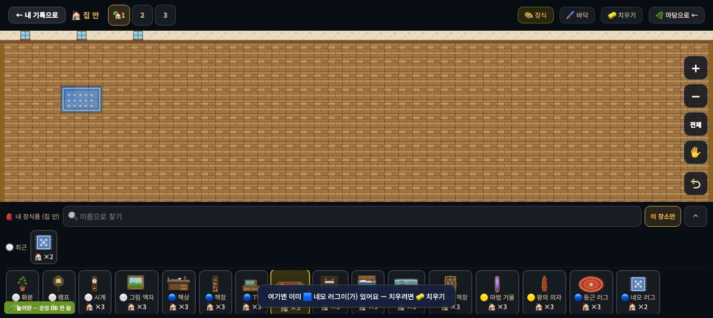
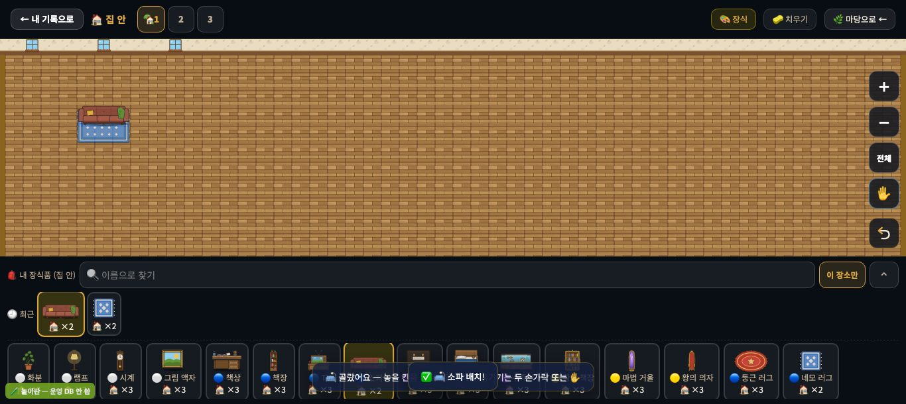
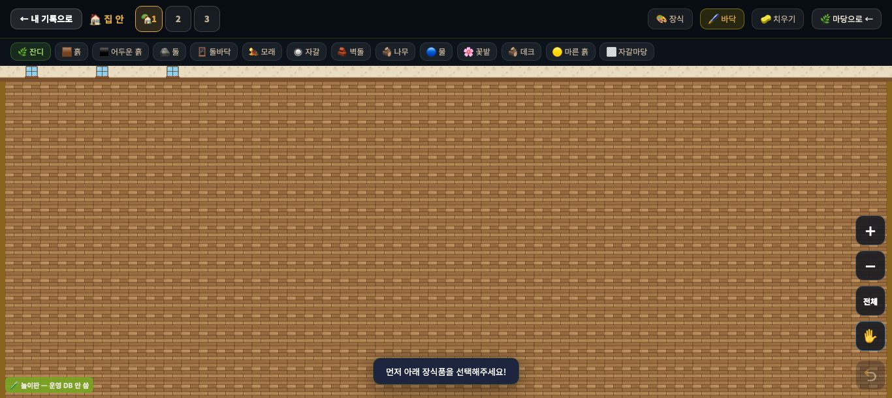
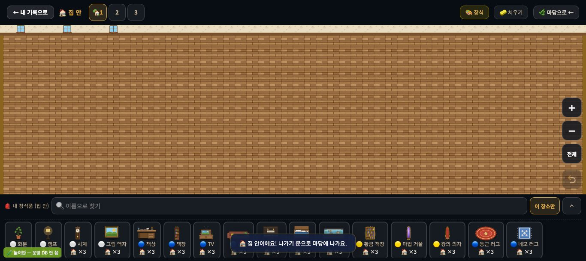
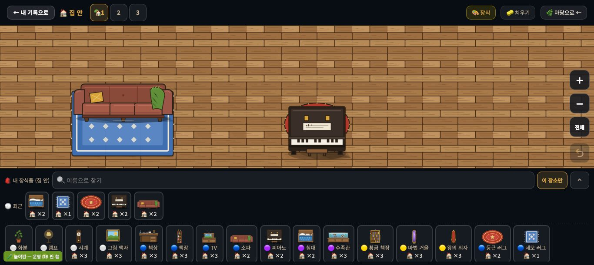
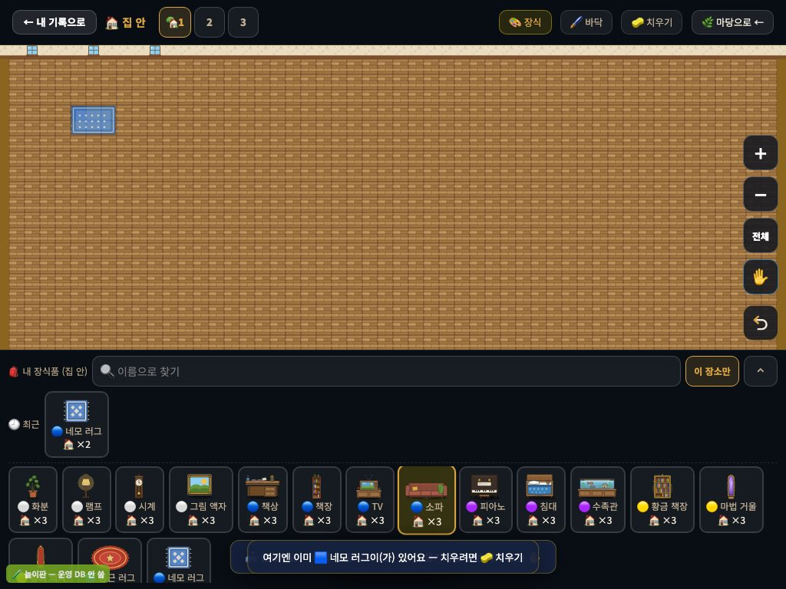
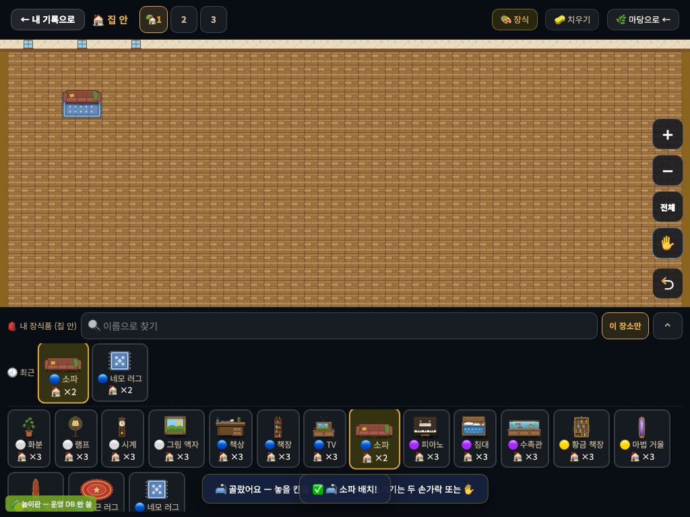
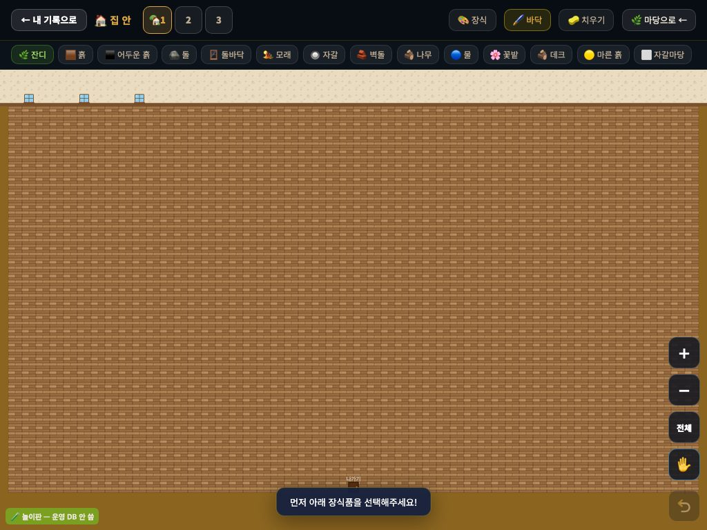
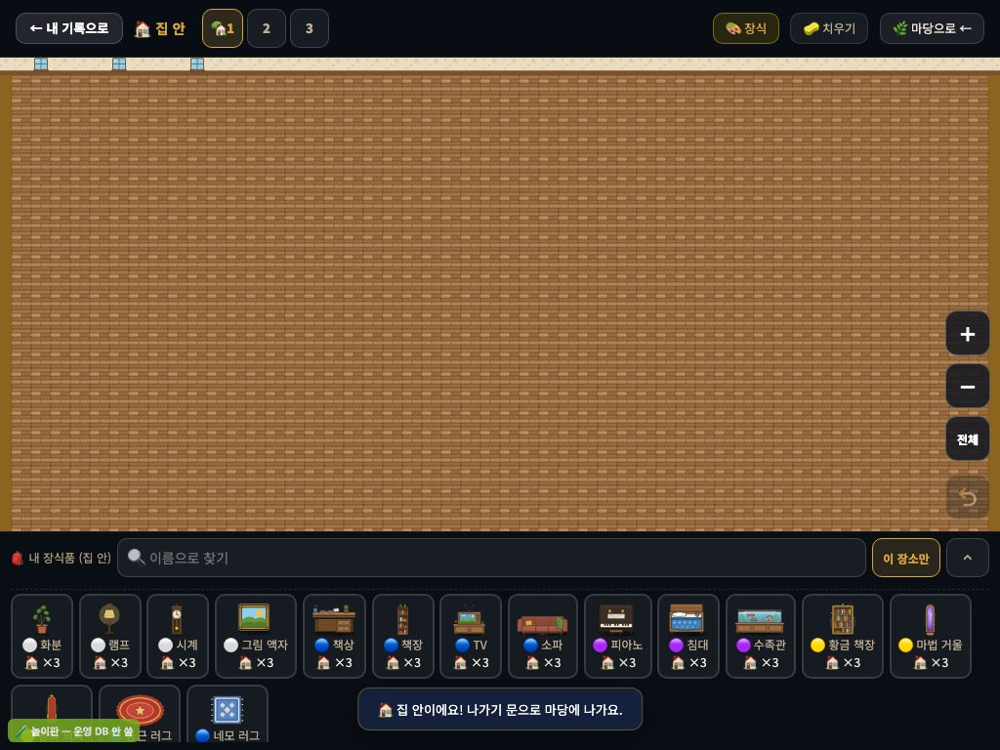
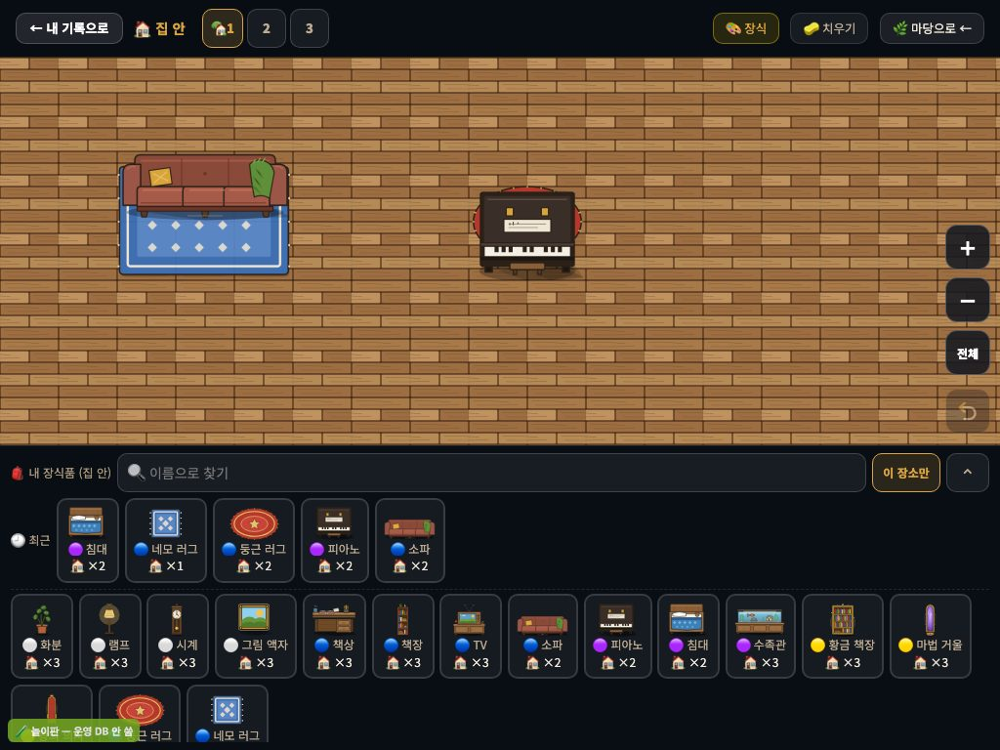

# 집 안 IN-1 — 러그 위에 가구 + 집 안의 🖌️ 바닥 단추 (INDOOR-RUG-1)

> 2026-09-20 · 집 안 꾸미기 프로그램 담당(mc) · 지도 = `docs/indoor_rooms_proposal_20260920.md` §6 의 IN-1.
> 저장 형식 변경 0 · 새 그림 0 · `student.js` +22/−2. 화면은 전부 **놀이판**(운영 DB 미접속)에서 찍었다.

## 무엇이 바뀌나 (아이 눈으로)

| | 전 (main) | 후 |
|---|---|---|
| 러그 위에 소파 | "여기엔 이미 🟦 네모 러그이(가) 있어요" — 못 놓는다 | 놓인다. 러그는 밑에, 소파는 위에 |
| 가구 밑에 러그 | "여기엔 이미 🎹 피아노이(가) 있어요" | 깔린다(가구를 치우지 않고 러그를 밀어 넣을 수 있다) |
| 러그 위에 러그 · 가구 위에 가구 | 안 된다 | **그대로 안 된다** |
| 겹친 칸을 🧽 치우기 · 빈손 누르기 · 길게 눌러 스포이드 | — | **위의 것(가구)이 먼저** 잡힌다. 러그는 남는다 · ↩ 하면 가구가 러그 위로 돌아온다 |
| 집 안의 🖌️ 바닥 단추 | 마당 바닥 14종이 뜨고 눌러도 끌어도 아무 일이 없다 | **집 안에서는 단추가 없다.** 바닥 모드인 채 들어오면 장식 모드로. 마당으로 나가면 다시 보인다 |

| 전 · 1366×610 | 후 · 1366×610 |
|---|---|
|  |  |
|  |  |
| | 가까이(배율 3)  |

| 전 · 1024×768(터치) | 후 · 1024×768(터치) |
|---|---|
|  |  |
|  |  |
| | 가까이  |

## 러그를 어떻게 구별하나

장식 표(`gamedata.js`)의 **`layer:'floor'`** — 지금까지 '가구보다 먼저 그린다'에 쓰던 바로 그 표시다(`_isFloorLayerDeco`). 지금 둥근 러그·네모 러그 둘.
id 목록을 코드에 따로 두지 않았다 → 디자인 담당이 새 깔개를 표에 `layer:'floor'` 로 넣으면 그리기 순서와 놓는 규칙이 같이 따라온다. `gamedata.js` 는 안 고쳤다.

## 고친 줄 지도 (`student.js`)

| 자리 | 무엇 |
|---|---|
| `_decoOverlapOk` (기존 함수 · +1줄) | 집 안에서 '깔개 ↔ 깔개 아닌 것'이면 겹쳐도 된다. 우리↔동물 규칙은 그대로 |
| 그 아래 새 블록 `_isRugDeco` · `_decoBlockerAt` (+11줄) | 깔개 판정 한 곳 · "여기엔 이미 ○○" 의 ○○ 를 **정말 막는 것**으로 말하려고(러그 위 소파를 누르며 러그를 놓으려 할 때 막는 것은 밑의 러그다) |
| `_decoTopAt` 의 `rank` (기존 1줄 고침) | 깔개는 우리(pen)처럼 맨 아래 → 치우기·빈손 누르기·스포이드·오른쪽 클릭이 다 위의 것부터 |
| `_decoPlace` 의 '이미 있어요' 가지 (기존 1줄 고침 + 2줄) | 집 안이면 막는 것의 이름으로 |
| `ifSyncScene` 끝 (+5줄) | 집 안이면 `#if-mode-floor` 감춤 · 바닥 모드였으면 장식 모드로 |

안 고친 것: `canPlaceDeco`(겹침 허용은 `_decoOverlapOk` 를 이미 거친다) · `_drawIndoor`(러그를 먼저 그리는 순서 그대로) · `_decoUndoOne`(되살릴 때 `canPlaceDeco(…, rec.p.id)` 가 같은 규칙을 탄다) · 끌어 놓기 · 친구 구경 · 정원 바닥 둘레 · 상점/서랍.

## 있는 집 안은 픽셀까지 그대로 — 증명

- 그리기 코드는 한 줄도 안 바뀌었다. 바뀐 것은 '놓을 수 있나'와 '누른 칸에서 무엇이 잡히나'뿐이다.
- 하네스 `옛집안_그림지문`: 러그와 가구가 **안 겹친**(= 지금까지 가능했던) 집 안 — 벽걸이 2 · 1×1/2×1/1×2/3×1/2×2 가구 · 러그 2 — 을 저장본처럼 바로 넣고 캔버스 전체의 SHA-256 을 찍는다.
  같은 기기에서 나란히: 이 브랜치 `1512x508:0c54c1f54ce508ceea4e` = main(`REPO=<main 을 푼 폴더>`) `1512x508:0c54c1f54ce508ceea4e`. 마당 지문(`옛바닥마당_그림지문`)도 같다.
- 옛 캐시 JS 기기: 러그 위에 가구가 놓인 저장본을 열어도 러그를 먼저 그리니 **같은 그림**이 나온다. 그 기기에서는 겹친 칸을 누르면 목록에서 먼저 나오는 쪽이 잡힐 뿐이다(사라지거나 깨지는 것 없음 · 필드 추가 0).

## 시험

- `node scripts/unit/deco-save-count/run.mjs` — 157줄 · `=false` 0 · 끝 표식 있음 · 3번 돌려 줄마다 같음(걸린 시간 줄 빼고). 새 줄 24(⑯ · 전 133줄): 바닥 단추 5 · 옛 집 안 지문 3 · 러그/가구 놓기·막힌 까닭·치우기·되돌리기·스포이드·끌어 놓기·공간 2·친구 구경 그리기 순서 16.
  (같은 test.js 를 main 에 돌리면 새 줄 중 11줄이 false — 고치기 전에는 정말 안 됐다는 뜻이다.)
- 놀이판 · 진짜 입력(CDP `Input.dispatchMouseEvent` 1366×610 · `Input.dispatchTouchEvent` 1024×768): 단추·카드·칸을 실제 좌표로 눌러 위 표의 모든 줄을 main 과 나란히 확인. 콘솔 오류 0.

## 남긴 것 · 다음(IN-2)

- 집 안의 '놓을 수 있는 칸' 옅은 표시(`_drawIndoor` 의 선택 하이라이트)는 예전부터 **놓인 것의 왼쪽 위 칸만** 뺀다 — 이 PR 에서 안 건드렸다(그리기 불변이 먼저). IN-2 에서 `_drawIndoor` 를 열 때 같이.
- 🖌️ 자리는 IN-2 에서 '방 꾸미기(벽지·바닥)'로 돌아온다 — 그때 `ifSyncScene` 의 감춤 두 줄을 걷어 낸다.
