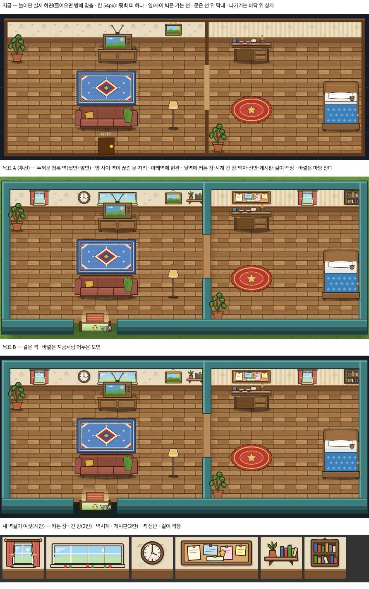

# 집 안 두꺼운 벽 — 방을 두른 벽 · 끊긴 문 자리 · 현관 · 뒷벽 벽걸이 (2026-09-23)

> 꾸미기 디자인 담당이 썼다. 사용자 요청은 "톱다운 사무실 느낌" — 벽 윗면·앞면으로 방이 또렷하고, 벽이 끊긴 문 자리가 있고, 뒷벽에 창·액자·책장이 붙는 모습이다.
> 기준선은 창조자 29회(`creator_notes/2026-09-23_round29.md` ⓑ62~65)다.
> 이 문서와 그림 PR 에서 **코드 · 저장 · 표 · 경제 값 변경은 0** 이다. 그리는 코드는 꾸미기 프로그램 담당이 맡는다.

- 맨 위는 놀이판(운영 DB 0)의 실제 화면이다. 1366 에서 들어오면 방에 맞춰져 칸이 54px 가 된다.
- 아래 둘은 같은 방 · 같은 가구를 실제 SVG 로 짠 시안이다. **A 가 채택**됐다(보스 09-23).

## 결정 (보스 09-23)
| | 결정 |
|---|---|
| 방 밖 | **A — 마당 잔디 + 집 그림자** (어두운 도면 79~87% 를 없앤다) |
| 위아래로 맞닿은 방의 문 | **옆방과 같은 규칙**: 맞닿은 벽이 2칸 이상이면 가운데에 끊긴 문 자리 하나 |
| 방 이름 팻말 | 보류. 이름을 저장해야 해서 설계 한 장이 먼저다 |
| 새 벽걸이 여섯 · 긴 탁자 · 의자 | 그림은 이 PR 에 들어간다. **값 · 희귀도 · 상점은 사용자 답을 받은 뒤** 프로그램 담당이 표에 넣는다. 표에 없으면 게임에 안 나온다 |

## 그리는 법 — `_inDrawRooms` (칸 C 기준)
| 부분 | 자리 | 그림 |
|---|---|---|
| 벽 두께 | 모든 벽 | `T = .34C` (지금 막대 `t = .16C`) |
| 색 | | 윗면 `#3e7b7a` · 밝은 줄 `#63a7a2`(가로 벽 위쪽 · 세로 벽 왼쪽, T 의 22%) · 테두리 `#1f3a3c` 폭 `max(1.4, .035C)` · 앞면 `#2b5557`(아래 40% `#203f41`) |
| 테두리 | 모든 벽 | ① 벽 사각형 전부를 테두리색 + `stroke 2×폭` 으로 칠한다. ② 그 위에 윗면색을 테두리 없이 칠한다. 모퉁이 · T자 만남에 속선이 없다 |
| 뒷벽 | 벽 띠(지금 그대로 벽지 + 걸레받이) **위** | 윗면 띠 `y = (r−1)C − T … (r−1)C`, 좌우로 T/2 씩 넘침 |
| 옆벽 · 방 사이 벽 | 칸 경계 가운데, 폭 T | 윗면 띠 윗끝부터 아래벽까지. **벽 띠를 가로지른다**(방 사이 벽이 뒷벽 앞으로 나온 모습) |
| 아래벽 | 칸 경계 가운데, 폭 T | 윗면 + 그 아래 칸 밖에 **앞면 `.3C`**. 가구보다 **나중에** 그린다 |
| 바닥 위 그림자 | 방 안 | 뒷벽 아래 `.35C`(지금 그대로) + 옆벽 오른쪽 `.28C` 가로 그라데이션 `rgba(40,20,5,.2) → 0` |
| 문 자리 | `_inRoomDoors` 자리(옆 · 위아래 모두 같은 규칙) | 그 구간은 벽을 그리지 않는다. 문턱 `#b98a58` 폭 T, 양옆 `#7a5230` 선. 끊긴 두 끝은 테두리가 닫는다 |
| 현관 | 규칙으로 정한 한 자리(예: 첫 방 아래벽 가운데 2칸 — **저장 안 늘림**) | 아래벽 2칸을 비우고 `in_exit_door.svg`(200×140 · y100 = 벽선, #858) |
| 방 밖 | 판 전체 | `tile_grass_a~d` 를 칸마다 고정 난수로 깐다. 방들을 두른 상자에 그림자(흐림 `.18C` · 아래로 `.25C` · 불투명도 .45) |
| 방 없는 큰 방 | | 지금 그대로 둔다 |

## 새 벽걸이 여섯 — `assets/deco/in_w_*.svg`

`d_i4_wall.svg` 와 같은 틀의 **벽 띠 판**이다.
- 한 칸이면 100×100, 두 칸이면 200×100.
- 걸레받이(y76~) 위에 걸리고, 벽 그림자를 가진다.

| 그림 | 칸 | 무엇 |
|---|---|---|
| `in_w_curtain` | 1 | 창 하나 + 양쪽 커튼(묶음 끈) + 커튼봉 |
| `in_w_window2` | 2 | 긴 창 — 네 칸 유리 · 창턱 꽃 |
| `in_w_clock` | 1 | 벽시계 — 둥근 나무 테 · 초침 |
| `in_w_board` | 2 | 게시판 — 코르크판 · 쪽지 다섯 · 압정 · 별 스티커 |
| `in_w_shelf` | 1 | 벽 선반 — 까치발 · 화분 · 책 |
| `in_w_bookshelf` | 1 | 걸이 책장 — 벽에 건 두 단 책장 |

- 표에 넣을 때는 새 id 를 정하고 두 표에 한 줄씩 적는다(**코드 · 표 · 값 = 사용자 답 뒤**).
  - `DECO_WALL` 에 `<id>: 1`
  - `DECO_WALL_ART` 에 `<id>: 'in_w_…'`
- 서랍 카드용 `<id>.svg` 는 id 가 정해지면 디자인 담당이 그린다.
- 두 칸짜리는 표 `size:{w:2,h:1}` 로 한다.

## 한계
- 목표 그림은 손으로 짠 시안이고, 코드가 그린 화면이 아니다. 구현 뒤 29회 '전·후 되밟는 법'으로 다시 잰다.
- 768×1024 는 보지 않았다.
- 아이가 두 방을 '방 둘'로 읽는지는 수업에서 확인할 일이다(ⓒ63).
