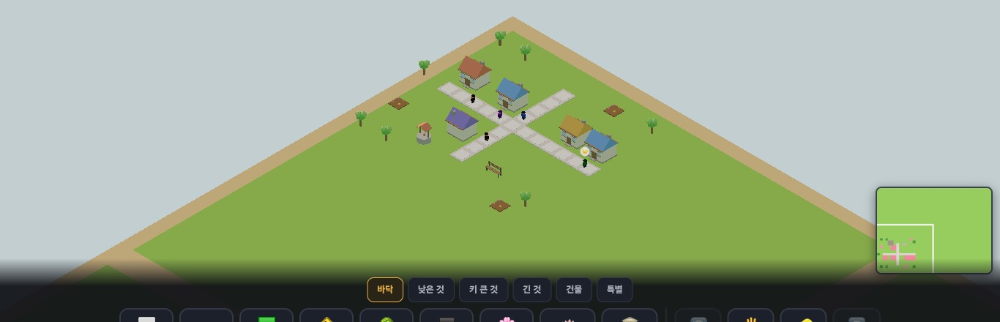
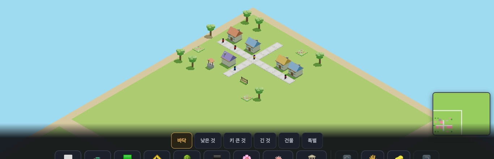
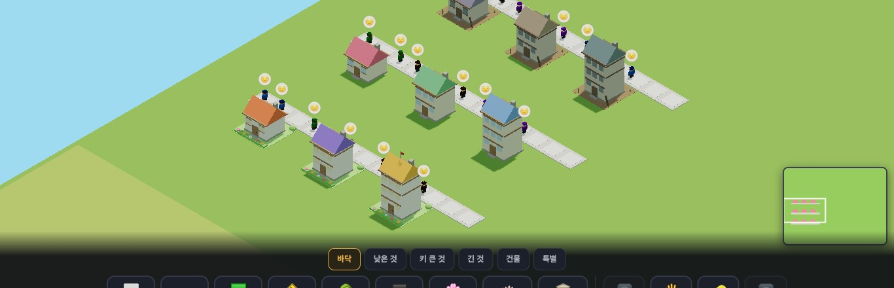

# 우리 마을 — 생김새 점검 · 빠진 조각 제안 · 집 모습 설계안 (2026-09-20 · 맥북 마을 디자인 담당)

> **②③은 구현 전 제안이다.** 보스·선생님이 고른 것만 만든다. ①의 앞 세 줄은 이미 PR 로 나갔다.
> 방법: `feat/village-45`(59차) 를 `python3 -m http.server` 로 띄워 **`?sid=guest` 로만** 열었다(운영 요청 0 — sync.js 는 guest 면 네트워크를 안 쓴다). 크롬북 1366×610 · 태블릿 768×1024. 낱개 모델 뷰어가 아니라 **게임 화면 그대로** 판단했다.
> 구역: 나는 모양·색·재질·모델·CSS 생김새. 규칙·시뮬·입력·저장·성능은 프로그램 담당([`village-proposal-20260920.md`](village-proposal-20260920.md)).

사진은 `docs/worklog/img/2026-09-20-village/`.

| 처음 본 화면(59차 그대로) | 지금(#433·#435·#437 + 프로그램 담당 #428·#431) |
|---|---|
|  |  |

---

## ① 발견 목록 (심각도순)

| # | 무엇이 어색한가 | 잰 값 | 상태 |
|---|---|---|---|
| 1 | **꽃밭·덤불이 칸을 못 덮고, 울타리·돌담이 이어 놓아도 끊긴다.** 꽃밭 3×3 = '갈색 흙판 9개', 덤불 3×3 = '양배추 9개'. 꾸미기(2D)에서 보스가 본 것과 같은 병 | 꽃밭 바닥판 84% · 덤불 지름 47% · 울타리 가로대 6.6/8 | ✅ #433 머지 |
| 2 | **나무가 집 처마보다 작고 '큰나무'가 가장 작다** | 꼭대기: 사람 1.7 · 1층 집 5.9 · 가로등 5.4 · 나무 4.1 · 큰나무 4.2 · 과일나무 3.9 | ✅ #435 머지 |
| 3 | **주민이 회색 길 위 검은 점** — 기본 확대에서 키 14px 에 옷이 짙은 네 색 | 옷 `3E2723·7B1FA2·1565C0·2E7D32` | 🟡 #437 (옷 색만). 말풍선·얼굴 키우기는 프로그램 몫 |
| 4 | **울타리·담이 꺾이는 곳에서 반 칸이 빈다.** 물건이 칸 가운데 띠라 ㄱ 자로 만나면 모퉁이가 안 닿는다 | 빈 길이 2(반 칸) | ⬜ 모양만으론 못 푼다 → ② '모퉁이·문 조각' + 자동 이음(프로그램) |
| 5 | **기본 품질에 그림자가 없다**(`GFX_DEFAULT = 3` = 그림자 없음). 나무·가로등·사람이 바닥에 붙어 보이지 않고 떠 보인다. 맥북은 곧 '기본 그림자'로 올라가지만 **크롬북은 그대로일 가능성**(추정 — 실기기 미확인) | 사다리 3단 = shadow none | ⬜ 제안: 서 있는 물건 발밑에 어두운 납작 원판 1개(+12~24△). 크롬북 실측 뒤 결정 |
| 6 | **잔디밭 색이 계절을 안 탄다.** 땅은 가을엔 누렇고 겨울엔 하얀데 잔디밭(`0x7cb944` 고정)만 한여름 색 | 계절 표에 없음 | ⬜ 작은 PR 가능(잔디밭을 계절 잔디색 계열로). 일부러 늘푸른 것이면 그대로 |
| 7 | **위 단추 14개가 그림문자뿐**이고 설명은 `title`(마우스 올릴 때만) — **태블릿에선 뜻을 알 방법이 없다.** 그림문자는 기기마다 그림이 다르다(크롬북·아이패드·윈도우) → 아이콘 일관성 0 | 44×44 는 충족(#431) | ⬜ 제안: `assets/ui` 규격(#401)의 자체 아이콘 + 단추 밑 두 글자 이름. 자주 안 쓰는 5개(품질·소리·파일·흐름·앨범)는 '더보기'로 |
| 8 | **태블릿 세로(768×1024)에서 미니맵이 물건바 뒤에 깔린다** | 사진 `first_tablet_768x1024.jpg` 오른쪽 아래 | ⬜ CSS 한 줄(미니맵 bottom 을 물건바 높이에 맞춤) — 다음 작은 PR |
| 9 | 아래 물건바가 1366×610 에서 **화면의 약 30%**(#431 로 글자·단추를 키운 값). 마을이 보이는 높이 ≈ 400px | 바 높이 ≈ 180px | ⬜ 제안: 물건 카드의 `1×1 · 무료` 두 줄을 한 줄로(전부 무료인 동안 '무료'는 정보가 아니다) → 카드 높이 −16px |
| 10 | 우체통(2.1)이 사람(1.7)보다 크다. 눈사람 3.5 = 사람 둘 | 모델 꼭대기 높이 | ⬜ #435 의 `GLB_SCALE` 에 `mailbox: .8` 한 칸이면 된다. 눈사람은 '큰 눈사람'으로 봐도 돼서 보류 |
| 11 | 가득 찬 마을(`#full`)에서 **검은 가로등·빨간 우체통 같은 가는 세로선이 잡음**이 된다. 멀리서는 1~2px 막대 | 사진 `first_full30_1366x610.jpg` | ⬜ 낮음. 가로등 기둥을 짙은 회색→중간 회색으로만 |
| 12 | 집 벽이 낮 빛에서 녹회색으로 읽힌다(모델 재질 `wall #f7efdc` 인데 그늘면이 잔디 반사처럼 보임) | — | ⬜ 낮음. ③ '예쁜 집' 단계에서 같이 해결 |

**좋은 점(안 건드릴 것):** 지붕 7색 돌리기 · 바다+모래 테두리 · glb 30개 합 5,350△ · 505KB 의 가벼움 · 청크 합치기로 draw call 이 물건 수와 무관한 구조.

### 모양 규칙 — '칸을 덮는 것'과 '서 있는 물건' (새 물건을 그릴 때 기준)
| 종류 | 예 | 규칙 |
|---|---|---|
| **칸을 덮는 것** | 길·잔디밭·자갈·꽃밭·광장·연못 | 바닥판 = 칸의 **100%**. 높이 ≤ 0.4. 위 무늬(꽃머리·자갈)는 **간격이 칸 경계를 넘어도 같게** — 깔았을 때 줄무늬가 안 생긴다 |
| **칸을 잇는 것** | 울타리·돌담·산울타리(덤불)·가로수 열 | 긴 축은 **칸 끝까지**, 짧은 축은 가운데 띠. 끝 기둥은 끝에서 0.12 안쪽(이음매에서 두 기둥이 한 기둥으로) |
| **서 있는 물건** | 화분·바위·가로등·나무·조각상 | 칸의 40~70%, **바닥판 없음**. 깔면 '여러 개'로 보이는 게 맞다 |
| **키 비례** | — | 사람 1.7 기준: 낮은 것 ≤ 2 · 가로등 5~5.5 · 1층 집 6 · 나무 6.5 · 큰나무 8 ≈ 2층 집 · 3층 집 10 |
| **무게** | — | 비용은 **삼각형 수**(청크가 부위를 합치므로 부위 수·재질 수는 draw call 과 무관). box 12 · cone 8 · cyl 24 · sph 60△ — **공은 비싸다**, 멀리서 안 보이는 줄기·받침은 뺀다. 색 변형은 새 모델이 아니라 색 값만 |

---

## ② 빠진 조각 — 롤러코스터 타이쿤에서 빌릴 것은 '세트 설계'

그 게임의 그림은 안 베낀다. 빌리는 건 **"한 재료로 담·문·모퉁이·기둥이 한 벌"**, **"한 모양에서 색만 바꿔 여러 종"**, **"바닥+담+나무+의자를 겹쳐 '장소'를 짓는다"** 세 가지 방식이다.

| # | 조각 | 왜 | 만드는 법 | 무게 | 새 id(안) |
|---|---|---|---|---|---|
| A | **문** — 울타리 문 · 돌담 문(아치) | 담을 두르면 **들어갈 곳이 없다.** 문이 있어야 '마당'이 된다 | 울타리/돌담과 같은 재료·같은 높이, 가운데 2 가 열림. 1×1 | 60~84△ | `gate_f` · `gate_w` |
| B | **모퉁이** — 울타리 ㄱ · 돌담 ㄱ | 발견 4. 자동 이음이 생기면 필요 없어진다 → **프로그램 담당과 먼저 상의** | 1×1, 두 방향으로 반 칸씩 | 48△ | `fence_c` · `wall_c` |
| C | **꽃밭 색 변형** — 분홍 · 노랑 · 흰 · 섞음(지금) | 색으로 무늬·글자를 그리는 게 꾸미기의 가장 싼 재미 | **같은 parts, 꽃머리 색만** — K 항목이 parts 를 함수로 공유. 새 삼각형 0 | 168△ 그대로 | `flower_p` · `flower_y` · `flower_w` |
| D | **나무 실루엣 3종 더** — 다듬은 나무(둥근 공·네모) · 뾰족한 나무(포플러) · 가을 나무 | 지금은 둥근·침엽·과일 셋. 길가(다듬은)·경계(포플러)·공원(둥근)이 갈려야 '장소'가 읽힌다 | 다듬은 나무 = 줄기 cyl + box/sph 1개(36~84△). 포플러 = cone8 2단 | 36~84△ | `tree_top` · `tree_box` · `tree_pop` |
| E | **광장 바닥 1×1** — 밝은 돌 · 붉은 벽돌 · 체크 | 지금 광장은 3×3 한 덩어리뿐 → 모양을 아이가 못 정한다 | 바닥판 100% + 줄눈 2개 | 36△ | `pave_s` · `pave_b` |
| F | **화단 테두리** — 낮은 돌 턱 1×1(꽃밭을 두르는 용) | 꽃밭+턱+나무+의자 = '작은 공원' | 칸을 잇는 것 규칙, 높이 0.4 | 24△ | `curb` |
| G | **살아 있는 장식의 모양** — 분수 물줄기(3단 물기둥) · 시계탑 바늘 · 풍차 날개 · 깃발 | 움직임은 프로그램 담당. 나는 **움직일 부위를 따로 떼어 이름 붙인 모양**을 준다(`anim:'spin'` 같은 표식은 상의) | 분수 = cyl 3개(물색, 반투명 bucket) | +72△ | (기존 `fountain`·`clock`·`flag`) |
| H | **벤치 짝** — 가로등+벤치+쓰레기통이 같은 철제 색 한 벌 | 길가 가구가 제각각 색이라 세트로 안 보인다 | 색 값만 통일(`metalD`) | 0 | — |

**추천 순서: C(색 변형, 삼각형 0) → A(문) → E·F(광장·화단 조각) → D(나무) → G.** B 는 자동 이음 결정 뒤.
**id 규칙:** palette 는 뒤에 붙이기만. 위 id 는 **안**이다 — 만들기 전에 worklog 에 먼저 적고 프로그램 담당과 겹침을 확인한다.

---

## ③ 집 모습 3단계 × 층수 1~3 — "숫자가 아니라 그림이 바뀌는 것이 피드백"

프로그램 담당이 '동네 점수 → 집 모습' 규칙을 준비한다. 나는 **모양만** 정해 둔다. 아래는 게임 화면 그대로 찍은 **모형(목업)** 이다 — 로컬에서만 돌렸고 코드는 커밋하지 않았다.

(윗줄 = 낡은 집 · 가운데 = 보통(지금) · 아랫줄 = 예쁜 집 / 왼쪽부터 1·2·3층)

### 설계 원칙
1. **새 모델 0.** 집 glb 3개(176·200·260△)는 그대로. 단계는 **① 재질 색 바꾸기 + ② 마당 바닥판 + ③ 작은 덧붙임** 셋으로만 만든다.
2. **멀리서는 색과 마당, 가까이서는 덧붙임.** 기본 확대에서 집은 약 50px — 그 크기에서 읽히는 건 **지붕 채도**와 **발밑 2×2 마당 색**뿐이다. 그래서 그 둘을 주 신호로 쓴다.
3. **층수(성장)와 모습(동네 점수)은 서로 다른 축.** 층수 = 실루엣 높이, 모습 = 색·마당. 3층 낡은 집도, 1층 예쁜 집도 있을 수 있다.
4. **벌처럼 보이지 않게.** 낡은 집은 '망가진 집'이 아니라 **'손이 덜 간 집'** — 금·깨진 창·쓰레기는 안 쓴다. 마을은 리셋되지 않고 저절로 부서지지 않는다는 결정(09-14)과 맞춘다.

### 단계별 모양
| | 낡은 집 | 보통(지금) | 예쁜 집 |
|---|---|---|---|
| 지붕(재질 `roof`) | 채도 ×0.30 · 명도 ×0.72 — 7색이 모두 회갈색 쪽으로 | 지붕 7색 그대로 | 채도 ×1.25+0.08 · 명도 ×1.04 |
| 벽(`wall`) | 누런 회색 `hsl(36°,16%,62%)` | `#f7efdc` | 따뜻한 흰색 `hsl(40°,55%,95%)` |
| 창(`window`) | 어두운 청회색 — **밤에도 불이 안 켜짐**(`aNight` 0) | 하늘색 · 사람이 살면 밤에 불 | 따뜻한 노랑 · 밤 불빛 1.3배 |
| 나무 부재(`wood`·`dark`) | 명도 ×0.70 | 그대로 | 명도 ×1.12 |
| **마당 바닥판 2×2** | 맨흙 `#a08a68` + 잡초 cone 3 | 없음(잔디 그대로) | 밝은 잔디 `#86c95e` + 앞쪽 꽃띠(잎 box 1 + 꽃머리 5) + 뒤 모서리 둥근 덤불 2 |
| 덧붙임 | 기운 막대 1(벽에 기대 세운 장대) | — | 3층이면 지붕 위 작은 깃발 |
| 더해지는 삼각형 | +48△ | 0 | +204△ (1·2층) · +228△ (3층) |

- 예쁜 집의 +204△ 중 120△ 가 덤불 공 2개다. **무게가 걱정이면 덤불을 box 로(−96△)** — 멀리서는 차이가 없다. 집 50채가 전부 예쁜 집이어도 +10,200△(지금 `#full` 장면 32만△ 의 3%).
- 색 바꾸기는 **청크를 합칠 때 꼭짓점 색 한 번 계산**이라 프레임 비용 0. 단계가 바뀔 때 그 집의 청크만 다시 합친다(집이 자랄 때 이미 하는 일과 같다).

### 층수 1~3 (지금 모델 기준 · 바꿀 것만)
| 층 | 꼭대기 | 지금 | 제안 |
|---|---|---|---|
| 1층 | 5.9 | 박공지붕 + 굴뚝 | 그대로 |
| 2층 | 8.1 | 1층을 위로 늘린 모양 — **1층과 실루엣이 같다** | 2층에 **작은 발코니(난간 box 3)** 또는 **옆 처마** 하나 — 멀리서 '1층이 길어진 것'이 아니라 '다른 집'으로 읽히게. +36△ |
| 3층 | 10.3 | 2층을 또 늘린 모양 | **지붕창(도머) 1개** 또는 **옥상 난간**. +48△ |

층수 모양은 glb 를 다시 뽑아야 해서(모델 원본은 학교 PC) **월요일 이후** 일이다. 색·마당 단계는 모델 없이 지금 코드로 된다.

### 프로그램 담당에게 넘길 접점(모양 쪽에서 필요한 것 한 가지)
`buildChunk` 가 집을 합칠 때 **그 집의 단계(0·1·2)를 알려 주는 함수 하나**(`houseLook(root)` 같은)만 있으면 된다. 색 표·마당 parts 는 디자인 쪽이 새 블록으로 준다. 단계를 어떻게 정하는지(동네 점수·문턱·되돌아가는 속도)는 전부 프로그램 몫.

---

## 월요일(학교 최신판과 합칠 때) 부탁
- 내 PR 세 개는 **K 의 parts 몇 줄 · `GLB_SCALE` 새 블록 + `glbParts` 한 줄 · `TOPC` 한 줄**뿐이다. 줄 지도는 [worklog](worklog/2026-09-20-mac-village-design.md).
- 학교 판이 꽃밭·울타리·덤불 parts 를 이미 고쳤다면 **학교 판을 살리고** 위 '모양 규칙' 표만 맞춰 주면 된다(바닥판 100% · 가로대 칸 끝까지).
- 집 glb 원본(블렌더)이 학교 PC 에 있으면 ③의 2·3층 실루엣을 같이 본다.
