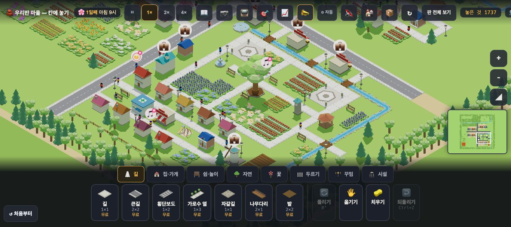

# 살아 있는 첫 화면 — 원본 마을이 열린 첫 30초에 보여야 할 사는 모습 (2026-09-23 · 주민 연기 담당 · 문서)

> 사용자(보스 전달): *"기본 마을 등이 세팅돼 있고, 상황에 따라 배치하면서 부족한 걸 채우거나 발전하면서 목표 달성. 전제 조건은 — 애들이 '우와 마을 예쁘다', 선생님도 감탄하게 기본 세팅이 다 되어야 돼."*
> 디자인 담당이 **'우리 마을 원본'**(수업 판들이 모두 시작하는 기본 마을) 시안 셋을 만든다. 이 문서는 그 위에 **사는 모습**이 어떻게 얹혀야 하는지의 목록이다. 시안이 오면 그 위에서 다시 잰다.
> 구현 제안은 **두 문장**(① 아이가 새로 즐기거나 고를 수 있는 것 ② 학생이 설명할 수 있게 되는 사회적 관계)과 함께만 적는다(정본 설계 원칙 6).
> 표기: ✅확인 = 잰 것 · 💭 = 내 판단 · 🔶 = 가설(아이·교사에게서만 확인된다).

---

## 0. 한 줄

**첫 30초는 시뮬 4시간이다. 그래서 '무엇이 보이나'는 연기의 목록보다 원본 마을의 시계(몇 시에 여나)가 먼저 정한다.**
💭 **아침 8시 무렵에 열면**, 30초 동안 우물가 아침 → 출근 → 일터 문 밖 → 놀이터 아이 → 광장·벤치가 차례로 지나간다. 저녁은 아름답지만 모두가 한꺼번에 집으로 서두른다.

---

## 1. 잰 것 (사실)

**조건** ✅: `pop88`(집 88명 · 기본 판 · 흐름 없음) · 시드 1 · 1× 배속. 30초 = **300틱 = 시뮬 4시간**(하루 1800틱 = 24시간 → 한 시간 75틱). 10틱마다 30번 표본.
표의 값 = **평균 / 가장 많을 때 / 30표본 중 보인 횟수**.

| 연기(지금 보이는 사람 수) | 6→10시 | 8→12시 | 10→14시 | 13→17시 | 17→21시 | 19→23시 | 21→1시 |
|---|---|---|---|---|---|---|---|
| 밖에 있는 사람 | 89/91/30 | 89/91/30 | 89/91/30 | 89/91/30 | 81/88/30 | 37/86/30 | 8/65/21 |
| 무언가 **곁에 서 있음**(우물·꽃·가게 앞…) | 17.6/25 | 18.5/23 | 18.5/27 | 17.2/24 | 15.7/20 | 7.6/17 | 1.2/5 |
| 벤치에 **앉음** | 2.1/3 | 2.1/4 | 2.3/4 | 2.5/4 | 2.1/4 | 1.1/2 | 0.1/1 |
| **광장** 위 | 4.0/5 | 3.9/5 | 4.3/6 | 4.2/6 | 3.6/5 | 1.7/3 | 0.3/2 |
| 물동이 든 사람 | 0.7/3 (11) | 0.4/2 (11) | 0 | 0 | 0.4/2 (9) | 0.3/2 | 0.1/2 |
| 일터 **문 밖 일꾼** | 0.5/2 (8) | 0.8/3 (11) | 1.8/4 (20) | 1.4/4 (19) | 0 | 0 | 0 |
| 밖에 있는 **아이** | 1.4/2 (28) | 1.7/2 (30) | 1.4/2 (30) | 1.5/2 (30) | 0.6/2 (12) | 0 | 0 |
| 붐빔에 **멈칫** | 2.9/7 (30) | 3.2/6 (30) | 3.1/6 (30) | 3.1/6 (30) | 2.5/7 (26) | 0.9/5 (10) | 0 |
| 새 이웃이 **떠나는 풍선** | 0.3/1 (10) | 0 | 0 | 0.2/1 (6) | 0 | 0 | 0 |
| 가로등 아래 **종종걸음** | 0 | 0 | 0 | 0 | 7.1/**38** (8) | 6.2/34 (23) | 3.1/34 (11) |
| 밤길 귀가 | 0 | 0 | 0 | 0 | 9.5/**48** (8) | 9.4/41 (23) | 5.1/42 (15) |
| 걸어가는 목적 — 놀이·쉼 / 물·장보기 | 21 / 20 | 25 / 9 | 26 / 6 | 30 / 7 | 23 / 12 | 12 / 1 | 0 / 0 |

**0으로 나온 것**: 이웃 인사 · 우물가 수다 · 비켜섬 · 정원 들르기 · 끊긴 길 앞 멈칫 · 걱정 얼굴.
⚠ **잰 도구의 한계** ✅: 시뮬은 그림을 그리지 않는다. **우물가 수다(6~9시)와 반딧불은 그리는 쪽에서 정해져** 여기서 늘 0이다 — 없다는 뜻이 아니다. 인사는 **새 집이 들어온 아침**(11시까지)에만, 정원은 **16:30~19:30**에만 뜬다. 한 시드 · 한 판이고, 걷는 사람은 120명 표본이다.

**실화면 한 장** ✅(Playwright · 1800×973 · pop88 · 기본 줌 9.4 · 아침 10시):
- 사람 키가 **약 10px**다. **사람이 있다·걷는다**는 보이지만 **무엇을 하는지**(앉음·물동이·상자)는 거의 안 읽힌다.
- 광장은 표의 평균(4명)보다 비어 보였다(그 순간 1명). 사람은 길 위에 **한 사람씩 흩어져** 걷는다 — 차분하지만 '북적임'은 아니다.
- 오른쪽 위에 **「이웃을 기다리는 집 18」** 칩이 있다.

---

## 2. 첫 화면에 **함께 보이면 '우와'**인 것 (💭 해석)

1. **많이 흩어져 걷는 사람** — 밖 89명. 바탕이다. 이것만으로는 '움직이는 그림'이고 '사는 마을'은 아니다.
2. **머무는 사람** — 곁에 서 있음 18 · 벤치 2~4 · 광장 4. 🔶 '사는 곳'의 느낌은 걷기보다 **머무름**에서 온다. 멈춰 있는 사람이 어디에 모이나(우물가·광장·가게 앞)가 마을의 **중심**을 그려 준다.
3. **아이** — 1~2명뿐이다. 놀이터가 첫 화면 안에 있다면 거기서 아이가 **뛰는** 모습(지금 0~1)이 가장 빨리 '우와'를 부를 자리다. 🔶
4. **일하는 사람** — 9시부터(`isWorkHour` 9~17 ✅) 가게·온실·풍차 문 밖. 가장 많을 때 4명. 일터가 첫 화면 안에 있어야 보인다.
5. **아침 우물가** — 6~9시 수다(시뮬로는 못 잼). 🔶 아이가 '이웃'을 느끼는 가장 따뜻한 장면인데, **9시가 넘어 열면 30초 안에 한 번도 안 나온다.**
6. **흐름 판이면 수레와 장바구니** — 수레가 길을 따라 가게에 닿고 선반이 오른다(#827). 원본 마을이 흐름을 켜면 **첫 화면 안에 밭·가게·수레가 한 줄로** 들어와야 한다.

**동시에 보일 수를 셋으로** 💭: 첫 화면(기본 줌 · 1800px)에 **① 머무는 무리 한 곳(우물가 또는 광장) ② 놀이터 아이 ③ 문 밖 일꾼 한 곳**이 함께 들어오면 된다. 그 셋은 **서로 다른 삶**(이웃 · 놀이 · 일)이라, 아이가 "사람들이 저마다 뭘 하고 있네"라고 읽는다.

---

## 3. 오히려 **어수선한** 것 (💭 · 첫 30초에서 빼거나 늦출 후보의 목록 — 구현 제안 아님)

| 무엇 | 잰 것 | 왜 첫 화면에서 어수선한가 |
|---|---|---|
| **걱정 칩·풍선** | 실화면 「이웃을 기다리는 집 18」 | 원본은 **'기본 세팅이 다 된'** 마을이다(사용자 전제). 첫 화면이 걱정부터 말하면 "예쁘다" 전에 "고쳐야 한다"가 온다. 원본 저장본이 **걱정 0**으로 시작하는지는 **시안의 시험 항목**이다 |
| **붐빔 멈칫** | 낮 내내 평균 3 · 최대 7 | 붐비는 길의 연기다. 원본에서 늘 보이면 **'막힌 마을'**로 읽힌다. 원본의 길 폭이 인구에 맞는지(멈칫 ≈ 0)가 시험 항목이다 |
| **떠나는 풍선** | 6시에 열면 10표본 · 13시 6표본 | 빈집에 온 새 이웃이 돌아서는 장면이다. 원본에 **빈집이 있으면** 첫 30초에 뜬다 |
| **저녁 한꺼번에 귀가** | 17시에 열면 밤길 48 · 종종걸음 38 | 가로등 아래 모두가 서두른다. 아름답지만 '움직임이 한 방향'이라 🔶 **첫 화면**으로는 어수선할 수 있다(두 번째 장면으로는 좋다) |
| **수업 판 시작 카드** | 수업 판을 처음 열면 뜬다 ✅(MAC-STAGECARD) | 첫 몇 초를 카드가 덮는다. 카드 뒤 마을이 **멈춰 있나 움직이나**가 첫인상을 가른다 — 시안에서 확인 |
| **아이콘 겹침** | (흐름 판) 팻말·⚠·장바구니 | 원본에 흐름을 켜면 선반·팻말·수레가 한꺼번에 나온다. 첫 30초에 **빈 선반이 없게**(재고가 찬 채로) 시작하는지가 시험 항목이다 |

---

## 4. 제안 (두 문장과 함께만)

### 4-가. 원본 마을의 시계를 **아침 8시 무렵**으로 둔다 (저장본 값 · 코드 0)
- 근거 ✅: 8→12시 줄이 **떠나는 풍선 0 · 아이 30/30 · 일꾼 11/30 · 광장 30/30**으로 가장 고르다. 6시에 열면 떠나는 풍선이 뜨고, 10시 넘어 열면 우물가 아침(6~9시)을 놓친다. 7:30~8:00 이면 우물가의 끝과 출근이 30초 안에 같이 든다.
- ① 아이가 열자마자 **우물가의 아침 → 출근 → 놀이터**가 30초 안에 지나가는 마을을 본다.
- ② 학생이 **"사람들은 하루의 시간에 따라 다른 곳에 있다"**(일·놀이·쉼의 하루 리듬)를 말할 수 있게 된다.

### 4-나. 첫 화면 줌을 **'무엇을 하는지'가 읽히는 거리**로 (디자인 담당과 함께 정할 값)
- 근거 ✅: 기본 줌 9.4(1800px)에서 사람 키 약 10px — '있다'는 보이지만 '무엇을 하나'는 안 읽힌다. 고장 배율 측정(#758)에서 짐 6.6px · 사람 폭 2.9px 은 이미 안 보였다.
- ① 아이가 첫 화면에서 **앉아 쉬는 사람 · 물동이를 든 사람 · 상자를 정리하는 일꾼**을 알아본다.
- ② 학생이 **"마을에는 쉬는 사람·일하는 사람·장 보는 사람이 함께 산다"**를 그림으로 설명할 수 있다.
- 💭 값은 정하지 않는다. 시안의 원본 마을 크기가 정한다 — **2절의 셋(머무는 무리 · 놀이터 · 문 밖 일꾼)이 한 화면에 들어오는 가장 가까운 줌**이 기준이다.

---

## 5. 디자인 시안이 오면 그 위에서 확인할 것 (체크 목록)

1. 원본 저장본의 **시계**(4-가) · 첫날이 **비 오는 날이 아닌지**(`rainDay` — 사흘에 하루꼴 ✅).
2. 첫 30초 **걱정 칩·풍선 0** · **떠나는 풍선 0**(빈집 없음) · **붐빔 멈칫 ≈ 0**.
3. 기본 줌 첫 화면 안에 **머무는 무리 한 곳 · 놀이터 · 문 밖 일꾼 한 곳**(2절).
4. 사람 키 px(4-나) — 시안 크기에서 다시 잰다.
5. (흐름을 켠다면) 밭·가게·수레가 한 화면 · 첫 30초 **빈 선반 0**.
6. 수업 판이면 시작 카드 뒤 마을이 움직이는지.
7. 이 표를 **시안의 저장본으로 다시 잰다**(같은 도구 · 여는 시각 셋: 7:30 · 8 · 10).

**잰 도구**: `load.mjs` 로 저장본을 열고 `__setHour(h)` 뒤 300틱을 10틱씩 — `__beside · __workLook · __rhythm · __kids · __plaza · __crowdLook · __leave · __lampWalk · __nightHome · __destMix`. (이번에 쓴 임시 스크립트는 저장소에 넣지 않았다 — 시안이 오면 `run.mjs` 에 `--first30` 로 넣을지 보스가 정한다.)

---

## 6. 원본 7차(의원 넷 · 인구 74)로 다시 잼 — 5절 체크 목록 (2026-09-25 · 주민 연기 담당)

**잣대**: `?stage=origin` · headless(metal · 1366×610 · 첫 화면 카메라 그대로 · 사람 수는 화면 위 띠 60px·아래 트레이 170px 를 뺀 곳만) · 1배속 30초 · 0.5초 표본(60) · 여는 시각 셋: 저장본 그대로(8.4시) · 7.5 · 10. 셈 훅은 임시(저장소에 안 넣음 — 사람 발밑·머리를 카메라로 투영).

| 여는 시각 | 보이는 사람 | 머무는 무리(둘 이상 한 곳) · 처음 본 초 | 머묾 · 앉음 | 아이 · 놀이터 아이 | 문 밖 일꾼 · 처음 본 초 | **붐빔 멈칫** | 떠나는 사람 · 이사 오는 사람 | 걱정 칩 | 비 |
|---|---|---|---|---|---|---|---|---|---|
| 8.4(저장본) | 20.9 | 0.2곳 · 24초 | 2.2 · 0.2 | 0.2 · **0** | 1.3 · 13.5초 | **2.5** | 0 · 2.0 | 0 | 아님 |
| 7.5 | 20.6 | 0.7곳 · 9.5초 | 3.9 · 0.4 | 0.7 · **0** | 0.8 · 16초 | **4.6** | 0 · 2.3 | 0 | 아님 |
| 10 | 21.5 | 0.4곳 · 8.5초 | 3.0 · 0 | 0.4 · **0** | 2.5 · 11.5초 | **1.1** | 0 · 2.2 | 0 | 아님 |

- 어른 키: 첫 화면에서 **16px**(발밑~머리 투영 가운데값 · 4-나).
- 첫 화면 안: 공원(마을 나무·정자·긴의자)·분수·광장 둘·개울·가게 셋·의원 하나·놀이터 하나가 들어옵니다.

**체크 목록 대조**
| 5절 | 결과 |
|---|---|
| 1. 시계 · 비 | ✅ 저장본은 8.4시로 열리고 첫날 비가 아님 |
| 2. 걱정 칩·풍선 0 · 떠나는 풍선 0 · 붐빔 멈칫 ≈ 0 | 칩 ✅ 0 · 떠남 ✅ 0 · **멈칫 ✗ 1.1~4.6**(7.5시 출근·등교 길이 가장 많음) · 💬 풍선 대신 **💼 일곱 개가 3초마다 깜박**(아래) |
| 3. 머무는 무리 · 놀이터 · 문 밖 일꾼 | 무리 🔶 평균 0.2~0.7곳(처음은 8.5~24초) · **놀이터 아이 ✗ 0**(8~14시는 모든 아이가 학교) · 일꾼 ✅ 11~16초에 처음 |
| 4. 사람 키 px | 16px |
| 5. 흐름 | 원본은 흐름을 안 켬 — 해당 없음 |
| 6. 수업 판 카드 | 원본은 수업 판 아님 — 해당 없음 |

**💡 해석 · 다음 후보** (구현 제안 아님 · 판정이 움직이는 것은 보스 결정)
- **💼 일곱 개**: `drawFaces` 의 '일터만 많다 — 빈 자리 위에 💼(3초마다)'입니다. 원본은 일 없는 어른이 0이고 일자리가 남아서, 첫 화면 가게·온실 위에 💼 가 깜박입니다. 걱정은 아니지만 첫 30초의 풍선 대부분이 이것입니다. → 고장·디자인 몫(원본에서는 숨길지)
- **놀이터 아이 0**: 8~14시에는 모든 아이가 학교에 있습니다(`isSchoolHour`). 첫 화면의 '놀이 · 이웃 · 일' 셋 가운데 놀이가 비어 있습니다. 아침에 여는 한 늘 그렇습니다. → 여는 시각을 14시 넘어로 두거나, 학교에 안 가는 어린 동생(판정이 움직임)을 두거나
- **붐빔 멈칫 1~5명**: 출근·등교 시각의 좁은 길입니다. 원본의 '막힌 마을' 인상은 7.5시가 가장 큽니다 → 저장본 시계 8.4시가 알맞음
- **머무는 무리**: 아침에는 드뭅니다. 공원 모임(#1087)은 14~18시 몫이고, 아침 모임(#1084 kindsDry)은 6~9시입니다. 8.4시에 열면 끝물이라 24초에야 처음 보입니다.
