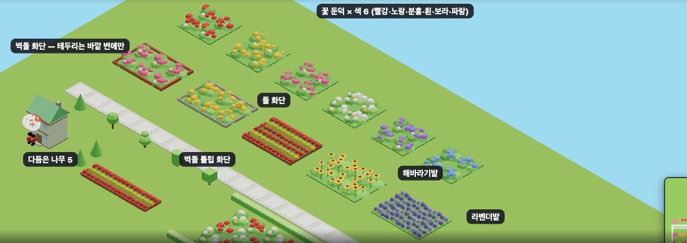
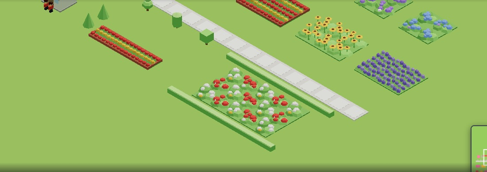
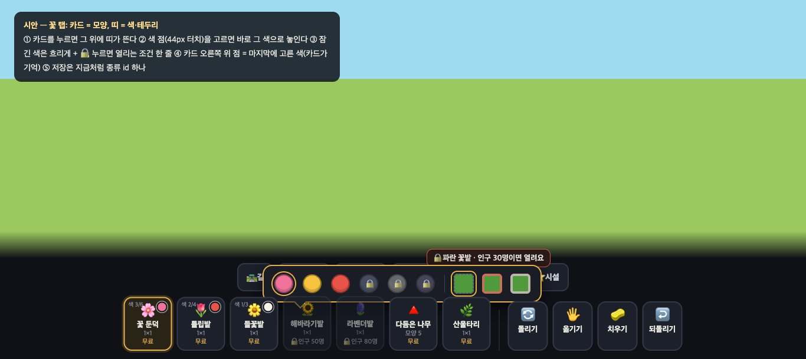

# 우리 마을 — 정원 가족 (시안 + 목록 한 장) (2026-09-20 · 마을 디자인 담당)

> 선생님: **"꽃은 한종류가 아니야 롤러코스터타이쿤처럼 여러 종류여도 돼" · "꽃밭 같은 것 종류도 많았으면 좋겠다."**
> 그 게임에서 빌리는 건 그림이 아니라 **짜임**이다 — 같은 틀에서 *모양 × 색 × 테두리*로 열댓 가지가 나오고, 거기에 다듬은 나무·낮은 산울타리가 붙어 '정원'이 된다.
> **새 모델 0.** 전부 꽃밭 생성 함수(`buildFlowerBeds`)의 **표 한 줄** 또는 parts 몇 개다. 아래 사진은 **게임 화면 그대로**(1366×610 · `?sid=guest`) — 시안 코드는 로컬에서만 돌렸고, 이 PR 에는 문서와 사진만 있다(꽃밭 여섯 종 #466 이 머지된 뒤 코드 PR 로 올린다 — 스택 금지).

## 시안 한 장


겹쳐서 '장소'를 지은 모습 — 산울타리 두른 빨강·흰 체크 화단, 길가의 다듬은 나무, 해바라기·라벤더:


## 목록 — 이름 · id(안) · 매개변수
꽃밭 한 종 = `FLOWER_KINDS` 표 한 줄 `{ st 모양, main 주색, side 곁색, edge 테두리 }`. ✅ = #466 에 있음 · 🟡 = 이 시안(로컬)에서 돌아감 · ⬜ = 아직.

### ⓐ 꽃 둔덕(모양 b — 겹친 잎 둔덕 위 큰 꽃 덩이) × 색 6
| 이름 | id(안) | main · side | 한 칸 △ | |
|---|---|---|---|---|
| 꽃밭(분홍) | `flower` | `f0719a` · 흰 | 172~190 | ✅ |
| 파란 꽃밭 | `flower_hb` | `7fa6f0` · `b79af0` | 〃 | ✅ |
| 빨간 꽃밭 | `flower_hr` | `e8534a` · 흰 | 〃 | 🟡 |
| 노란 꽃밭 | `flower_hy` | `f6c23e` · 흰 | 〃 | 🟡 |
| 흰 꽃밭 | `flower_hw` | 흰 · `f6c23e` | 〃 | 🟡 |
| 보라 꽃밭 | `flower_hv` | `a583e6` · 흰 | 〃 | 🟡 |

### ⓑ 꽃 종류가 다른 밭 (모양이 다르다)
| 이름 | id(안) | 모양 `st` | 색 | 한 칸 △ | |
|---|---|---|---|---|---|
| 튤립밭 · 노란 튤립밭 | `flower_tr` · `flower_ty` | **a 줄화단** — 잎 이랑 3줄, R 로 가로/세로 | 빨강+흰 줄 · 노랑+주황 줄 | 244 | ✅ |
| (튤립 색 더) 분홍 · 흰 · 보라 | `flower_tp` · `flower_tw` · `flower_tv` | a | — | 244 | ⬜ 표 세 줄 |
| 들꽃밭 · 보라 들꽃밭 | `flower_wd` · `flower_wv` | **c 들꽃** — 무리 2덩이, 잔디 위 포인트 | 흰+노랑 · 보라+분홍 | 190 | ✅ |
| **해바라기밭** | `flower_sf` | **d** — 사람 키쯤 되는 줄기 5 + 넓적한 노란 꽃판(가운데 갈색) | `f6c23e` · `7a5230` | 231 | 🟡 |
| **라벤더밭** | `flower_lv` | **e** — 물결치는 세 줄(한 칸 = 한 파장이라 옆 칸과 이어짐)에 굵은 보라 꽃대 | `9a7fe0` · `b9a4ee` | 202 | 🟡 |

라벤더는 처음에 가는 꽃대 15개(460△)로 뽑았더니 **다시 점박이**가 됐다 → 굵게 12개(202△)로 고친 것이 위 사진이다. 교훈 그대로: *점을 늘리지 말고 덩어리를 키운다.*

### ⓒ 테두리 화단 — `edge:'brick' | 'stone'`
| 이름 | id(안) | 매개변수 | |
|---|---|---|---|
| 벽돌 화단 | `flower_bk` | b · 분홍 · `edge:'brick'` | 🟡 |
| 돌 화단 | `flower_st` | b · 노랑 · `edge:'stone'` | 🟡 |
| 벽돌 튤립 화단 | `flower_tb` | a · 빨강+노랑 줄 · `edge:'brick'` | 🟡 |

- **테두리는 바깥 변에만 생긴다**(사진의 3×2 화단 — 안쪽 이음매엔 없다). 같은 종류가 옆에 있으면 그 변을 뺀다. 변마다 box 2개(24△) → 1칸짜리 +96△, 3×3 의 가운데 칸 +0△.
- ⚠ **프로그램 담당과 맞출 것 하나:** 옆 칸이 놓이거나 치워지면 **이웃 칸의 테두리도 바뀐다.** 같은 청크면 같이 다시 합쳐지지만 청크 경계에선 옛 테두리가 남는다 → 놓을 때·치울 때 "이웃 네 칸의 청크도 다시 합치기" 한 줄이 필요하다.
- 색마다 테두리 3종을 다 만들면 6 × 3 = 18장 → **카드가 아니라 고르기로 풀어야 한다**(아래 '카드').

### ⓓ 다듬은 나무(토피어리) — parts 2~3개, 새 모델 0
| 이름 | id(안) | 모양 | △ | |
|---|---|---|---|---|
| 원뿔 나무 | `topi_cone` | 줄기 + cone8 | 48 | 🟡 |
| 공 나무 | `topi_ball` | 줄기 + 공 | 84 | 🟡 |
| 2단 공 나무 | `topi_two` | 줄기 + 공 2 | 144 | 🟡 |
| 원통 나무 | `topi_cyl` | 원통 + 뚜껑 | 72 | 🟡 |
| 네모 나무 | `topi_box` | 줄기 + 상자 | 36 | 🟡 |
| (동물 모양) | `topi_bird` 등 | box 5~6 조합 | ~70 | ⬜ 나중 |

시안의 키는 3.3~3.7 — 사진에서 **너무 작다.** 모양 규칙의 키 사다리로는 '문·처마' 단(사람의 2배)이라 4.2~4.8 로 키운다. 잎은 `P.leaf` 라 계절색을 탄다.

### ⓔ 낮은 산울타리 · 바닥 무늬
| 이름 | id(안) | 모양 | |
|---|---|---|---|
| 낮은 산울타리 | `hedge` | 1×1, 칸 끝까지 가는 잎 상자(높이 1.0 — 허리). R 로 가로/세로. 이어 놓으면 한 줄 | 🟡 |
| (모퉁이·문) | — | 놓는 방식 설계의 **테두리(edge)** 단계에서 — 지금 칸 물건으로는 ㄱ 자에서 반 칸이 빈다 | ⬜ |
| 줄무늬 잔디 · 클로버 · 낙엽 바닥 | `lawn_s` · `lawn_c` · `leaves` | 잔디밭과 같은 바닥판 + 색 띠/작은 둔덕. **점 뿌리기 금지** — 클로버도 흰 점이 아니라 낮은 덩어리 2~3 | ⬜ |
| 나무용 꽃밭 벌 | (id 없음) | 가운데 반지름 0.8 을 비운 벌 · 깔개만 있는 벌 — 놓는 방식 2단계(땅 층)와 같이 | ⬜ |

## 카드 — 30장이 되면 못 고른다 (프로그램 담당과 상의할 제안)
지금 방식(종류마다 카드 1장)으로는 꽃 탭이 곧 두세 줄이 된다. 제안:

```
🌷 꽃 탭:  [꽃 둔덕] [줄화단] [들꽃] [해바라기] [라벤더]   │  [원뿔][공][2단][원통][네모]  [산울타리]
            카드를 고르면 그 위에 작은 띠가 뜬다 →  색 ● ● ● ● ● ●    테두리 ▢ 없음 ▣ 벽돌 ▣ 돌
```
- **카드 = 모양, 띠 = 색·테두리.** 아이는 "튤립을 빨강으로"처럼 두 번에 고른다. 마지막에 고른 색·테두리는 카드가 기억한다.
- 저장은 지금처럼 **종류 id 하나**(`flower_hr` 등)로 남는다 — 띠는 id 를 고르는 화면일 뿐이라 **저장 형식이 안 바뀐다.** 테두리까지 id 에 넣으면(`flower_hr_bk`) 6색 × 3테두리 × 모양 2 = 36 id 가 되므로, **테두리만은 옆 필드**가 낫다(놓는 방식 v3 의 테두리 층과 같이 정할 일).
- 그때까지의 임시 순서(가족끼리 붙여서): 둔덕 색들 → 줄화단 색들 → 들꽃 → 해바라기 → 라벤더 → 테두리 화단 → 다듬은 나무 → 산울타리.

## 무게 (한 칸 삼각형 — 전부 '칸을 덮는 것 ≤ 310' 예산 안)
둔덕 172~190 · 줄화단 244 · 들꽃 190 · 해바라기 231 · 라벤더 202 · 테두리 +0~96. 한 칸의 꽃 전체가 꼭짓점 색 기하 하나라 **종류가 30이 돼도 draw call 은 그대로**(#466 실측: 집 50채 + 꽃밭 100칸, 77). 기하는 종류 × 벌 4 를 로드 때 한 번 만든다 — 30종이면 120개 × 약 250 꼭짓점 ≈ 1MB 미만(추정).

## 올리는 순서 (제안)
1. #466 머지(여섯 종 + 꽃 탭).
2. **색 늘리기** — 둔덕 4색 + 튤립 3색(표 일곱 줄, 코드 0).
3. **해바라기 · 라벤더**(모양 d·e) + 꽃 덩이 다듬기.
4. **다듬은 나무 5 · 낮은 산울타리**(parts) — 키를 4.2~4.8 로.
5. **테두리 화단** — 이웃 청크 다시 합치기를 프로그램 담당과 맞춘 뒤.
6. 카드 + 색 띠(프로그램 담당 주도, 나는 띠의 생김새).

---

## 덧붙임 — '카드 = 모양, 띠 = 색·테두리' 생김새 시안 (프로그램 담당에게 넘김)

보스가 제안을 받았다(09-20). 아래는 **정적 시안**(HTML 한 장을 1366×610 으로 찍은 것 — 게임 코드 아님). 트레이 코드는 프로그램 담당 몫이고, 나는 생김새와 치수를 준다.



### 동작
1. 꽃 탭의 카드는 **모양 하나에 한 장**(꽃 둔덕 · 튤립밭 · 들꽃밭 · 해바라기밭 · 라벤더밭 · 다듬은 나무 · 산울타리) — 20장이 7장이 된다.
2. 카드를 누르면 그 **위에 띠**가 뜬다(탭 줄 자리에 겹침). 색 점을 누르면 **바로 그 색이 든 채로** 놓기 상태가 된다. 바깥을 누르거나 다른 카드를 누르면 닫힌다. 색이 하나뿐인 카드(해바라기·라벤더·산울타리)는 띠 없이 바로.
3. **잠긴 색**은 흐리게 + 🔒. 누르면 고르지 않고 **열리는 조건 한 줄**("🔒 파란 꽃밭 · 인구 30명이면 열려요" — 기존 `lockedWhy` 문구 그대로).
4. 카드 오른쪽 위 **작은 색 점 = 마지막에 고른 색**(카드가 기억 — 기기 메모리면 충분, 저장 안 함). 왼쪽 위 `색 3/6` = 열린 색 수 — "더 열 게 있다"는 걸 카드가 말해 준다.
5. 다듬은 나무 카드의 띠는 색 대신 **모양 다섯**(실루엣 아이콘).
6. 테두리(없음 · 벽돌 · 돌) 칸은 **v3 의 테두리 층이 정해진 뒤**에 켠다 — 그때까지는 자리만.

### 치수 · 색 (기존 트레이 값에 맞춤)
| | 값 |
|---|---|
| 띠 | 배경 `#1a1d26` · 테두리 2px `#e8b04b`(고른 카드와 같은 금색) · 모서리 16px · 안쪽 여백 8×12px · 그림자 `0 10px 30px #000a` · 아래 가운데에 카드를 가리키는 꼬리 14px |
| 색 점 | 보이는 원 28px · **터치 영역 44×44px**(태블릿 기준) · 점 사이 간격 4px · 테두리 2px `#0006` |
| 고른 점 | 바깥에 금색 고리(3px 띄우고 2px `#e8b04b`) |
| 잠긴 점 | 불투명도 .35 · 채도 .4 · 가운데 🔒 13px |
| 구분선 | 1×30px `#3a4050` · 좌우 6px |
| 테두리 칸 | 26px 둥근 네모(6px) · 초록 바탕에 테두리 4px: 벽돌 `#c8705a` · 돌 `#bdb7ab` · 없음 = 점선 |
| 안내 한 줄 | 배경 `#2a1a17` · 테두리 1px `#e0574a` · 13px 굵게(기존 빨간 토스트와 같은 계열) |
| 색 점의 색 | 그 꽃밭의 `FLOWER_KINDS[id].main` 그대로 — 표에서 읽으면 된다 |

### 저장 · 호환
- **저장은 지금처럼 종류 id 하나**(`flower_hy` 등). 띠는 id 를 고르는 화면일 뿐이라 저장 형식·palette·sync 무변경.
- 카드→종류 묶음은 표로: `FLOWER_KINDS[id].st`(모양)가 같은 것끼리 한 카드. 다듬은 나무는 `TOPIARY` 전체가 한 카드.
- 띠가 없던 때 놓인 물건, 옛 판에서 온 저장본 — 전부 그대로 읽힌다(id 가 같으므로).
