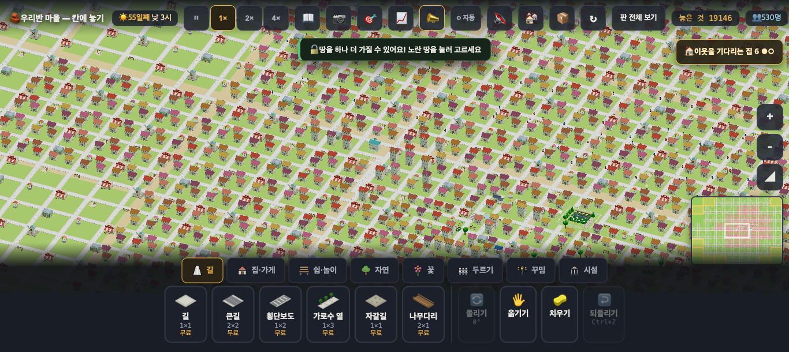
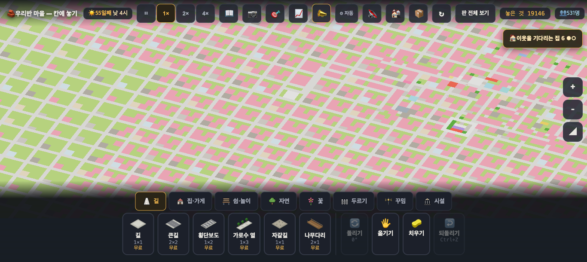
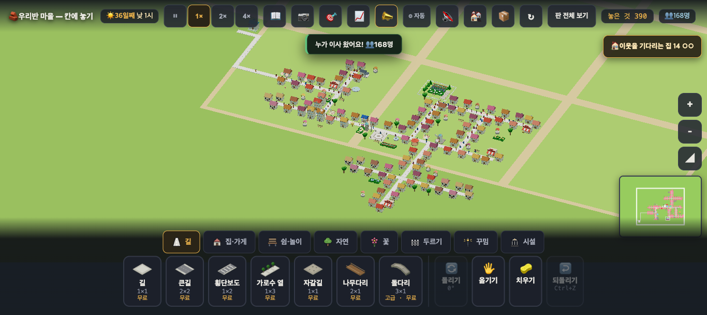
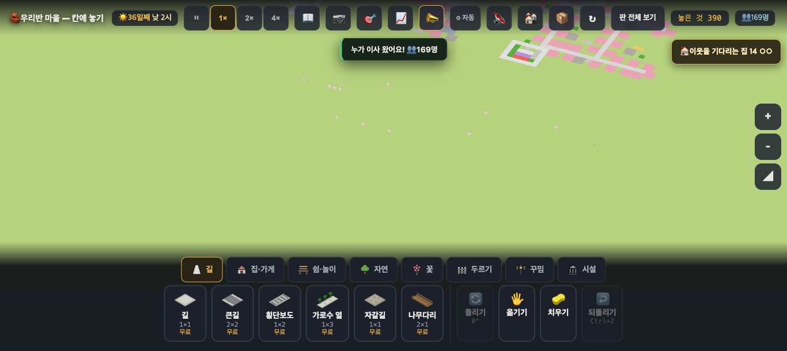

# 값싼 수 둘을 재 봤다 — ① 지도 문턱 · ③ 청크 크기 (2026-09-20 · 마을 프로그램 담당 · **문서만 · 구현 전**)

> 보스 승인: ①(지도 문턱 12 → 16·18px)과 ③(청크 6 → 8칸)을 재 볼 것. ① 은 화면 사진도 · ③ 은 한 수(놓기·치우기·큰길) 비용도. **CPU 6배 느리게** 기준 · 판 셋 × 세 거리 · 규칙 수치는 그대로.
> 잰 법: `village/index.html` 사본 셋(`_perf_map16` · `_perf_map18` · `_perf_chunk8` — 한 줄씩만 바꾼 임시 파일 · 커밋 안 함 · 잰 뒤 지움)을 나란히 열어 `__bench(40)`·`__tickBench(150)` · 한 수 뒤는 **실제 프레임 간격**(requestAnimationFrame 6프레임).
> 앞 조사: [`village_perf_scan_20260920.md`](village_perf_scan_20260920.md).

## 한 줄
**① 은 숫자로는 최고(최악 구간이 사라진다)지만 그림을 잃는다 — 같은 배율에서 3D 마을이 평면 지도로 바뀐다.** 게다가 작은 판(88·167명)은 그 구간이 원래 가벼워서(63~90 호출) **잃기만 한다**. ③ 은 호출을 457 → 302로 줄이지만 **한 수 뒤 프레임이 더 자주 크게 튄다**(큰길 59~79ms). 그래서 추천은 '문턱을 판 크기에 맞춰 조절'이다.

## ① 지도 문턱 12 → 16 / 18px

**숫자(CPU 6배 느리게 · 그리기 호출 · 프레임 ms)**

| 판 | 배율 | 지금(12px) | 16px | 18px |
|---|---|---|---|---|
| pop88 | 4 | 10 · 2.12ms | 11 · 2.02 | 10 · 1.82 |
| pop88 | **6** | **63 · 1.97ms** | **6 · 1.59** | **5 · 1.43** |
| pop88 | 10 | 63 · 2.39 | 63 · 2.62 | 63 · 2.33 |
| pop167 | 4 | 10 · 2.61 | 5 · 1.78 | 6 · 2.28 |
| pop167 | **6** | **89 · 3.36ms** | **5 · 1.74** | **5 · 1.93** |
| pop167 | 10 | 79 · 4.23 | 71 · 2.72 | 71 · 2.83 |
| **pop529** | 4 | 9 · 3.87 | 8 · 2.83 | 7 · 3.76 |
| **pop529** | **6** | **457 · 11.60ms** | **8 · 2.37** | **8 · 3.01** |
| **pop529** | 10 | 234 · 9.69 | 228 · 5.27 | 228 · 8.72 |

- **최악 구간(배율 6)은 완전히 사라진다**: 516명 판 457 호출 · 11.6ms → 8 호출 · 2.4ms.
- 배율 10(가까이)은 문턱과 무관하다(228~234 그대로 · ms 차이는 GC·측정 흔들림).

**그림(같은 배율 6 · 같은 자리)**

| | 지금(12px) | 16px |
|---|---|---|
| pop529 |  |  |
| pop167 |  |  |

- 지금(12px)에서는 그 배율이 **'우리 마을 전체가 집 모양으로 보이는' 3D 그림**이다. 문턱을 올리면 같은 배율이 **평면 색칠 지도**가 된다(집은 분홍 네모).
- 18px 은 16px 과 그림이 사실상 같다(더 일찍 지도가 될 뿐).
- **작은 판에서 특히 손해다**: pop88·pop167 은 그 구간이 63~90 호출(프레임 2~3.4ms)로 이미 가볍다. 얻는 것 없이 3D 그림만 잃는다.

## ③ 청크 6 → 8칸

| 판 | 배율 | 지금(6칸) 호출·삼각·프레임 | 8칸 |
|---|---|---|---|
| pop88 | 6 | 63 · 93,651 · 1.97ms | **48** · 93,653 · 1.77 |
| pop88 | 10 | 63 · 94,611 · 2.39 | **47** · 94,611 · 2.26 |
| pop167 | 6 | 89 · 120,824 · 3.36 | **55** · 124,584 · 2.01 |
| pop167 | 10 | 79 · 120,648 · 4.23 | **54** · 126,198 · 2.05 |
| **pop529** | **6** | **457 · 444,675 · 11.60** | **302** · 473,533 · **7.82** |
| **pop529** | 10 | 234 · 287,658 · 9.69 | **153** · 308,242 · 4.90 |

- 호출은 **0.66배**(457 → 302 · 234 → 153)로 준다. 프레임도 11.6 → 7.8ms.
- 다만 **삼각형은 조금 는다**(444k → 473k) — 조각이 크면 화면 밖 것도 함께 들어오기 때문이다.

**한 수 뒤 실제 프레임 간격(ms · 516명 판 · CPU 6배 · 연속 6프레임)**

| 한 수 | 지금(6칸) | 8칸 |
|---|---|---|
| 평소 | 9.8 · 11.6 · 8.1 · 10.7 · 10.9 · 12.0 | 9.1 · 8.0 · 8.6 · 9.2 · 5.8 · 8.2 |
| 가게 놓기 | **48.1** · 11.2 · **54.9** · 11.8 · 9.1 · 8.8 | **46.4** · 7.1 · **43.7** · 6.7 · 6.7 · 8.1 |
| 치우기 | 26.5 · 31.0 · 10.4 · 10.5 · 8.2 · 8.6 | 24.9 · 7.9 · **55.3** · 8.5 · 9.2 · 6.4 |
| 큰길 깔기 | 37.7 · 31.8 · 13.4 · 12.4 · 17.2 · **75.6** | **61.6** · **79.2** · **67.7** · 9.0 · **59.4** · 11.6 |

- 한 수 뒤에는 지금도 한두 프레임이 크게 튄다(청크를 다시 만드는 값). **8칸에서는 큰길 깔기처럼 여러 청크를 건드리는 수에서 큰 프레임이 더 자주** 나온다(6프레임 중 4번 > 59ms vs 지금 1번).
- 이 값들은 CPU 6배 느리게라 흔들림이 크다 — 경향만 읽어야 한다.

## 그래서 — 추천
| 안 | 효과 | 잃는 것 | 내 추천 |
|---|---|---|---|
| ① 문턱을 **모두** 16/18px 로 | 516명 판 최악 구간 사라짐 | 모든 판에서 3D '마을 전체' 그림을 잃는다(작은 판은 순손해) | ✗ |
| ①′ **문턱을 판 크기에 맞춰** — 예: 놓인 물건이 8,000을 넘으면 16px, 아니면 지금처럼 12px | 큰 판만 최악 구간이 사라지고, 작은 판은 지금 그림 그대로 | 아이 마을이 커지는 어느 날 '넓게 볼 때 그림이 바뀐다' — 한 번은 낯설다 | **○ 첫 수** |
| ③ 청크 8칸 | 호출 0.66배(457 → 302) · 프레임 11.6 → 7.8ms | 한 수 뒤 프레임 튐이 잦아짐(특히 큰길) · 삼각형 조금 늚 | △ ①′ 뒤에도 무거우면 |
| ② 멀리서 작은 꾸밈 빼기(LOD) | 호출·삼각형 함께 — 아직 안 쟀다 | 청크 만드는 코드 한 겹 | 다음 |

- ①′ 는 한 줄이 아니라 **몇 줄**(물건 수를 세어 문턱을 고르는 것)이지만, 그림을 지키면서 최악 구간만 없앤다.
- 보스가 원하면 ①′ 의 문턱 값(8,000)과 16/18px 중 무엇이 좋은지는 **디자인 담당 눈**으로 고르는 편이 낫다 — 위 사진 넷이 그 비교다.

## 조심 · 안 한 것
- 규칙 수치·판정은 **한 글자도 안 건드렸다**. 사본은 한 줄(문턱 또는 청크)만 바꾼 임시 파일이고, 재고 나서 지웠다.
- 맥북에서 CPU만 6배 느리게 한 값이다 — 크롬북 GPU 를 대신하지 못한다. **호출·삼각형**이 기기와 무관한 기준이다.
- 메모리는 GC 로 크게 흔들려(60~144MB) 이 표에서는 뺐다.
- 아직 안 잰 것: ② LOD · ④ 그림자 끄기 · ⑤ 틱 튐(최악 53~55ms)의 출처 — 보스 순서대로 ⑤ 를 다음에 잰다.
