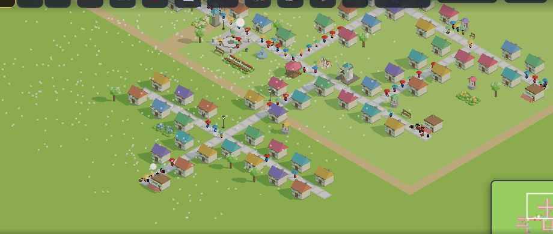

# 인구가 멈춘 마을 — 조사 (2026-09-20 · 맥북 마을 프로그램 담당 · **규칙 수치는 안 건드렸다**)

> 창조자의 눈 4회 🟡B4: pop88 판이 18~25일째 **인구 100 그대로**, 집 68채 중 사는 집 48 · 😊 5 · 빈집 20. 아이 눈엔 '더 안 자라는 마을'.
> 보스 과제 ⑤: ⓐ 그 20채가 무엇이 없어서 돌아서는지 ⓑ 그 까닭이 화면에서 읽히는지 ⓒ 아이가 고칠 수 있는 한 수가 무엇인지.
> 잰 법: 창조자의 눈 저장본 `village_child_pop88_day13.json` 을 `feat/village-45`(#574 까지)에 불러 20일째까지 돌린 뒤, 집마다 `__sat(x,y)`·`__away()` 를 읽었다. `?sid=guest&dev=1` 만.

## 한 줄
**인구 100 은 '사는 집 48채가 꽉 찬 값'이다.** 더 자랄 길은 둘인데 둘 다 막혀 있다 — ① 빈집 20채는 **시설이 하나도 없는 새 거리**라 새 이웃이 전부 돌아서고(돌아섬 규칙 그대로), ② 사는 집은 인구 80 에서 생긴 **'배움'** 이 53/62채에서 빠져 2층으로 못 자란다. 둘 다 **아이의 한 수로 풀린다**(우물 하나 → 하루 만에 +20명). 문제는 규칙이 아니라 **그 까닭이 눌러 보기 전엔 안 보인다**는 것.

## ⓐ 빈집 20채는 무엇이 없어서 돌아서나 (20일째)
| 빈집 | 어디 | 빠진 것(기본 넷 가운데) | 가진 것 | 돌아섬 규칙(둘은 있어야) |
|---|---|---|---|---|
| 10채 | 새 거리 가운데(169~178 , 163~171) | 물 · 놀이 · 쉼 | 장보기 **1** | ✕ 하나 모자람 |
| 8채 | 새 거리 양 끝(163~166 · 181~184) | 물 · 장보기 · 놀이 · 쉼 | **0** | ✕ 둘 모자람 |
| 2채 | 옛 마을 남쪽(140,150 · 140,153) | 물 · 장보기 · 쉼 | 놀이 **1** | ✕ 하나 모자람 |

- 스무 채 전부 **물**과 **쉼**이 없다. 열여덟 채가 **한 거리**(가로 길 y=165 · 세로 길 x=173)에 몰려 있다 — 아이가 길을 새로 내고 집만 죽 지은 곳이다. 우물·의자·놀이터가 그 거리에 **하나도 없다.**
- `__away()`: 돌아선 집 **20** = 빈집 20. 7일 동안 돌아섬 48번(하루 약 7번), 다시 옴 0. 즉 빈집은 '아직 안 온 집'이 아니라 **전부 '왔다가 돌아간 집'**이다.
- 사는 집 48채는 1층 46(2명) + 2층 2(4명) = **100명 = 꽉 참.** 그래서 인구가 100 에서 한 명도 안 움직인다.

## ⓑ 그 까닭이 화면에서 읽히나
| 단서 | 있나 | 아이가 알아채겠나 |
|---|---|---|
| 빈집을 **눌렀을 때**의 말 | ✅ "빈집이에요 · 물 뜰 곳·놀 곳·쉴 곳이 멀어서 새 이웃이 돌아가요 — 물·가게·놀 곳·쉴 곳 중 두 가지는 가까워야 해요" | **말은 아주 좋다.** 그러나 누를 까닭이 없다 — 빈집은 사는 집과 **똑같이 생겼다** |
| 돌아서는 순간(이웃이 집 앞까지 왔다가 풍선을 띄우고 돌아감) | ✅ 집마다 하루 한 번 · 6초 | 하루(3분) 가운데 그 거리에서 약 42초. 그 순간 그 거리를 보고 있어야 한다. 넓은 마을에선 거의 못 본다 |
| 빈 거리의 **모습** | ✕ | 낮에 보면 '사람이 안 다니는 거리'일 뿐(아래 그림 왼쪽 아래 무리). 빈집 표시·어두운 창·'?' 없음 |
| 위쪽 숫자 | ✕ | 👥 100명만 보인다. **빈집 20** 은 어디에도 없다 |
| 목표판·하루 소식 | ✕ | 목표는 '인구 120명'. 왜 안 느는지는 말하지 않는다. 하루 소식(📰)에 돌아선 이웃 이야기가 없다 |
| 집을 **지을 때** | ✕ | 시설 없는 곳에 집을 놓아도 아무 말이 없다(#516 은 우물·의자를 길에서 멀리 놓을 때만 말한다) |

*21일째 낮 5시. 왼쪽 아래 무리가 빈집 18채의 거리 — 사는 집과 구별되지 않는다. 사람만 안 다닌다.*

## ⓒ 아이가 고칠 수 있는 한 수 — 실제로 해 봤다
| 한 수 | 다음 날 | 인구 | 빈집(=돌아선 집) |
|---|---|---|---|
| (그대로) 20~21일째 | — | 100 | 20 |
| **우물 하나**를 새 거리의 길 곁(174,161)에 | 22일째 | **120** | **10** |
| 이틀 더 기다림 | 24일째 | 120 | 10 |
| **긴의자 하나**를 거리 동쪽 끝(186,164)에 | 28일째 | **128** | **6** |
| (해 보지 않음) 의자 하나를 서쪽 끝(164,164 곁)에 + 옛 마을 남쪽 두 채 곁에 우물 | — | 140 예상 | 0 예상 |

- **우물 하나 = 하루 만에 +20명.** 열 채가 "하나 모자람"이었기 때문이다. 나머지는 가게가 닿지 않는 양 끝이라 하나를 더 놓아야 한다.
- 돌아섬 규칙은 뜻대로 돈다 — "살기 불편한 집엔 안 온다, 하나 놓으면 바로 온다". **수치를 바꿀 까닭이 없다.**

## 또 하나의 멈춤 — 층이 안 자란다 ('배움')
인구 80 에서 필요에 **배움**이 더해진다. 도서관은 (158,150) 한 채뿐. 30일째 사는 집 62채 가운데:

| 빠진 것 | 집 |
|---|---|
| 배움만 | 12 |
| 배움 + 놀이/장보기/쉼 | 41 |
| 배움은 있고 다른 것 | 4 |
| 다 있음(😊 — 2층으로 자랄 수 있음) | **5** |

- **53/62 채가 배움이 빠져** 2층으로 못 자란다. 창조자의 눈이 센 불만 풍선 1위도 배움(72)이었다 — 이쪽은 **풍선으로 읽힌다**(📚).
- 한 수: 도서관을 마을 반대편에 하나 더(또는 인구 120 에서 열리는 학교). 해 보지는 않았다 — 도서관이 닿는 범위를 재는 일은 다음 조사로.

## 그래서 — 고칠 곳 후보(규칙 말고 '읽히게'). 보스가 고르면 하나씩 PR
| # | 무엇 | 어디에 얹나 | 값 |
|---|---|---|---|
| 1 | **집을 놓는 순간** 그 자리가 돌아설 자리면 한마디: "여긴 물·쉼이 멀어요 — 우물이나 의자를 가까이 놓으면 이웃이 와요" | 놓는 순간의 반응 MAC-SAY(#516)에 한 가지 더 — `awayLacks` 를 그대로 쓴다 | 원인이 생기는 **그 순간**에 말한다. 가장 싸고 가장 곧다 |
| 2 | 위쪽 👥 곁에 **빈집 수**(0 이면 안 보임) — 누르면 가장 가까운 빈집으로 화면 이동 + 그 집의 말 | 있던 `satText`·미니맵 이동 | '왜 안 늘지?'에 숫자 하나로 답한다 |
| 3 | 돌아선 집의 **모습** — 창이 어둡고 문 앞에 작은 '?'(하루 종일) | 돌아섬의 `awayWhy(rec)` 접점(집 모습 — 디자인 담당) · draw call 주의(예산 턱밑 #564) | 눌러 보게 만든다. 창조자의 눈 B2 의 '아무도 안 오는 정원 문 위의 ?'와 같은 말투 |
| 4 | 하루 소식(📰)에 한 줄: "어제 새 이웃 7명이 돌아갔어요 — 물 뜰 곳이 먼 집이 많아요" | 있던 하루 소식 | 하루에 한 번, 가장 많이 빠진 것 하나만 |
| 5 | 목표 '인구 120명'이 오래(사흘) 안 풀리면 목표판 그 줄 아래 작은 귀띔: "빈집에 이웃이 오게 해 봐요" | 목표판 `renderGoals` 감싸기 | 목표가 '기다리는 줄'이 아니라 '할 일'이 된다 |

추천 순서: **1 → 2** (둘 다 프로그램 몫 · 있는 장치 · draw call 0). 3 은 디자인과 같이, 4·5 는 그 뒤.

## 하지 않은 것 · 조심할 것
- 돌아섬·필요·성장의 **수치는 그대로 뒀다.** 이 조사에서 보인 멈춤은 규칙이 세서가 아니라 까닭이 안 보여서다.
- 저장본 하나(pop88)만 봤다. pop167 판(집 95 · 사는 집 81)의 **빈집 14채**가 같은 까닭인지는 아직 안 봤다.
- 시험 중 따로 본 것: 새 마을에 길 한 줄 + 집 18채만 지으면 **시뮬 열흘 동안 인구 14 그대로**(돌아선 집 18 · 까닭은 전부 장보기·놀이·쉼). 처음 5분을 넘긴 아이가 '집만 죽 짓는' 두 번째 세션에서 가장 먼저 만날 멈춤이다 — 후보 1 이 바로 이 순간에 말한다.
